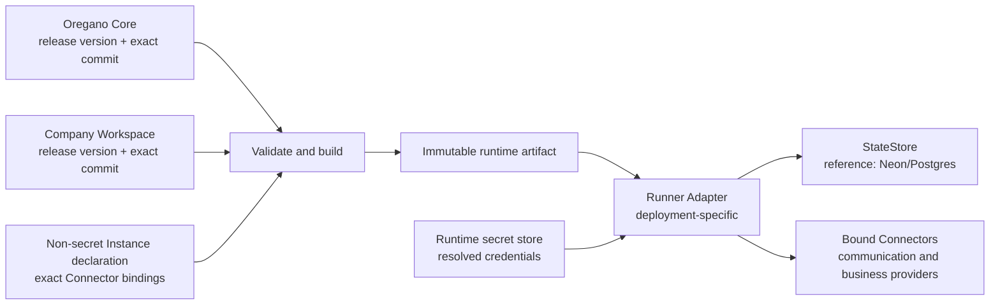
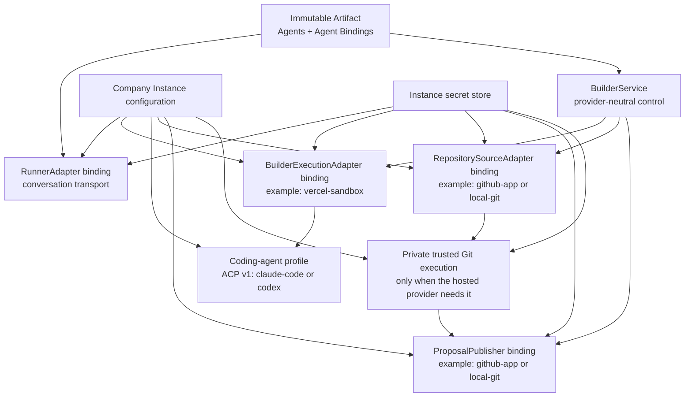
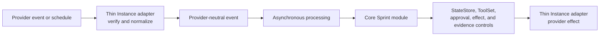

# Company Instance

A Company Instance is one deployed pairing of an exact Oregano Core version
and an exact Company Workspace version, connected to environment-specific
infrastructure, configuration, secrets, integrations, and operational state.
The environment is part of the identity, for example `acme-production` or
`acme-staging`.

The optional Builder binding deliberately separates five choices that often
share one hosted deployment but are not one contract:

Changing the runtime host does not select a repository provider or coding
agent. Changing Claude Code to Codex does not change the normal Runner. The
Workspace declares company behavior and the repository identity; the Instance
binds qualified implementations, installations, and secrets.

`TrustedGitExecutionAdapter` is an optional private composition detail behind
the repository bindings, not a sixth public Instance role. The maintained
Vercel composition uses a Git-and-Workbench snapshot because its Function
runtime has no Git executable. Repository credentials are brokered only into
that boundary; the separate coding snapshot receives a credential-free bundle.

Vercel is the maintained reference runtime host, not the Instance itself.
Neon/Postgres is the maintained reference durable StateStore. Both are
replaceable adapters or services.

The Builder produces the immutable artifact. The maintained Vercel Runner
loads one integrity-checked production Artifact from the Instance secret
store, verifies Slack identities against its compiled roster before model
invocation, exposes only its resolved ToolSet, and persists Chat SDK plus
CompanyOS control state in the Instance Postgres schema. The first real
Connector publishes exact R3-approved text or HTML artifacts through Postgres
and the Runner's public artifact route. Paid-provider Connectors remain
unavailable until their own binding and rollout evidence exist.

The build-time relationship is local file composition, not a runtime API
between repositories. `companyos build` reads both clean checkouts, compiles
only scoped Workspace material and resolved Tools, combines them with the
non-secret Instance declaration, and writes one artifact. Runtime code consumes
that artifact; it does not reach back into either Git repository.

## Reference deployment and replacement boundary

The maintained reference deployment uses a company-controlled Vercel
account/team/project and a company-controlled Neon/Postgres project. This makes
the onboarding path concrete and testable; it does not make either provider a
CompanyOS architectural dependency.

Workbench setup code reaches providers through a private typed boundary with
four roles: source host, runtime host, state service, and communication
provider. Model execution is a separate typed selection because it is consumed
by the Runner rather than by installation resource orchestration. The maintained
`vercel-neon-slack` profile binds the four setup roles to GitHub, Vercel,
Neon/Postgres, and Slack and supports Vercel AI Gateway or direct Anthropic
execution. The boundary exists to keep provider
SDK behavior, eventual-consistency handling, and resource receipts out of Core
runtime semantics. It is deliberately not a public plugin registry: a new
Hetzner, Docker, Railway, Supabase, or communication binding is introduced as a
separately qualified adapter and profile without changing the provider-neutral
Instance identity, Artifact, Tool, evidence, or readiness contracts.

A replacement runtime host must preserve environment isolation, scoped
deployment identity, secret injection, immutable deployment provenance,
observable health, and rollback. A replacement StateStore must preserve the
specified transactional, idempotency, evidence, retention, backup, and recovery
contracts. Provider account IDs, project IDs, tokens, and secrets belong to the
Instance configuration or CI secret store, never the Company Workspace.

Runtime secrets live in the target environment's secret store. Deployment
credentials live in CI secrets. The Workspace declares required logical
connections, allowed scopes, and secret references but never contains values.
Local development uses an ignored `.env.local` populated from an approved
secret source.

For the hosted GitHub repository profile, the service operator creates one
CompanyOS GitHub App per service environment. Each customer installs that same
App and selects repositories. The Instance stores only verified installation
and repository identities. The provider mints separate short-lived,
single-repository tokens for exact-source reading and checked proposal
publication; neither token enters the Builder job or coding-agent process.

The isolated Builder worker contains the exactly pinned ACP SDK and Claude
Code/Codex ACP packages in a qualified image or snapshot. The normal Runner
contains only orchestration and adapter code. Model keys are general Instance
provider secrets (`ANTHROPIC_API_KEY` and `OPENAI_API_KEY`), not
Builder-specific Workspace configuration.

Every release records at least the Instance ID, environment, Core version and
commit, Workspace version and commit, deployment ID, specification version,
Workbench version, governance hash, resolved toolset hash, and build timestamp.
A rollback points to an existing immutable artifact; it does not rebuild old
sources with new dependencies.

The reference Runner receives its immutable Artifact as a gzip-compressed
deployment environment value. It recomputes the content hash before accepting
traffic and refuses an Artifact whose declared environment is not
`production`. The value is generated from clean exact checkouts and is never a
source of editable operating truth.

## Maintained supervised starter

The experimental `vercel-neon-slack` setup profile is the first bounded
deployment path for a new company. It starts from the release-matched Codex or
Claude Code runbook, creates or adopts one explicitly named private GitHub
repository, Vercel project, Neon Marketplace resource, and Slack Vercel Connect
resource, and converts the local baseline through a separately confirmed
operating Workspace change. The change contains one supervised `oregano`
Agent, one Slack workflow, a non-secret connection declaration, and an empty
business ToolSet.

Provider browser authentication and consent remain human actions. The setup
state contains versioned write-ahead intents, immutable provider receipts,
identifiers, hashes, phase status, and non-secret evidence only. A provider
mutation is preceded by an intent and followed immediately by its receipt, so
resume can reconcile an interrupted operation by immutable identity instead of
creating a duplicate from a name-only search. Database URLs, provider
credentials, private keys, immutable Artifact content, and short-lived Slack
user credentials are excluded. The Slack credential used to resolve the
consenting human's canonical team and user IDs exists only in memory and is
discarded after the identity call.

The maintained Vercel project is configured with `packages/runner-vercel` as
its root, and setup refuses to overwrite a conflicting adopted root or
production environment value. The Slack binding uses the fixed Connector UID
`slack/oregano` and visible Agent name `Oregano`; provider-internal resource
names may remain company-specific but do not become the Agent identity.

Model execution is bound explicitly as `vercel-ai-gateway` or
`anthropic-direct`. Gateway uses the Vercel deployment identity. Direct
Anthropic uses the official Anthropic provider from the Runner and sends model
traffic directly to Anthropic; Vercel is only the runtime host and secret
store. Its `ANTHROPIC_API_KEY` value exists only as a Sensitive Production
runtime variable. Setup records the non-secret reference, presence, and
Sensitive classification, never the key. Health, production confirmation, and response evidence bind the route
and exact model.

The path creates an immutable Artifact only from clean exact Core and Workspace
commits, deploys only after an exact candidate confirmation, verifies current
health, and requires one nonce-bound Slack input plus a real selected-model call
that returns the exact reply `Setup-Test <nonce> successful.`. Both entries and
non-secret model response evidence are persisted in the same Neon conversation. Live
verification ties that proof to the immutable provider and deployment receipts
and fails closed on unresolved setup intents. Its completion scope is
`live-starter-instance` with derived readiness `validated`. This is not a
general deployment or promotion orchestrator and does not prove `enforced`
readiness, unattended eligibility, arbitrary Tool grants, or future provider
effects.

## Event-driven runtime and Gateway boundary

The maintained Sprint Agent V1 topology uses event-driven Instance endpoints,
asynchronous processing, durable StateStore state, and executable provider
adapters. It does not require a long-running Instance Gateway. Existing
boundaries provide the required responsibilities:

The provider adapters own protocol verification, acknowledgement, and mapping,
but remain thin. Provider SDKs MUST NOT be imported by the provider-neutral
module. Idempotency, ordering, evidence, retry, and reconciliation MUST NOT
exist only in an endpoint process. Durable authority remains in StateStore and
Core controls; a queue is an execution mechanism, not an authority boundary.
Webhook and scheduled execution enter the same provider-neutral module path.

A shared Runtime Kernel is considered only after a second independent module
demonstrates repeated ingress and dispatch logic that cannot be kept coherent
through the existing contracts. An Instance Gateway is considered only when
implementation evidence shows at least one of these needs:

- persistent channel or socket connections;
- central lifecycle and routing for multiple channels or agents;
- live Workbench or control-client streaming;
- remote execution nodes;
- central adapter start, stop, and health supervision; or
- failure of the event-driven deployment topology to meet documented
  operational requirements.

Crossing either promotion gate requires a separate approved Core Change Plan.
Anticipated ecosystem growth by itself is not sufficient evidence.

## Derived readiness

Instance readiness belongs to one exact Core, Workspace, and environment
pairing. It is derived rather than written into `company.md`:

| Readiness | Meaning |
|---|---|
| `declared` | Required Workspace and Instance contracts exist and identify their intended dependencies. |
| `validated` | Deterministic validation succeeds for the exact version pair and environment configuration. |
| `enforced` | The deployed runtime proves that required controls, resolved Tools, approvals, effect handling, evidence, and rollback operate as declared. |

Workbench validation can establish structural evidence and report missing
external checks. Only deployment and runtime evidence can establish
`enforced`. The same Instance may run supervised and unattended workflows;
readiness for unattended execution is evaluated against the stricter workflow
and effect requirements instead of inferred from a global profile.
