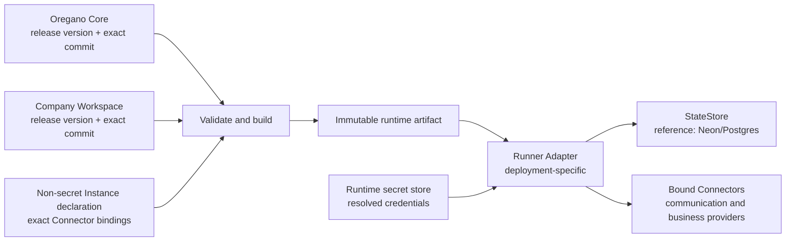
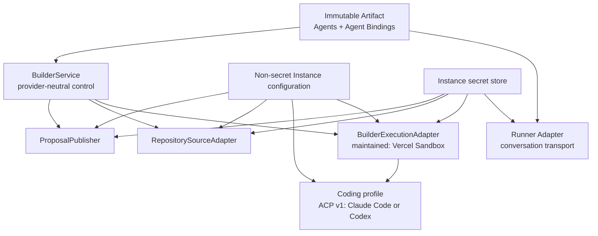
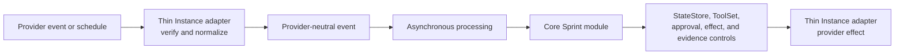

# Company Instance

A Company Instance is one deployed pairing of an exact Oregano Core version
and an exact Company Workspace version, connected to environment-specific
infrastructure, configuration, secrets, integrations, and operational state.
The environment is part of the identity, for example `acme-production` or
`acme-staging`.

An Instance may additionally opt into the proposal-only Builder. These
bindings are separate even when one maintained deployment hosts them:

Changing the runtime host does not select a repository provider or coding
agent. Changing Claude Code to Codex does not change the normal Runner. The
Workspace declares company behavior and repository identity; the Instance
binds qualified implementations, repository installations, and secrets.

The optional proposal target branch is compiled into the Artifact, copied into
each immutable job, shown during confirmation, and checked with the exact base
commit. Without it, the provider-verified default branch is used. A hosted
provider may privately compose a separate trusted Git worker when the normal
runtime lacks Git; that worker receives short-lived repository authority but
never runs the coding agent. The coding snapshot remains credential-free.

Vercel is the maintained reference runtime host, not the Instance itself.
Neon/Postgres is the maintained reference durable StateStore. Both are
replaceable adapters or services.

The Builder produces the immutable artifact. The maintained Vercel Runner
loads one integrity-checked production Artifact from the Instance secret
store, verifies Slack identities against its compiled roster before model
invocation, exposes only its resolved ToolSet, and persists Chat SDK plus
CompanyOS control state in the Instance Postgres schema. The first real
Connector publishes exact R3-approved text or HTML artifacts through Postgres
and the Runner's public artifact route. Paid-provider Connectors remain
unavailable until their own binding and rollout evidence exist.

The build-time relationship is local file composition, not a runtime API
between repositories. `companyos build` reads both clean checkouts, compiles
only scoped Workspace material and resolved Tools, combines them with the
non-secret Instance declaration, and writes one artifact. Runtime code consumes
that artifact; it does not reach back into either Git repository.

## Reference deployment and replacement boundary

The maintained reference deployment uses a company-controlled Vercel
account/team/project and a company-controlled Neon/Postgres project. This makes
the onboarding path concrete and testable; it does not make either provider a
CompanyOS architectural dependency.

Workbench setup code reaches providers through a private typed boundary with
four roles: source host, runtime host, state service, and communication
provider. Model execution uses the separate Core recipe registry because it is
consumed by the Runner rather than by installation resource orchestration. The maintained
`vercel-neon-slack` profile binds the four setup roles to GitHub, Vercel,
Neon/Postgres, and Slack and supports Gateway, native Anthropic/OpenAI/Google,
and named compatible cloud execution. The boundary exists to keep provider
SDK behavior, eventual-consistency handling, and resource receipts out of Core
runtime semantics. It is deliberately not a public plugin registry: a new
Hetzner, Docker, Railway, Supabase, or communication binding is introduced as a
separately qualified adapter and profile without changing the provider-neutral
Instance identity, Artifact, Tool, evidence, or readiness contracts.

A replacement runtime host must preserve environment isolation, scoped
deployment identity, secret injection, immutable deployment provenance,
observable health, and rollback. A replacement StateStore must preserve the
specified transactional, idempotency, evidence, retention, backup, and recovery
contracts. Provider account IDs, project IDs, tokens, and secrets belong to the
Instance configuration or CI secret store, never the Company Workspace.

Runtime secrets live in the target environment's secret store. Deployment
credentials live in CI secrets. The Workspace declares required logical
connections, allowed scopes, and secret references but never contains values.
Local development uses an ignored `.env.local` populated from an approved
secret source.

The maintained GitHub repository binding uses one service-owned GitHub App per
service environment. Each company installs that same App and selects its
repositories; customers do not create an App or copy a long-lived token.
Verified installation and repository identities are durable Instance state.
Separate short-lived, repository-scoped credentials are minted for exact
source acquisition and checked proposal publication and never enter Builder
jobs or coding-agent processes.

The isolated coding snapshot pins the ACP SDK and Claude Code/Codex adapters.
General provider keys remain ordinary Instance secrets named
`ANTHROPIC_API_KEY` and `OPENAI_API_KEY`, not Builder-specific configuration.

Database setup distinguishes resource provisioning from schema preparation.
The State Service adapter first creates or explicitly adopts one database
resource. The runtime-host adapter then starts the provider-neutral
`companyos database prepare` operation in a secret-bound process. Prepare
detects whether the database is empty, behind the current manifest, or already
current and selects `bootstrap`, `upgrade`, or read-only `verify`
accordingly. Bootstrap is the empty-database primitive; preparation creates or
upgrades both maintained schemas and records an immutable version-manifest
ledger entry. `companyos database verify` performs the corresponding explicit
read-only catalog qualification. Setup state retains only the selected
operation, previous manifest versions, resource identity, manifest identity
and digest, feature evidence, counts, and qualification time. It never
retains `DATABASE_URL`. The maintained Vercel adapter uses `vercel env run` as
its secret transport, while another qualified runtime adapter may provide an
equivalent process without changing the database manifest.

Production health is read-only with respect to schema. It verifies the exact
recorded manifest and required schema objects and cannot create or alter tables
as a side effect of a readiness request.

The current additive database manifest is `companyos-postgres@1.7.0`. It
retains the immutable `1.6.0`, `1.5.0`, `1.4.0`, `1.3.0`, `1.2.0`, `1.1.0`, and `1.0.0` ledger identities
and contains 67 required `companyos_knowledge` tables. Phase 3 adds durable Source
Events, provider ACL snapshots, bounded pipeline receipts, completed
watermarks, an integrity-linked Knowledge change stream, and governed source
lifecycle requests. Phase 4 adds a durable lease per Source reconciliation
stream so overlapping schedules cannot process the same partition concurrently.
Phase 5 adds durable compounding leases and receipts, review-only Claim-pair
proposals, and explicit grading requests. Phase 6 adds policy-bound model-task
results, atomic spend reservations, and a rated execution ledger. Phase 7 adds
rebuildable Retrieval V3 projection runs and Units plus payload-free
KnowledgeBench, shadow-comparison, and productization receipts. When `pgvector`
is available, the two optional vector tables retain Handbook-fragment and
Retrieval-Unit embeddings; neither is durable company authority.
The reusable activation path qualifies a fully isolated non-production
Instance. Oregano HQ also has one explicit internal-dogfood production-canary
path: a Neon point-in-time branch rehearses the additive migration, production
V3 is built verified but inactive, shadow execution continues serving V2, and
an exact Agent allowlist plus projection hash gates canary service. This path
does not require duplicate Slack, Granola, model, or Vercel bindings, does not
permit external-user traffic, and does not weaken the generic isolation
contract. Invalid mode, projection, allowlist, or candidate execution falls
back to V2. Database projection activation separately requires a persisted
qualification receipt.
Runtime readiness is a separate gate: the Core-resolved
subject and groups must pass policy intersection before retrieval, graph
traversal, review hydration, citations, or model context. Unknown mappings and
quarantine fail closed.

Every release records at least the Instance ID, environment, Core version and
commit, Workspace version and commit, deployment ID, specification version,
Workbench version, governance hash, resolved toolset hash, and build timestamp.
A rollback points to an existing immutable artifact; it does not rebuild old
sources with new dependencies.

The reference Runner receives its immutable Artifact as a gzip-compressed
deployment environment value. It recomputes the content hash before accepting
traffic and refuses an Artifact whose declared environment is not
`production`. The value is generated from clean exact checkouts and is never a
source of editable operating truth.

## Maintained supervised starter

The experimental `vercel-neon-slack` setup profile is the first bounded
deployment path for a new company. It starts from the release-matched Codex or
Claude Code runbook, creates or adopts one explicitly named private GitHub
repository, Vercel project, Neon Marketplace resource, and Slack Vercel Connect
resource, and converts the local baseline through a separately confirmed
operating Workspace change. The change contains one supervised `oregano`
Agent, one Slack workflow, a non-secret connection declaration, and an empty
business ToolSet.

Provider browser authentication and consent remain human actions. The setup
state contains versioned write-ahead intents, immutable provider receipts,
identifiers, hashes, phase status, and non-secret evidence only. A provider
mutation is preceded by an intent and followed immediately by its receipt, so
resume can reconcile an interrupted operation by immutable identity instead of
creating a duplicate from a name-only search. Database URLs, provider
credentials, private keys, immutable Artifact content, and short-lived Slack
user credentials are excluded. The Slack credential used to resolve the
consenting human's canonical team and user IDs exists only in memory and is
discarded after the identity call.

The maintained Vercel project is configured with `packages/runner-vercel` as
its root, and setup refuses to overwrite a conflicting adopted root or
production environment value. The Slack binding uses the fixed Connector UID
`slack/oregano` and visible Agent name `Oregano`; provider-internal resource
names may remain company-specific but do not become the Agent identity.

Model execution resolves through the Core recipe registry. The maintained
setup binds Gateway, native Anthropic/OpenAI/Google, or a named compatible
cloud recipe. The registry also supports explicitly configured LiteLLM,
Ollama, llama-server, and generic OpenAI-compatible endpoints; those endpoints
must be reachable from the selected runtime and are not assumed to exist on a
Vercel deployment. Gateway uses the Vercel deployment identity. Native routes
use official provider adapters; named compatible routes reuse one shared
OpenAI-compatible transport with per-provider credentials and endpoints.
Vercel is only the runtime host and secret store in this profile. Provider
API-key values exist only as Sensitive Production runtime variables. Setup
records the non-secret reference, presence, and Sensitive classification,
never the key. Health, production confirmation, and response evidence bind the
route and exact model.

`COMPANYOS_MODEL_CONFIG_BASE64` may bind exact tasks, profiles, and a default.
Those bindings override the simple `COMPANYOS_MODEL_ROUTE` and
`COMPANYOS_MODEL` pair. Without either form, key-aware resolution uses the
documented Anthropic-then-OpenAI priority before the Gateway default. No
resolved request silently fails over across providers.

`COMPANYOS_KNOWLEDGE_MODEL_CONFIG_BASE64` accepts the same provider-neutral
shape and overrides the shared bindings only for registered Knowledge prompts.
This permits retained evidence to use a direct provider without changing the
interactive Agent. The maintained setup preset pins utility, reasoning, and
deep Knowledge tasks to direct Anthropic Haiku 4.5, Sonnet 4.6, and Opus
4.7. Embeddings and cross-encoder reranking remain separately configured
capabilities.

The path creates an immutable Artifact only from clean exact Core and Workspace
commits, deploys only after an exact candidate confirmation, verifies current
health, and requires one nonce-bound Slack input plus a real selected-model call
that returns the exact reply `Setup-Test <nonce> successful.`. Both entries and
non-secret model response evidence are persisted in the same Neon conversation. Live
verification ties that proof to the immutable provider and deployment receipts
and fails closed on unresolved setup intents. Its completion scope is
`live-starter-instance` with derived readiness `validated`. This is not a
general deployment or promotion orchestrator and does not prove `enforced`
readiness, unattended eligibility, arbitrary Tool grants, or future provider
effects.

## Event-driven runtime and Gateway boundary

The maintained Sprint Agent V1 topology uses event-driven Instance endpoints,
asynchronous processing, durable StateStore state, and executable provider
adapters. It does not require a long-running Instance Gateway. Existing
boundaries provide the required responsibilities:

The provider adapters own protocol verification, acknowledgement, and mapping,
but remain thin. Provider SDKs MUST NOT be imported by the provider-neutral
module. Idempotency, ordering, evidence, retry, and reconciliation MUST NOT
exist only in an endpoint process. Durable authority remains in StateStore and
Core controls; a queue is an execution mechanism, not an authority boundary.
Webhook and scheduled execution enter the same provider-neutral module path.

The maintained records foundation uses an additive `companyos_records` schema
inside the existing Company Instance database. It is isolated from the
`companyos` and `companyos_knowledge` schemas and contains immutable source
events and object versions, current pointers, rebuildable projection rows,
access decisions, synchronization receipts and watermarks, leases, durable
timers, Connector echo receipts, and callback replay claims. The schema is
prepared idempotently when the records implementation is activated; Core
release alone does not migrate a real Instance. Synchronized values remain
operational evidence and do not become Handbook or provider authority.

The maintained Monday adapter is Core-owned privileged Connector code, while
the board account, external Agent registration, permissions, board grants,
callback route, signing material, exact resource bindings, and activation
receipts are Instance state. Conversational callbacks are signature- and
replay-verified before `AgentResolver` selects the compiled Agent. Board-change
callbacks bypass the chat prompt and enter the records and Sprint path. An
outbound Sprint message similarly resolves the provider-neutral
`communication.message.publish` Capability to an exact destination binding;
the Sprint Blueprint does not know a channel ID.

The first maintained external-Agent runtime ingress implements Monday's exact
signed synchronous callback and SSE/JSON acknowledgement formats. It binds an
Instance-injected account id, external Agent id, and signing secret, retains
only a digest for replay prevention, and rejects a wrong Agent identity before
dispatch. Monday's current pre-release trigger envelope authenticates the
external Agent callback but does not identify the human who initiated chat,
mention, or assignment. That provider fact is insufficient to authorize a
human principal. Ordinary interactive traffic therefore fails closed before
Company Workspace material, model invocation, Tool resolution, or effect
execution. A deterministic setup proof remains available to qualify delivery;
mention and assignment receive protocol acknowledgement only. Company data or
Tools require a later provider identity fact or separately approved
authorization design. Board grants and outbound Agent-token actions remain
distinct Instance effects.

The maintained Monday qualification uses that same external Agent rather than
a second provider identity. `companyos records source qualify --provider
monday` binds one clean Core checkout, exact Company Workspace, external Agent
ID, `API-Version: dev`, administrator-attested complete resource-grant set, and
explicit board IDs before resolving the Instance SecretRef. It accepts only
`external_agent_member` or `external_agent_detached_member`, derives the Agent
subject ID from its provider identity, and records it separately from the
configured UI/callback Agent ID because monday uses different identifier
namespaces. A second digest-bound administrator review confirms that exact
mapping. Qualification reads only the explicitly selected boards. Successful
return proves at least read access; `access_level: edit` is required as metadata
evidence for an attested `READ_WRITE` board but does not prove a completed write
effect. Monday does not expose `agent_knowledge` to the external Agent token, so
the receipt distinguishes the administrator's complete-set attestation from
machine-proven effective selected-board access. Only Agent and
account identity, attestation evidence, effective access, board/group/column
structure, request evidence, and a discovery digest enter the mode-0600
Instance qualification receipt. The Agent token remains in the protected
Instance secret surface and is not retained by the Workbench. Qualification
creates no Agent, grant, callback, board change, or write. A later reversible,
separately confirmed effect is still required to prove an operational write.
The external Agent is the sole maintained Monday qualification identity.

After qualification, Company Records uses a separate non-secret Instance
binding. It selects one exact Record Source Connector version, Instance and
source identity, logical resource binding, provider configuration, and one
SecretRef. It also pins the non-secret qualification receipt and its digest so
resource and scope evidence cannot be substituted at apply time. The
credential value and `DATABASE_URL` remain in the Instance runtime secret
surface. `companyos records source materialize` may turn an
explicitly authored source draft into one reviewable Workspace file only when
the named board and mapped columns exist in the non-secret qualification
receipt. It never invents a mapping or commits the file.

`companyos records source sync` and `reconcile` share the same provider-neutral
plan/apply boundary. The plan resolves no credential and calls neither the
provider nor the database. Apply first verifies the exact plan hash, then the
trusted synchronization worker resolves the Connector and SecretRefs. `sync`
appends observations and projections without inferring deletion. `reconcile`
may record provider-absence tombstones only after one bounded complete
inventory under the durable source lease. Both advance the watermark only
after successful completion and store a receipt; neither grants an Agent a
Tool or performs a provider write. `status` is payload-free and read-only and
does not create the records schema when it is absent.

A shared Runtime Kernel is considered only after a second independent module
demonstrates repeated ingress and dispatch logic that cannot be kept coherent
through the existing contracts. An Instance Gateway is considered only when
implementation evidence shows at least one of these needs:

- persistent channel or socket connections;
- central lifecycle and routing for multiple channels or agents;
- live Workbench or control-client streaming;
- remote execution nodes;
- central adapter start, stop, and health supervision; or
- failure of the event-driven deployment topology to meet documented
  operational requirements.

Crossing either promotion gate requires a separate approved Core Change Plan.
Anticipated ecosystem growth by itself is not sufficient evidence.

## Derived readiness

Instance readiness belongs to one exact Core, Workspace, and environment
pairing. It is derived rather than written into `company.md`:

| Readiness | Meaning |
|---|---|
| `declared` | Required Workspace and Instance contracts exist and identify their intended dependencies. |
| `validated` | Deterministic validation succeeds for the exact version pair and environment configuration. |
| `enforced` | The deployed runtime proves that required controls, resolved Tools, approvals, effect handling, evidence, and rollback operate as declared. |

Workbench validation can establish structural evidence and report missing
external checks. Only deployment and runtime evidence can establish
`enforced`. The same Instance may run supervised and unattended workflows;
readiness for unattended execution is evaluated against the stricter workflow
and effect requirements instead of inferred from a global profile.

## Knowledge state in the Company Instance database

Company Knowledge V1 does not create a second database. The existing
`DATABASE_URL` contains `companyos` for control state and
`companyos_knowledge` for snapshots, documents, fragments, lexical/graph and
optional vector projections, index receipts, review candidates, source
bindings/receipts/object versions/inventory, and Runtime Observation lifecycle
evidence. Its inactive Brain foundation additionally owns versioned Pages,
Claims, Holders, entity identity, ACL records, raw assets, timelines, sourced
and inferred edges, syntheses, promotion and decision evidence, sessions,
extraction runs, cursors, calibration, merge, and export ledgers. Every query
qualifies its schema. Source bindings persist SecretRefs, never resolved
credentials.

A bundle is staged idempotently by hash, verified against stored counts, and
only then activated. Exactly one verified snapshot is active. Documents,
fragments, graph edges, lexical indexes, and embeddings are rebuildable
projections; review decisions, source receipts and versions, observation
events, deletion requests, legal holds, and activation receipts are durable
Instance evidence. Rollback explicitly reactivates a prior verified snapshot.
`pgvector` creation is optional and its absence keeps lexical retrieval active
with a recorded degradation.
