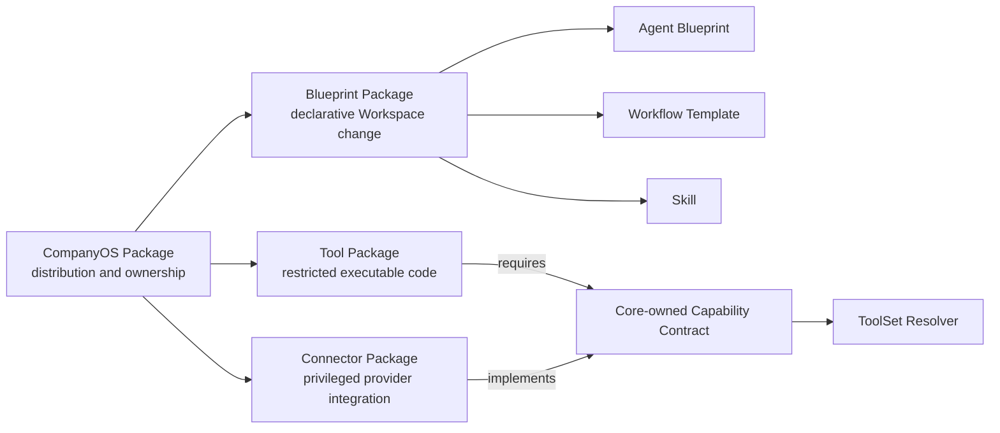

# Ecosystem and Package Architecture

CompanyOS supports an open contributor ecosystem without treating third-party
content or code as company authority. The architecture separates the thing
that is distributed, the logical content it carries, the Core contract it uses,
and the exact authority a company later grants.

## Decisive distinctions

- A **Package** is a versioned distribution and ownership boundary.
- A **Component** is a logical artifact inside a Package.
- A **Capability Contract** is a Core-owned provider-neutral interface.
- An **implementation** satisfies a Capability Contract.
- A **grant** is company authority for one agent to use a Tool.
- A **binding** connects an Instance to provider configuration and secrets.
- **Activation** places an installed and resolved Package into one deployment.

Therefore:

```text
Package != Capability
Install != Grant
Grant != Binding
Binding != Activation
Activation != per-effect Approval
```

“Plugin” is not a normative CompanyOS term. It is too broad to communicate
placement, execution privilege, authority, or lifecycle.

## Minimal public Package model



| Package kind | Content | Placement | Runtime privilege |
|---|---|---|---|
| Blueprint | Agent Blueprints, Workflow Templates, Skills, SOPs, assets | proposed as a governed Workspace diff | declarative only |
| Tool | reusable Tool contracts and restricted Tool SDK code | declared and pinned through the Workspace; executed only through Core | restricted |
| Connector | provider implementation, authentication, retry, evidence, and read-after-write | installed and bound in the Instance | privileged |

One Blueprint Package may contain one or many Components. A single Skill is
still distributed as a Blueprint Package with one Component; it does not need a
fourth Package kind.

## Capability ownership

Core owns stable Capability Contracts. A Connector Package owns one provider's
implementation of those contracts. Tools, workflows, and channels consume the
Core contract without importing provider code.

For example, a Monday Connector may implement `work-item.read`,
`work-item.update`, and `work-item.comment`. A Sprint Tool requires those
Capabilities but does not know that Monday supplies them. A company selects and
binds the provider in its Instance and grants only the resulting Tools to an
agent.

The same Sprint Blueprint may require `communication.message.publish` without
naming Slack. A Slack or another communication Connector implements that
contract for one exact Instance destination binding. The Blueprint cannot
select a real channel or install the Connector.

If a needed provider-neutral Capability Contract does not exist, the valid
contribution is a Core contract proposal. A Package must not create an ad hoc
provider escape hatch in a Workspace.

## Trust follows privilege

Blueprint, Tool, and Connector Packages intentionally have different trust
requirements:

1. Blueprint Packages are inspected as files and cannot contain executable
   runtime code, secrets, principals, completed approvals, or Instance bindings.
2. Tool Packages execute only through the Tool SDK and cannot access provider
   SDKs, network, environment secrets, databases, or Core effect primitives
   directly.
3. Connector Packages are privileged code. External activation requires a
   stronger publisher, provenance, isolation, review, and conformance contract
   than Blueprint or Tool installation.

An official badge or Registry listing never changes these boundaries.

## Lifecycle

The governed lifecycle is:

```text
Discover -> Acquire -> Inspect -> Plan -> Apply -> Grant/Bind -> Resolve -> Activate -> Execute
```

- **Discover** reads Registry or source metadata.
- **Acquire** obtains one exact local, Git, Registry, mirror, or fork artifact
  without trusting or executing it.
- **Inspect** validates the manifest, content, compatibility, requested
  permissions, provenance, and trust state without executing Package code.
- **Plan** exposes every managed file, capability, permission, grant, binding,
  and readiness change before mutation.
- **Apply** performs only the reviewed placement change, records one exact
  version and digest, and creates or updates the Package installation record.
- **Grant/Bind** requires the applicable Workspace Steward, Process Steward, or
  Platform Administrator authority; Packages cannot perform these steps for
  themselves.
- **Resolve** combines the exact installed Package set with Core contracts,
  Workspace policy, agent grants, and Instance availability deterministically.
- **Activate** records the exact resolved state in deployment provenance.
- **Execute** still applies authentication, authorization, approval, effect
  claiming, idempotency, and evidence per call.

Updates and removals repeat inspection and planning. There are no silent
upgrades. Drift between a reviewed plan and apply fails closed.

## Locks and provenance

Blueprint and Tool Package origins belong in a versioned Workspace Package
lock. The lock records exact Package identity, source, version, artifact and
manifest digests, selected Components, managed or referenced files, resolved
contract versions, and the reviewed plan digest.

Connector installation and binding belong in an Instance Package ledger because
they include privileged code, environment availability, accounts, and secret
references. Deployment provenance includes hashes of both the Workspace Package
lock and Instance Package ledger. Neither lock contains resolved secret values.

## Open Registry boundary

The CompanyOS Package Registry is a separate open product and protocol. It owns
publisher namespaces, immutable Package metadata and versions, artifact
locations and digests, compatibility metadata, advisories, yanks, and
revocations. It owns no Workspace grant, Instance binding, approval, or
activation state.

The official Registry must not be mandatory. Local directories, exact Git
references, mirrors, forks, and other registries use the same Package manifest,
Inspector, lock, compatibility, and trust rules. A Marketplace is a discovery
experience over Registry data, not an authority plane.

## Planned delivery sequence

CompanyOS progresses in bounded stages, each with its own Change Plan and
status update. An implemented earlier stage does not imply that a later
mutation or execution stage exists.

| Stage | Status and outcome | Admission gate |
|---|---|---|
| Contract Foundation Lite | implemented: manifest schema, local read-only Blueprint Inspector, enforced seed Compatibility Registry, repository-local neutral fixtures, and the authority-free `oregano/sprint-agent` Blueprint | this architecture and v0.1 specifications approved |
| Blueprint path | local and exact-Git inspect, plan, apply, lock, update, and remove for declarative Packages | deterministic diff, path safety, provenance, and drift tests |
| Open Registry | open read/publish protocol and reference implementation without mandatory central hosting | publisher ownership, immutable versions, advisories, yank, and revocation policy |
| Local Tool execution foundation | implemented experimentally: Company Tool contract loading, JSON Schema enforcement, restricted Tool SDK, process isolation, ToolSet resolution, runtime grants, and sandbox Capability evidence | reference campaign security and failure tests pass |
| Published Tool path | published Tool Package validation, acquisition, locking, and activation | Package provenance, signing decision, public Tool contract tests, and lifecycle controls |
| Connector path | one external provider Package installed and bound through an Instance | signing/provenance decision, privileged isolation, binding contract, and provider conformance tests |
| Marketplace | human discovery and comparison over Registry data | Registry lifecycle and security operations proven without a web UI |

## Deferred extension register

Deferred means the architecture preserves the option but does not yet promise a
public API or delivery date. A future Change Plan promotes an entry only when
its evidence trigger and safety prerequisites are met.

| Candidate | v0.1 treatment | Evidence trigger for reconsideration | Minimum prerequisites |
|---|---|---|---|
| Workbench Extension | not a Package kind; Workbench remains package-aware but closed to third-party runtime code | repeated external authoring or inspection need that built-in commands and Blueprint assets cannot satisfy | non-weakenable validators, sandboxed extension boundary, versioned API, compatibility records, contract tests |
| Runner Package | internal Runner Adapter contract only | a second independently maintained real runner needs installation outside Core | runner-neutral contract proven by at least two implementations, isolation, lifecycle and conformance suite |
| Module Package | Core contribution or restricted Tool composition | repeated demand for independently distributed deterministic state machines | state, migration, scheduling, evidence, compatibility, and rollback contracts |
| Channel Package | represented as a Connector implementing communication Capabilities | at least two integrations demonstrate lifecycle or routing semantics that the Connector model cannot express | channel-neutral contracts, identity mapping, ingress/egress security and conformance tests |

The register is reviewed when the relevant evidence appears and whenever the
Package contract reaches a new major version. Lack of evidence is a reason to
keep the boundary deferred, not to delete the option.

## Deferred foundation backlog

The Lite implementation deliberately stops at inspection. The following work
is retained here so it is neither implemented speculatively nor lost in an
informal backlog. Each item is promoted by a new approved Change Plan only when
its trigger occurs.

| Deferred capability | Why it is not in Lite | Promotion trigger | Must exist before |
|---|---|---|---|
| separate `package validate` command | `package inspect` already validates and reports the complete current result | scripts need validation-only output that inspection cannot provide without ambiguity | no current milestone |
| public versioned Contract Test Kit | repository-local fixtures prove the first contract without creating a support promise | a second independent Package author or the first external contribution needs reusable conformance | public Package compatibility claims |
| deterministic artifact build and digests | no artifact is built, installed, or locked yet | Blueprint plan/apply work begins | Package apply or lock |
| Blueprint plan, apply, lock, update, and remove | mutation requires collision, ownership, plan-integrity, drift, and rollback semantics | the first real Package-managed Workspace installation is approved | any Package-managed Workspace mutation |
| exact-Git and other source adapters | local-directory inspection is sufficient to prove the contract boundary | a Package must cross a repository boundary | acquisition from Git, a mirror, or a Registry |
| generic compatibility solver | one experimental Package contract version does not justify a solver | two supported contract versions or a real compatibility range must be resolved | multi-version Package resolution |
| publisher identity, signing, transparency, advisories, and revocation | local inspection makes no external publisher or artifact trust claim | external publication begins, or privileged Package acquisition is proposed | external Tool or Connector activation |
| public Tool and Connector conformance suites | local Tool execution has internal fixtures but no public compatibility promise; external Connector activation is absent | a second independent Tool author or one real Connector needs reusable conformance | public activation of the corresponding kind |

The Sprint Agent may be built before Blueprint apply exists. Its reusable
declarative material is authored against the Blueprint contract and inspected
locally; materialization into a Company Workspace remains an ordinary reviewed
Workspace diff until plan/apply/lock is implemented. This avoids making the
future Package lifecycle a prerequisite for proving the Sprint product.

## Deliberate v0.1 limits

- no transitive Package dependencies;
- no floating deployment versions or automatic updates;
- no Package lifecycle scripts or executable install migrations;
- no Package-assigned principals, grants, approvals, bindings, or secrets;
- no Workbench, Runner, Module, or separate Channel Package kind;
- no external Tool activation before Package provenance, lifecycle, and public
  conformance complement the implemented local Tool SDK and Resolver;
- no external Connector activation before privileged isolation and provenance
  are proved; and
- no requirement to use one central Registry or Marketplace.

## Knowledge providers and sources

The maintained Postgres Knowledge Provider is a Core adapter implementing the
provider-neutral snapshot and query contract. A future alternative provider may
replace it without exposing a different Agent Tool surface. The maintained
repository Source Connector has a narrower role: authenticate through a
SecretRef, verify identity, enumerate/fetch read-only Markdown, reconcile a
complete inventory, and produce normalized raw envelopes and receipts. It
cannot publish authoritative OKF. Additional source types require their own
reviewed Connector contracts; they do not require another knowledge surface. A
knowledge Blueprint may provide filing guidance and examples but cannot bind a
provider, grant a Tool, or assign access.
