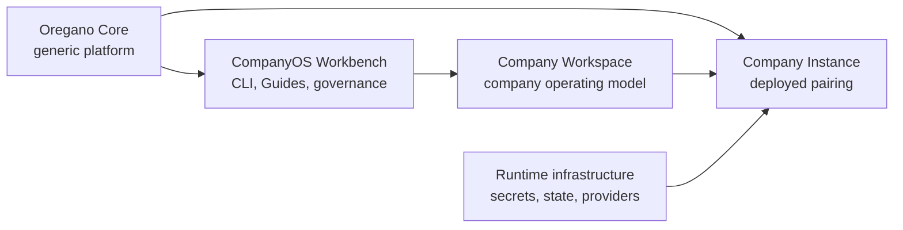

# CompanyOS Architecture Overview

A CompanyOS system has three operational parts and one contributor-facing surface.

- Oregano Core defines mechanisms that must work for every company.
- A Company Workspace defines how one company operates within those mechanisms.
- A Company Instance is the running result for one company and environment.
- The Workbench is how Human Contributors and Agent Contributors change a
  Workspace safely.

The primary placement rule is simple:

| Question | Destination |
|---|---|
| Must it work and remain safe for every company? | Oregano Core |
| Does it describe how this company works or decides? | Company Workspace |
| Is it a secret, live state, provider installation, or environment binding? | Company Instance |
| Does it try to bypass generic enforcement? | Stop; it is not a valid Workspace change |

Detailed boundaries are defined in [System boundaries](system-boundaries.md).

The open Package ecosystem is a supporting distribution plane, not another
operational authority layer. It lets contributors publish portable Blueprints,
Tools, and Connectors while Company Workspaces and Instances retain grants,
bindings, approvals, and activation. See [Ecosystem and Package
Architecture](ecosystem-and-packages.md).

Company Knowledge follows the same placement model. Reviewed OKF lives in the
Company Workspace, immutable projections and review state live in the existing
Company Instance database, and Oregano Core owns validation, bundling,
hybrid retrieval, deterministic graph traversal, citations, source envelopes,
Runtime Observations, and provider-neutral contracts. The maintained read-only
repository Source Connector feeds the same review boundary. Raw review input is
not operating truth and an external source never becomes a second authority
plane.
