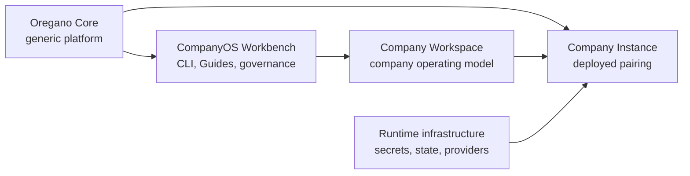

# CompanyOS Architecture Overview

A CompanyOS system has three operational parts and one contributor-facing surface.

- Oregano Core defines mechanisms that must work for every company.
- A Company Workspace defines how one company operates within those mechanisms.
- A Company Instance is the running result for one company and environment.
- The Workbench is how Human Contributors and Agent Contributors change a
  Workspace safely.

The primary placement rule is simple:

| Question | Destination |
|---|---|
| Must it work and remain safe for every company? | Oregano Core |
| Does it describe how this company works or decides? | Company Workspace |
| Is it a secret, live state, provider installation, or environment binding? | Company Instance |
| Does it try to bypass generic enforcement? | Stop; it is not a valid Workspace change |

Detailed boundaries are defined in [System boundaries](system-boundaries.md).

The open Package ecosystem is a supporting distribution plane, not another
operational authority layer. It lets contributors publish portable Blueprints,
Tools, and Connectors while Company Workspaces and Instances retain grants,
bindings, approvals, and activation. See [Ecosystem and Package
Architecture](ecosystem-and-packages.md).

## Multi-agent and Builder proposal path

An Instance may compile several Company Agents. Trusted surface facts select
one Agent through exact Agent Bindings before any model turn; message content
does not select authority. The Builder is one separately addressable Company
Agent. Its conversation still uses the normal Runner, while a confirmed
proposal is delegated asynchronously to an isolated coding worker.

```mermaid
flowchart LR
    M["Authenticated Slack message"] --> AR["AgentResolver<br/>exact surface binding"]
    AR --> SA["Sales, Marketing, or other Agent<br/>normal Runner turn"]
    AR --> BA["Builder Agent<br/>normal Runner conversation"]
    BA --> HC["Human confirms exact proposal"]
    HC --> BJ["Durable Builder job"]
    BJ --> RS["RepositorySourceAdapter<br/>exact base"]
    RS --> TG1["Trusted Git execution<br/>credential-brokered source bundle"]
    TG1 --> EA["BuilderExecutionAdapter<br/>credential-free isolated worker"]
    EA --> ACP["Private ACP v1 session<br/>Claude Code or Codex"]
    ACP --> TG2["Fresh trusted Git execution<br/>independent Workbench validation"]
    TG2 --> PP["ProposalPublisher<br/>outer commit and draft identity"]
    PP --> PR["Draft proposal for human review"]
```

`AgentResolver`, Builder job semantics, repository contracts, validation, and
proposal authority belong to Core. Runner transport, execution hosting, coding
agent profile, repository provider, credentials, and installations are
independent Company Instance bindings. ACP is private worker transport and is
not a Core-wide agent runtime contract. The maintained hosted GitHub provider
composes a second private execution adapter for repository-only Git commands;
that adapter never runs the coding agent and is not a public Core contract.
