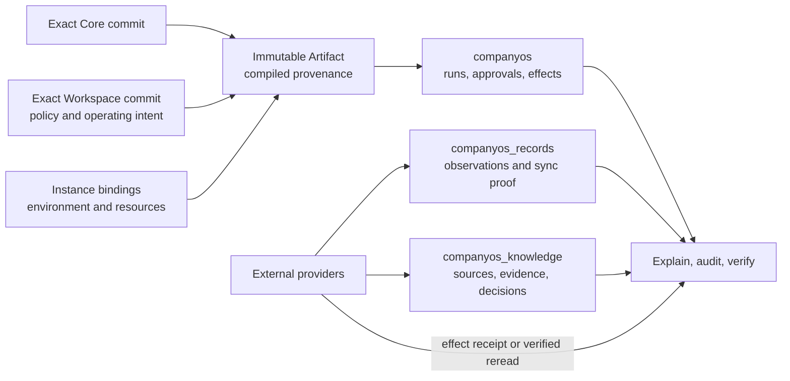

# System of Proof

The System of Proof is the connected evidence chain that lets CompanyOS answer
what ran, under which reviewed rules and exact versions, who authorized it,
what the system attempted, and what the external provider reported afterward.
It implements the principle that evidence beats claims.

It is a logical architecture, not a fourth database schema, a second Company
Workspace, or a new source of business authority. The proof chain composes
reviewed Git material, one immutable deployment Artifact, evidence stored in
the three existing Company Instance schemas, and attributable external
provider receipts.

## Sources of authority and evidence

The layers have different jobs and MUST NOT be collapsed:

| Layer | What it establishes | What it does not establish |
|---|---|---|
| Company Workspace Git history | Reviewed company intent, policies, Workflows, Agents, grants, and exact change history | That a deployment or provider effect occurred |
| Oregano Core and immutable Artifact provenance | Exact executable contracts, compiled material, versions, and hashes used by one Instance | Company approval or provider success |
| `companyos` | Workflow, identity, approval, handoff, idempotency, and effect-control evidence | External provider business truth by itself |
| `companyos_records` | Versioned provider observations, current pointers, authorized projections, freshness, reconciliation, synchronization receipts, and atomic Sprint event, state, decision, and intent evidence | Curated Handbook authority or a second provider authority |
| `companyos_knowledge` | Knowledge sources, versions, observations, Claims, evidence, review decisions, lifecycle state, and activation evidence | Automatic promotion into reviewed Workspace authority |
| External provider receipt or verified reread | The provider accepted or currently exposes the exact bounded effect or object version | That CompanyOS policy authorized the action |

A defensible proof normally links an authenticated principal, the exact Core,
Workspace, Artifact, policy, Agent, Tool, and model identities that applied, a
stable input or proposal digest, any attributable approval, the idempotency
claim and effect state, and the provider receipt or verified reread. Not every
row contains every fact; stable identities and digests connect the chain.

## Existing PostgreSQL schemas

The maintained StateStore uses one PostgreSQL database per Company Instance.
Neon/Postgres is the reference service. A qualified PostgreSQL-compatible
service, including Supabase Postgres, may host the same schemas without
changing their responsibilities.

### `companyos`: control and execution proof

This schema records the control path: database manifests, Workflow runs and
events, approval requests and decisions, idempotent effects and outcomes,
Conversation Assignments and transitions, published artifacts, Builder jobs,
and repository installations. Short-lived chat locks, queues, and comparable
coordination state also live here but are not durable business evidence merely
because they share the schema.

The maintained DDL is `packages/state-postgres/schema.sql`.

### `companyos_records`: operational record proof

This schema records immutable Source Events and object versions, current object
pointers, rebuildable projection rows, access decisions, synchronization
receipts and watermarks, reconciliation leases, durable timers, Connector echo
receipts, callback replay claims, and atomic Sprint event, monotonic state,
decision, and intent outcomes. A Sprint event, its resulting state and decision
evidence, and its newly created intents commit together or not at all. Provider
deletion is an observed version or absence decision; it does not silently erase
retained CompanyOS evidence.

The maintained DDL is `packages/state-postgres/records-schema.sql`.

### `companyos_knowledge`: knowledge and decision proof

This schema records Knowledge Snapshots, documents and fragments, source
receipts and versions, Runtime Observations and lifecycle decisions, Pages,
Claims and exact supporting evidence, identity and access decisions, Working
Syntheses, Decision Receipts, promotion candidates, model-execution evidence,
and rebuildable retrieval projections. These rows support explanation and
review; only the exact reviewed OKF in the Company Workspace is curated company
authority.

The maintained DDL is `packages/state-postgres/knowledge-schema.sql`.

## Retention model

Retention is a company policy expressed in its Company Workspace and enforced
for one Company Instance. Core supplies safe lifecycle mechanisms; it MUST NOT
embed a customer-specific duration.

CompanyOS distinguishes three categories:

1. **Durable proof** includes approvals, effect outcomes, provider receipts,
   immutable source versions, review decisions, and comparable evidence needed
   to explain a run later. A company may retain it indefinitely or adopt a
   governed finite policy.
2. **Rebuildable projections** include current and search-oriented read models.
   They may be rebuilt from retained authoritative inputs and are not a
   substitute for the durable proof chain.
3. **Temporary coordination state** includes locks, leases, replay claims,
   echo-suppression entries, queues, and explicitly temporary conversation or
   session state. Its mechanism-defined expiry continues to apply even when a
   company retains durable proof indefinitely.

The queued or leased status of a Sprint intent is coordination state. The
accepted Sprint event, resulting state version, deterministic intent content,
and terminal dispatch outcome remain durable proof; expiring a lease never
erases them.

The hosted Sprint path does not add a fourth evidence schema. Operator-opened
snapshots, Slack-normalized submissions, clock events, states, decisions,
intents, timer outcomes, and dispatch outcomes stay in `companyos_records`.
An allowlisted Slack conversation first enters that schema as immutable
generic `communication-message` object versions and access-scoped projection
rows. A Domain-owned derived-record envelope may interpret one projected
version, but does not create another database authority: the accepted Sprint
event stores the exact projection id, record id, and source-version id, while
typed references bind recognized card links to already authorized work-item
records. Provider message content never supplies identity, Agent selection,
approval, or effect authority. Historical Sprint replay uses an isolated
definition and controlled clock and stores only proof outcomes; the maintained
host refuses its compiled live communication and work-item bindings.
Hosted Sprint scenario runs use the same evidence schema and a separate
digest-derived definition and timer namespace. They execute the real compiled
host in proof-only Shadow mode and retain a bounded, content-free report over
durable event types, decision outcomes, intent states, timer states, source
versions, and active-binding readiness. The report includes full evidence
counts and digests while returning only a fixed maximum of individual rows; the
complete proof remains durable. It contains no rendered message body and does
not make a provider receipt claim. Repeating the same immutable input returns
the same proof digest without creating duplicate coordination rows.
An optional test-only publication adds the ordinary Tool execution and Slack
provider receipt to that proof chain. Before the effect, the host reruns the
scenario, compares the exact report digest, loads the chosen stored Monday
hand-off intent, and renders the compiled Workspace template. The receipt
records the actual Sprint Agent, template and content digests, exact test
binding, provider message id, thread reference, and publication time. A changed
digest or different intent type fails before a Connector call.
Any ordinary Tool authorization, confirmation, effect claim, and execution
outcome stays in `companyos`; an external provider receipt or verified reread
completes the chain. Shadow dispatch records a template digest and rendered
content digest only and produces no provider receipt because no provider effect
occurred. If a provider accepts an effect but a dependent receipt step cannot
be verified, the effect remains `unknown` with its bounded partial receipt. It
is never rewritten as an ordinary failure or retried automatically; an
operator must reconcile the provider before deciding any recovery action.
An exact-human subject confirmation for a reversible briefing is retained in
the same control chain as ordinary authorization. A Rollover batch uses the
ordinary R3 approval chain instead; its frozen item versions remain in Sprint
intent evidence, while the approved Tool request, complete preflight, provider
receipts, rereads, and any partial unknown outcome remain execution proof.

`retention: retain` means that CompanyOS does not schedule an automatic purge
merely because evidence has reached an age or disappeared from its provider.
It does not turn data into immutable legal records, defeat an applicable legal
obligation, block a valid data-subject request, or override a separately
approved deletion or legal-hold decision. Such an exception must be
attributable, scoped, dependency-checked, and itself leave non-sensitive
decision evidence. Backup retention and deletion must follow the same approved
company policy and remain an Instance responsibility.

The current schemas and adapters preserve substantial evidence, but CompanyOS
does not yet claim one universal automated retention and purge engine across
all three schemas. Until that contract exists and is qualified, a Company
Instance must not describe its retention policy as fully enforced merely
because the tables exist. Current implementation claims remain in
[Current System Status](../status/current.md).

## Minimum safety rules

- Secrets and credentials never enter proof rows, Git, prompts, receipts, or
  logs; proof stores SecretRefs and non-secret provider identities instead.
- Access to proof is authorized before content is returned. Audit evidence is
  not permission to disclose the underlying payload.
- Payload-free receipts are preferred whenever counts, identities, hashes,
  timestamps, and outcome state are sufficient.
- Raw conversations and personal content are not collected merely to make a
  proof chain look complete. If a Workflow genuinely requires them, its
  collection, access, purpose, and retention require explicit company policy.
- An external provider remains authoritative for its business objects. A
  receipt proves an observed outcome; it does not replace the provider record.
- Database presence is not proof of operational enforcement. Verification must
  bind the exact Instance, versions, policy, schema manifest, and external
  receipts relevant to the claim.

## Placement rule for future evidence

Before adding a table, classify the evidence. Generic proof structure,
validation, idempotency, access, and lifecycle mechanisms belong in Core.
Company-specific retention, purposes, roles, Workflow requirements, and
allowed audiences belong in the Company Workspace. Live rows, provider
identifiers, credentials, backups, and enforcement receipts belong to the
Company Instance. A new schema is justified only when an independent data
boundary cannot be represented safely in the three existing schemas; the name
“System of Proof” alone is never sufficient reason.

An `approval.requested` event binds the original authenticated requester to an
exact request ID, action, risk and payload hash, with its stable member ID and
Artifact identity. R4 authorization consumes this durable request evidence to
check separation from the approving human. Missing or conflicting request
evidence cannot authorize an effect; a later approving turn cannot replace
the original requester. Request and effect history remain retained on refusal.

Compiled workflow Tool evidence carries the exact workflow/version, manifest,
Artifact, Workspace commit, Instance, run, step and typed item identity. Runtime
run metadata uses the actual workflow identity and version; standalone Tool
invocations identify their Core revision. The effect claim has a stable identity
and compares its input digest separately, so changed content cannot mint a new
send. A valid completed effect retains its receipt even when a downstream
workflow output requirement or audit append fails. Unknown provider outcomes
retain partial evidence and require reconciliation. The guard's synthetic
Runtime tests are not durable engine or hosted human-acceptance evidence.
