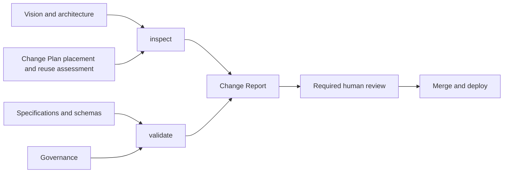

# Validation and Inspection

CompanyOS deliberately separates deterministic compliance from architecture
judgment.

`companyos validate` is deterministic, LLM-free, non-mutating, and blocking.
It validates document metadata or a Company Workspace and emits the same
diagnostics as human-readable text and structured JSON.

`companyos inspect` produces an Architecture Fitness Report. It discovers
facts about placement, protected paths, documentation impact, and known
anti-patterns, then requires explicit answers for judgments that static code
cannot prove. A required report can be enforced; honest judgment still needs a
human reviewer for protected changes.

Change Plan version 2 makes the architecture questions inspectable evidence.
The Workbench blocks a new plan unless it records responsibilities for Core,
Packages or Blueprints, Workspace, and Instance; reviews every governed
existing-mechanism family; confirms the company-value, secret, and public
fixture boundaries; and gives a Core reusability rationale. Inspection exposes
that structured assessment in its report. These checks prove completeness and
consistency, not that the recorded architecture judgment is semantically good.
Historical version 1 plans dated on or before 2026-08-31 remain readable.

