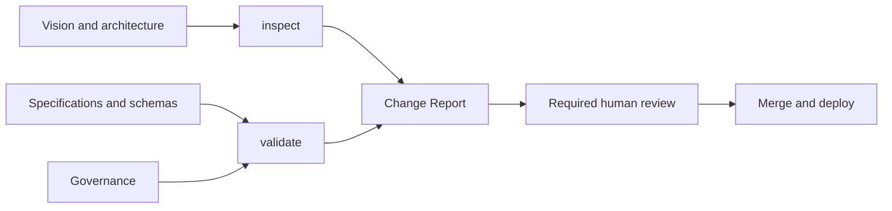

# Validation and Inspection

CompanyOS deliberately separates deterministic compliance from architecture
judgment.

`companyos validate` is deterministic, LLM-free, non-mutating, and blocking.
It validates document metadata or a Company Workspace and emits the same
diagnostics as human-readable text and structured JSON.

`companyos inspect` produces an Architecture Fitness Report. It discovers
facts about placement, protected paths, documentation impact, and known
anti-patterns, then requires explicit answers for judgments that static code
cannot prove. A required report can be enforced; honest judgment still needs a
human reviewer for protected changes.

