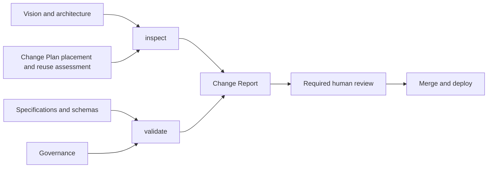

# Validation and Inspection

CompanyOS deliberately separates deterministic compliance from architecture
judgment.

`companyos validate` is deterministic, LLM-free, non-mutating, and blocking.
It validates document metadata or a Company Workspace and emits the same
diagnostics as human-readable text and structured JSON.

`companyos inspect` produces an Architecture Fitness Report. It discovers
facts about placement, protected paths, documentation impact, and known
anti-patterns, then requires explicit answers for judgments that static code
cannot prove. A required report can be enforced; honest judgment still needs a
human reviewer for protected changes.

Change Plan version 3 makes the architecture questions inspectable evidence
and keeps the plan small. A Core behavior or security plan records the
responsibility of Core, Packages or Blueprints, Workspace, and Instance; lists
only the governed mechanisms it extends, each with the bounded contract
extension as its reason, while every other mechanism is reused by definition;
names genuinely new Core mechanisms; confirms the company-value, secret, and
public-fixture boundaries; and gives a Core reusability rationale. The plan
carries no status and no approvals: the pull request that carries it is the
approval, and its merge through the required check is the implementation
record. Inspection makes three declarations bite: every changed file must
match `files_expected` (catch-all globs such as `packages/**` are rejected),
every listed test must be a real test file, and every affected document ID
must be changed in the same diff. A plan marked `proposal: true` describes
future work and may travel only with plan and documentation files. These
checks prove completeness and consistency, not that the recorded judgment is
semantically good. Historical version 1 and version 2 plans remain readable
and are not rewritten.

