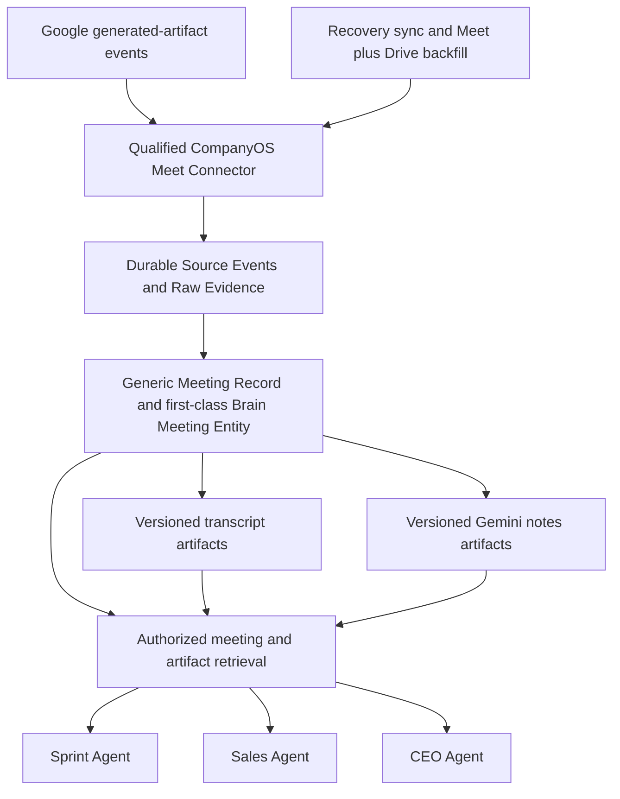
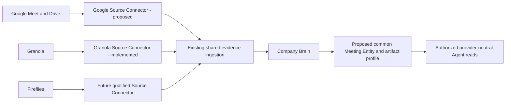

> Historical documentation. This subsystem was retired on 2026-09-11; these instructions must not be used for current setup or operation.

# Google Meet Evidence Ingestion and Scoped Meeting Retrieval

## 1. Proposed outcome and scope

Add a maintained, read-only Google Meet Source Connector that continuously
imports existing transcripts and Gemini notes into Company Brain. Make each
meeting occurrence a first-class Brain Entity with its own stable identity;
attach transcripts and Gemini notes as separately identified, versioned
artifacts. Events are the normal import path, periodic synchronization recovers
missed artifacts, and initial backfill reads Meet plus Drive. Let any authorized
Company Agent select a meeting, read its exact evidence, and cite passages.
Company Workspaces select sources, audiences, retention, and how their Agents
use that evidence; Instances supply credentials and provider installations.

Company Brain is already implemented: durable evidence, Pages and versions,
extraction, authorization and retrieval are existing delivery surfaces. The
[Company Brain architecture plan](2026-08-25-company-knowledge-implementation.md)
remains their design and delivery reference; referencing it does not mean the
Brain still needs to be built. This proposal extends that implementation with
Google ingestion, first-class meeting identity and scoped meeting retrieval.
The accompanying Core Change Plan is
`google-meet-knowledge-source-2026-09-07`. No provider is connected by this change.
Customer-specific adoption material belongs outside the public Core repository.

The first release imports already-generated artifacts. It does not attend
calls, record audio, enable transcription, send messages, change work items, or
make meeting statements Handbook authority. Importing all authorized meetings
does not grant every employee access to every meeting.

## 2. What exists and what must change

Inspection baseline: Core `0.5.13`, commit
`95f1ddcdfaa385561111cab9dfa8b4c7e6861cbc`.

| Surface | Existing implementation | Required work |
|---|---|---|
| Source contract | `source-contracts-v2.ts` supports meeting sources, pull/hybrid delivery, qualified bindings, inline evidence and Raw Assets. | Add the Google implementation and a strictly validated meeting selection/installation profile where current fields cannot represent it. |
| Registry | `source-registry-maintained.ts` registers GitHub, Granola and local files. | Register the exact Google Connector version and digest; keep selection outside generic orchestration. |
| Ingestion | `source-ingestion-v2.ts`, `source-sync-v2.ts` and Postgres pipeline state implement receipts, deduplication, leases and watermarks. | Reuse these for Google, including resumable backfill and delayed artifacts. |
| Hosted execution | `knowledge-source-runtime.ts` decodes a single Granola configuration; `knowledge-model-runtime.ts` also calls that decoder for extraction and compounding. | Generalize runtime source enumeration and processing. Merely adding a registry entry cannot deliver automatic Google ingestion. |
| Brain | `brain-contracts.ts` has a `meeting` Page type, immutable versions, Claims and evidence locators, but its Entity kind enum does not include `meeting`. | Extend the existing Entity mechanism with first-class meetings, typed occurrence metadata and evidence-bound artifact relationships. |
| Extraction | `extraction-pipeline.ts` derives a Page from each Source Object; metadata currently contains source locator and classification basis. | Copy trusted meeting metadata deterministically; distinguish provider-generated notes from transcripts before model extraction. |
| Retrieval | `retrieval-unit.ts` supports timestamps and provider-object locators; V2/V3 retrieval supports exact reads and authorization. | Carry meeting identity and occurrence time into projections and apply structured filters before ranking. |
| Agent Tools | `standard-tools/knowledge.ts` exposes search by query/limit/mode and get by path. | Add bounded filters, enumeration, exact-version reads and chunk navigation through the normal Capability boundary. |
| Work processes | Company Records supplies operational facts; existing Sprint code and a separate workflow-engine proposal coexist. | Keep meeting relevance rules in Workspaces. Add no new Sprint-specific Core executor or mandatory dependency on the proposed engine. |

The current `company-knowledge/pages/<page-id>` citation path can already select
a known Page. That is useful infrastructure, but it does not prove discovery
of every meeting in a week, access to a historical revision, or precise
timestamp citations throughout the full Agent path.

Granola is an implemented, registered Connector, not a prospective integration.
The [delivery status](../../status/current.md) records a production reconciliation
on 2026-08-26 that imported 21 of 21 notes with complete transcript evidence;
provider webhook delivery was still pending its signing-secret installation.
That historical receipt is not a fresh production health check or evidence
that every Company Workspace has activated Granola. No maintained Google Meet
or Fireflies Source Connector exists at this inspection baseline. This change
adds a plan only; it does not implement or activate those integrations.

Its own stable meeting identity is required even when only notes exist, when
a transcript arrives later, or when both artifacts receive new versions. The
meeting identity must not depend on artifact title, content digest or arrival
order.

## 3. OpenClaw and Hermes findings

Research checked on 2026-09-07. These are implementation references, not
dependencies or endorsements of their authorization model.

| Reference | Verified mechanism | Implication for CompanyOS |
|---|---|---|
| OpenClaw bundled `gog` skill | A CLI skill for Google Workspace; its published instructions include Drive search and Docs reads. | The skill is an Agent-facing wrapper, not a governed Company Brain ingestion service. [Source](https://github.com/openclaw/openclaw/blob/main/skills/gog/SKILL.md). |
| `openclaw/gogcli` | Meet commands use Google's Go Meet v2 client. `history` resolves a meeting code to a canonical space, lists conferences with pagination, and emits JSON. The inspected `MeetCmd` has create/get/update/end/history/participants, with no dedicated transcript subcommand. Generic Discovery API access is also documented. | Reuse canonical identity, explicit account selection, pagination and machine-readable output patterns. Build a native read-only Connector rather than shelling out to a broad personal CLI. [Commands](https://github.com/openclaw/gogcli/blob/981ca4a163e80f3476fdbcc30dbcb27bebb6bbfc/internal/cmd/meet.go), [history](https://github.com/openclaw/gogcli/blob/981ca4a163e80f3476fdbcc30dbcb27bebb6bbfc/internal/cmd/meet_history.go), [README](https://github.com/openclaw/gogcli/blob/981ca4a163e80f3476fdbcc30dbcb27bebb6bbfc/README.md). |
| ClawHub OpenUtter | A community skill joins Meet using Playwright and captures live captions. | This creates evidence by attending a call; it is a different product from retrieving existing Google artifacts. [Listing](https://clawhub.ai/sumansid/skills/openutter). |
| ClawHub Vexa | A community skill calls Vexa bots and APIs, retrieves transcripts and writes meeting reports into local memory. | Its meeting bundle and post-meeting ingestion pattern is useful; its extra bot/provider infrastructure is unnecessary for this scope. [Listing](https://clawhub.ai/dmitriyg228/skills/vexa), [provider repository](https://github.com/Vexa-ai/vexa). |
| Hermes bundled `google_meet` plugin | Optional in-tree plugin: Playwright joins calls and scrapes captions into files; realtime audio and remote nodes are additional modes. Its README explicitly excludes multi-tenant node sharing and calendar scanning. | Hermes does have a built-in optional Meet integration. It is not the native artifact synchronization design needed here. Prefer its specific plugin README over the broader built-in-plugin overview where their transcription descriptions differ. [Implementation README](https://github.com/NousResearch/hermes-agent/blob/08b140d14e6c1d49f9b7ad02c9437fe940d54d65/plugins/google_meet/README.md). |
| Hermes Google Workspace skill | OAuth-managed `gws` backend with Python fallback for Workspace operations; Hermes also integrates ClawHub as a community skill source. | Useful for setup UX and provider separation. No inspected component supplies CompanyOS tenant isolation, source watermarks or evidence authorization. [Workspace skill](https://github.com/NousResearch/hermes-agent/blob/08b140d14e6c1d49f9b7ad02c9437fe940d54d65/skills/productivity/google-workspace/SKILL.md), [skill sources](https://hermes-agent.nousresearch.com/docs/user-guide/features/skills/). |

Recommendation: implement against official Google APIs inside the maintained
Source Connector boundary. Do not install OpenClaw, Hermes, a marketplace skill,
or a second meeting bot into a Company Instance to obtain this capability.

## 4. Google API design and coverage

### 4.1 Retrieval and artifact identity

Use `conferenceRecords.list` with bounded time windows and optional exact
space filters; drain every page. A conference record identifies one occurrence
of a call. A recurring Meet URL identifies a space and must not be used as the
occurrence's primary key. Google deletes conference records 30 days after the
conference ends. [List contract](https://developers.google.com/workspace/meet/api/reference/rest/v2/conferenceRecords/list),
[conference identity and expiry](https://developers.google.com/workspace/meet/api/reference/rest/v2/conferenceRecords).

For each eligible conference, list all transcripts and all smart notes. Wait
for `FILE_GENERATED`; `ENDED` alone does not mean a file is ready. A conference
can have several transcription or note-taking sessions, so retain every
artifact. Smart notes represent “Take notes with Gemini” and provide a Docs
destination. Google announced general availability of smart-note get/list and
smart-note events on April 2, 2026. Use the stable v2 API; the artifact guide's
remaining v2beta examples are outdated relative to the release notes and v2
reference. Qualification still verifies the bound tenant's actual entitlement
and scope coverage. No Developer Preview enrollment is part of this plan.
[GA announcement](https://developers.google.com/workspace/release-notes#april_02_2026),
[Smart-note resource](https://developers.google.com/workspace/meet/api/reference/rest/v2/conferenceRecords.smartNotes),
[list endpoint](https://developers.google.com/workspace/meet/api/reference/rest/v2/conferenceRecords.smartNotes/list).

Fetch structured transcript entries, preserving entry IDs, speaker references
and start/end times. Drain `nextPageToken` even when a page is smaller than the
requested size. API entries can differ from the editable Docs transcript;
preserve their separate representations rather than overwriting either.
[Entries contract](https://developers.google.com/workspace/meet/api/reference/rest/v2/conferenceRecords.transcripts.entries/list).

Fetch linked transcript documents and Gemini notes through Drive export using
their verified document IDs. Keep an exact document revision/fetch receipt and
content digest. Never follow an arbitrary export URL supplied in provider text;
construct allowlisted Google API requests. Drive export size limits require
explicit oversize handling, not a clipped transcript represented as complete.
[Drive export contract](https://developers.google.com/workspace/drive/api/reference/rest/v3/files/export).

Transcription must already have been enabled in Meet; recording is not required.
Meet API transcript entries expire after 30 days, while saved documents follow
Drive/Vault retention. A missing artifact is a coverage gap, not permission to
generate a replacement transcript from a summary.
[Artifact behavior](https://developers.google.com/workspace/meet/api/guides/artifacts).

### 4.2 Authentication and company isolation

Start with a company-owned OAuth client and user consent for each approved
organizer/account. Bind the stable authenticated Google subject to one
installation and source; verify that identity on qualification and refresh.
Refresh tokens, OAuth client secrets and token rotation stay in Instance
secret storage. Use a state-bound OAuth flow with PKCE where supported;
never exchange an authorization code through Agent chat or persist tokens in Git.

The intended connection experience is separate from signing in to CompanyOS:

1. The Instance operator configures the company-owned Google Cloud OAuth client,
   enabled APIs and exact callback URI. On the Vercel adapter, server-side
   environment configuration may supply the client ID and client secret through
   the Instance secret boundary. These credentials identify the application;
   they do not themselves grant access to a user's meetings.
2. An authorized operator starts "Connect Google" for one approved source
   account. The browser opens Google's consent screen and returns to the
   Instance callback. Bind the one-use state to the initiating authenticated
   operator, Instance, installation and intended source; reject replay or a
   callback for another account/installation.
3. The backend exchanges the code, verifies account identity and granted scopes,
   and stores the offline refresh token in a durable, encrypted Instance
   credential store. Workspace files retain only declarations; bindings contain
   SecretRefs. No Google password or token is copied through the user interface
   into Git or Agent conversation.
4. The Connector refreshes access automatically. Revocation or a failed refresh
   marks that connection as requiring reconnection and stops new reads. Source
   qualification separately confirms which organizers, meetings and documents
   are covered before production activation.

Consent is needed for each bound source account, not for every employee who
later reads authorized Brain evidence. It does not make a Google connection a
mandatory part of CompanyOS onboarding. [Google web-server OAuth flow](https://developers.google.com/identity/protocols/oauth2/web-server).

This connection flow and token lifecycle are implementation work. The current
hosted Knowledge Source runtime resolves only `env:` SecretRefs; it has no
complete Google callback and durable OAuth credential lifecycle. Add a small
Instance credential-store interface with encrypted persistence, atomic token
updates, revocation and an environment-secret compatibility adapter. Static
application secrets may remain in server-side environment configuration; the
callback persists per-installation user tokens through the credential store.
Do not persist tokens by assigning `process.env`, require routine manual token
replacement, or grant the application a broad Vercel management credential to
rewrite deployment variables. Credential storage remains independent of the
hosting provider and is never stored as searchable Brain evidence.

Request `meetings.space.readonly` for Meet reads and qualify
`drive.meet.readonly` for documents created or edited by Meet. The latter is
narrower in content scope than general Drive read access, but Google still
classifies it as restricted. Record the applicable OAuth verification and
server-side data assessment requirements before public multi-company rollout.
Internal customer-owned clients and any verification exceptions require
explicit qualification; a private pilot does not prove public distribution
readiness. Do not silently request `drive.readonly`, Gmail, write scopes or
Admin Directory. [Meet authentication](https://developers.google.com/workspace/meet/api/guides/authenticate-authorize),
[Drive scopes](https://developers.google.com/workspace/drive/api/guides/api-specific-auth).

One consenting account does not expose the entire company's meetings. Maintain
an explicit coverage inventory of organizer accounts and selected spaces. For
larger companies, add administrator-approved domain-wide delegation as a
separately qualified authentication profile with an explicit impersonation
allowlist; a service account alone is not Meet user authentication.

Use one stable source per bound account and policy cohort. Credentials for
different companies never share an installation, token cache, source lease,
cursor, object key, Raw Asset or authorization context. Duplicate observations
through different accounts remain separate provenance until an exact provider
identity relation is established; retrieval may collapse their presentation
only after authorization. Changing credentials for the same approved account
must not create new meeting identities.

### 4.3 Automatic synchronization

Ship an event-first hybrid source. A generated-artifact event durably enqueues
an immediate fetch; a background worker imports the available artifact into
Brain without waiting for the next recovery cycle. Pub/Sub provisioning,
subscription renewal and a qualified receiver are part of normal production
activation, not an optional later feature. The Source Connector retains a
pull interface for recovery and backfill. Both paths feed the shared durable
Source Event queue and use the same fetch/version logic.

Proposed recovery defaults are a 15-minute interval, a 48-hour overlap, and a
daily sweep of the full currently available Meet history. These are configurable
recovery budgets, not a delay applied to normal event processing or a guarantee
of immediate Google artifact availability. Report event receipt-to-durable-import
latency separately from Google's conference-to-artifact generation delay.
Track ended conferences with pending artifacts separately, retry them through
their retention window, and refresh already-known Drive documents for edits.
Do not use only the newest conference start time as an artifact watermark.

Hybrid mode subscribes to `google.workspace.meet.transcript.v2.fileGenerated`
and `google.workspace.meet.smartNote.v2.fileGenerated`.
User-target subscriptions cover spaces owned by that user, not every meeting
they attended. Invited participants have narrower event eligibility. Event
coverage must be checked independently of REST read access; polling fills
subscription gaps. [Meet events](https://developers.google.com/workspace/events/guides/events-meet).

Google delivers Workspace events through Cloud Pub/Sub. Authenticate push
requests using Google's signed identity token, validating issuer, audience,
expiry, service-account identity, expected subscription and allowed source.
Do not reuse Granola's shared-secret HMAC verifier. Store only validated,
content-free references before acknowledging. Fetch asynchronously. Provisioning
subscriptions and Pub/Sub resources is an Instance setup operation; it does not
make the source's content-reading interface a business write Tool.
[Authenticated Pub/Sub push](https://docs.cloud.google.com/pubsub/docs/authenticate-push-subscriptions).

Persist subscription expiry, renew before expiry through a durable job, and
handle suspension or deletion with health evidence and reconciliation. Use the
server-returned expiry; do not encode an assumed permanent subscription or rely
only on reminder events. [Lifecycle](https://developers.google.com/workspace/events/guides/events-lifecycle),
[renewal](https://developers.google.com/workspace/events/guides/update-subscription).

Retry transient failures with bounded backoff, jitter and `Retry-After` support.
Persist resumable page state and pending objects. Partial listings never advance
a completed watermark or prove deletion. Expiry from the rolling Meet history
is not provider deletion of the Drive file. Permission loss, deletion, expiry,
missing transcription and generation delay must remain distinguishable.

### 4.4 Historical import

Import available Meet history first, then enumerate approved Drive folders or
exact document IDs for older artifacts. Scope Drive searches by approved account,
container, MIME type and date bounds; an artifact title alone is not proof of
type or meeting identity. [Drive file model](https://developers.google.com/workspace/drive/api/guides/about-files).
Retain a ledger of imported, duplicate,
unresolved, inaccessible, expired and oversized items. Only explicit provider
links or reviewed mappings establish the relationship to a meeting occurrence.
A title/date match can propose a relationship but cannot merge two meetings.

For legacy documents without a surviving conference record, retain a stable
Drive-based artifact identity and unresolved meeting association. A reviewed
mapping can create or select the first-class Meeting Entity and link the
artifact without rewriting old evidence IDs. Gemini notes
stay `ai-notes`; a transcript document stays `transcript` with
`representation: drive-document`. A copied or arbitrary document that the
narrow Drive scope cannot access requires an explicit file-access decision,
never an automatic permission expansion.

## 5. Data contract: keep the meeting and its evidence precise

Extend the existing Entity identity and membership mechanism with
`entityKind: meeting`; update its TypeScript enum, validators, database checks,
access projections and conformance tests together. This is a real durable
Meeting Entity, not a search-time grouping of independent documents. Give it
a versioned, evidence-backed occurrence record and a canonical `meeting` Page
for provider metadata. Transcripts, notes and their representations are child
artifacts with explicit `has-artifact` relationships and independent policies.

The normalized Generic Meeting Record feeds this Entity through the shared
Source pipeline. It is not a second database or an additional authoritative
Company Records ingestion loop. Company Records continues to supply work-item
facts; any future operational meeting projection must reference the same
meeting identity and source receipts.

Introduce a typed, versioned meeting evidence profile carried through Raw
Evidence, Page/Entity versions and rebuildable retrieval projections. Proposed
fields below are not accepted by the current schema until Phase 1 implements them.

| Field | Meaning |
|---|---|
| `meetingId`, `meetingKey` | Durable Brain Entity ID and tenant/provider-qualified occurrence identity; Google uses the conference record when known. Other providers use their own verified occurrence IDs; archived evidence may have an unresolved association. |
| `meetingSeriesKey` | Optional verified recurring-series or space identity; never the occurrence ID. |
| `artifactKey` | Exact transcript session, smart-note session or archived Drive file. |
| `artifactKind` | `transcript`, `ai-notes`, or `notes` with explicit origin; Google imports use the first two. Human-edited or mixed notes retain their provenance rather than being relabeled as a transcript. Preserved in every derived citation. |
| `representation` | Registered, versioned representation identifiers. Google initially supplies `meet-entries` and `drive-document`; other adapters can declare their native representations without requiring a Google document. |
| `startedAt`, `endedAt` | Actual meeting occurrence bounds, separate from ingestion `observedAt`, document edit time and artifact session times. |
| `provider`, `providerAccountId`, `providerObjectId`, `providerRefs` | Verified provider-neutral provenance. Google resource names and document IDs are optional typed Google references, not mandatory fields for other providers. Private runtime data, not public fixtures. |
| `segments` | Stable entry/segment IDs, speaker references, text and line/timestamp bounds. |
| `completeness` | Complete for the fetched artifact, partial, pending or unavailable, plus reasons and observed coverage. Does not assert whole-call transcription. |
| `relatedObjectRefs` | Exact project/work-item/calendar references with mapping proof; inferred matches stay proposals. |

Keep one source-specific child Page per artifact representation under the
existing Page identity rule, with an explicit artifact profile and declared
transcript/notes extraction behavior. New Google child Pages use the existing
`note` type with a typed artifact profile; the profile selects transcript or
AI-note extraction independently of Page taxonomy. Reserve the Google parent `meeting` Page for
the occurrence. Use existing membership receipts for exact associations and
extend typed relations only where needed. The Meeting Entity exists before all
artifacts arrive and survives artifact replacement or retention changes.

Google's conference identity establishes same-meeting associations across
authorized account sources within one company. Cross-provider associations
(for example a Granola note and a Google conference) require an exact reference
or reviewed identity decision. A recurring space never merges its occurrences.
No content similarity or shared title can establish meeting identity.

Meeting reads return only authorized metadata and child references. Access to
the parent never grants access to a restricted transcript; seeing a summary
never reveals the hidden transcript's existence or count. Derived meeting
overviews inherit contributing evidence restrictions. A Meeting Entity can
have several Pages and artifacts while remaining one stable identity.
Existing Granola `meeting` Pages retain their identities and taxonomy; a later
qualified Entity association does not rewrite or silently reclassify them.

Canonical normalization determines a representation's content digest. Keep
provider revision, content digest and ACL revision separate. When an API lacks
a revision token, use an explicitly marked observed-content version derived
from normalized content; exclude fetch time and delivery ID. Read Drive
metadata before and after export and retry concurrent modification. Repeated
events and poll results then create one immutable version per actual observed
revision. ACL-only changes update authorization without manufacturing new text.

Preserve speaker identity as a provider reference. Anonymous/dial-in speakers
remain unresolved; names and meeting attendance never create roster membership.
Model extraction may create evidence-bound proposals, but cannot supply trusted
meeting IDs, occurrence times, permissions, or exact work-item links.

Gemini notes are provider-generated summaries. Their presence is evidence that
the notes say something, not proof of a verbatim human statement. Derived
Claims must retain that origin and cannot automatically become source-literal
human Takes. Prefer a transcript passage when verifying an asserted quote or
commitment; expose disagreement and missing primary evidence.

## 6. Authorization and lifecycle

Authorize source admission, model processing and every search/get/chunk/graph
request independently. Source root policy is the maximum CompanyOS audience;
provider access evidence may narrow it. Returned meeting metadata, counts,
participants, related artifacts and synthesized text are protected too.

The first qualification may use a reviewed fixed CompanyOS policy for an
explicitly authorized archive cohort. It must state that this is deliberate
company access policy, not a claimed mirror of Google ACLs. Separate HR,
leadership, customer and team cohorts where their audiences differ. A general
all-visible-account import remains quarantined until its company policy is
reviewed. Unresolved Google groups, domain/link sharing, external principals
or incomplete permission evidence cannot be mapped to company-wide access.

If provider ACL mirroring is selected, qualify direct, inherited, group and
external access cases with negative tests first. Read permission does not
imply permission to list every ACL. Missing evidence quarantines the object.
Permission loss removes ordinary retrieval and model access promptly according
to the configured ACL freshness bound; retained historical bytes are not
automatically readable. A revoked source fails closed even if cached content
exists. Derived summaries inherit every contributing evidence restriction.

Reuse permanent or finite retention, legal hold and the existing governed
deletion/restore/purge protocol. Google expiry/deletion records source state;
it does not silently purge retained Brain evidence. Retained bytes, permission
to retrieve them, and permission to send them to a model are separate facts.

## 7. Agent retrieval and Sprint use

Extend the standard provider-neutral Knowledge surface, including Capability
schemas, Tool schemas, adapters, Postgres queries and fallback paths:

1. `knowledge.search`: add typed source, `meetingId`, artifact-kind and occurrence
   interval filters; optionally exact related-object references. Filtering
   precedes ranking, limits, graph expansion and model context construction.
2. `knowledge.list`: add cursor-based authorized enumeration of first-class
   meetings and their artifacts for a date range/source/meeting. Search top-k
   is not an inventory. Return a bounded
   coverage result and scoped synchronization watermark, not a misleading
   “all meetings” claim. A filter-only request is valid here.
3. `knowledge.get`: preserve existing path input and add a Meeting Entity
   selector, an exact artifact version/digest selector and bounded segment
   navigation. A meeting read returns its authorized artifact manifest and
   metadata; an artifact read returns its evidence. Long Raw Assets must be
   available through authorized reads; do not truncate to one prompt window.
4. Citations/context receipts: preserve source, occurrence, artifact kind,
   representation, immutable version, segment and provider link. Line locators
   map deterministically to stored timestamp segments. Reauthorize historical
   reads against current lifecycle/access controls.

Unknown filters must be rejected, never ignored by a V2 or V3 fallback. Include
filters and cursors in query/cache/context digests. A query constrained to one
meeting cannot expand to graph neighbors from unrelated meetings. Source
coverage and content freshness must survive the Agent answer envelope.

Example intended flow, using proposed contracts:

For “What did we discuss about work item 42 in last Friday's planning?” the
Agent resolves Friday in the Workspace timezone, enumerates the configured
meeting cohort, disambiguates occurrences if necessary, searches within the
selected meeting, reads exact segments and returns citations. It reports
unavailable evidence rather than selecting a similarly named meeting silently.

For a weekly Sprint brief, the Workspace defines meeting cohorts and the
period. Knowledge supplies cited discussion context; Company Records supplies
task state, ownership and submitted updates. A meeting can support a question
about a blocker or a proposed clarification. It cannot satisfy a required human
Sprint submission, mark work done, assign an owner, or authorize a Monday write.
Use exact provider object references or reviewed mapping receipts for task links;
semantic matches remain suggestions. No customer process or department names
are hardcoded in Core prompts, schemas, timers or tests.

## 8. Placement and mechanism reuse

| Boundary | Responsibility |
|---|---|
| Core | Source validation/registry, Google adapter, normalized metadata, generic source runtime, authorization, persistence, processing, retrieval contracts, operator diagnostics and synthetic conformance tests. |
| Package / Blueprint | Preserve the privileged Connector seam. A later Blueprint may distribute declarative meeting-reader instructions; no marketplace or arbitrary module loader is needed in this delivery. |
| Workspace | Source requirement, allowed artifact kinds, meeting cohort and process mapping, data owner, access/retention policy, Agent Tool grants and usage instructions. |
| Instance | Account and OAuth client bindings, SecretRefs, provider qualification, exact resources, recovery schedules, Pub/Sub and subscriptions, database state and deployment receipts. |

Provider adaptation belongs to Core's maintained Connector boundary. The
Workspace selects an available provider and its policy; it does not implement
API pagination, credential refresh or evidence normalization. The Instance
binds the selected provider account and supplies its secrets. Authentication
is provider-specific: Google uses the qualified OAuth profile; the existing
Granola Connector uses its Workspace API key and separate webhook signing key.
A future Fireflies Connector must qualify its own supported API and auth
profile; implementing it is outside this proposal's delivery scope.

Meet and Drive are two APIs inside the Google adapter, not mandatory stages
for other providers. A provider-specific artifact can be ingested even when
its meeting association remains unresolved. Adopting the common meeting profile
for existing Granola evidence requires an explicit, compatible enrichment or
backfill; generic source support alone does not prove that enrichment exists.
The Sprint Agent selects meetings and evidence through Knowledge Tools, without
calling Google, Granola or Fireflies directly.

Reuse AgentResolver unchanged; meeting text must never route an Agent or grant
Tools. Extend ToolSet/Capability resolution only for explicitly versioned new
Knowledge reads. Reuse ModelRecipeResolver and Prompt Registry; any new origin
rules or context shape update their exact prompt contract and fixtures. Reuse
Company Records for operational facts, identity controls for access and
speaker mappings, timers for source work, and existing idempotency/receipt
mechanisms for setup and synchronization. No second database, meeting-specific
authorization roster, task-state store or Sprint scheduler is introduced.

## 9. Delivery phases and concrete acceptance

### Phase 0 — provider qualification spike

Using a separately authorized test tenant, record the exact API/Discovery
versions, required scopes and a non-secret identity/coverage receipt. Verify
transcript entries, a transcript Doc and Gemini notes from one completed call;
verify two occurrences of one recurring space, delayed generation, edited Docs,
an older archived document and an inaccessible artifact. Check narrow Drive
scope export/list/metadata behavior and actual transcription/notes entitlement.
Use the GA smart-notes v2 surface and prove both artifact-generated event types
through the real receiver. Do not broaden scopes or substitute notes for a
failed transcript read.

### Phase 1 — reusable Core ingestion

- Add `packages/connectors/google-meet-knowledge-source-v2.ts` and register its
  exact version. Add a narrowly typed Google installation profile keyed to
  `installationId`, with stable authenticated subject and optional approved
  archive containers. Extend Source requirement/config schemas only for the
  missing declarative meeting selection fields; document old-profile behavior.
- Implement the operator connection/callback flow, scoped credential-store
  interface and durable OAuth refresh lifecycle from Section 4.2. Provide a
  Vercel setup adapter while keeping credential and connection contracts generic.
  Extend setup and recovery receipts without exposing token material.
- Add typed meeting evidence metadata to Source envelopes and preserve it in
  `extraction-pipeline.ts`, Brain versions and source stores. Maintain compatibility
  with GitHub, Granola and local sources that omit this optional profile.
- Add `meeting` to the existing Entity contract and implement versioned
  occurrence metadata, the canonical meeting Page and exact artifact
  relationships. Create the parent deterministically before attaching the
  first artifact; delayed arrivals and multiple account observations upsert
  the same Entity with attributable receipts and independently scoped Pages.
- Replace the single-Granola decoder dependency in
  `knowledge-source-runtime.ts` and `knowledge-model-runtime.ts` with generic
  configured-source resolution. Keep legacy Granola configuration as an explicit
  compatibility input. Source work is leased per source; mixed/global compounding
  still runs once at its declared scope.
- Wire event ingress, queue processing, extraction and compounding into actual
  hosted routes, with recovery/backfill schedules and subscription renewal.
  Qualify Google push verification separately from Granola's signature protocol.
  Keep Google-specific networking inside the adapter and ingress verifier.

Acceptance: a restart after fetch or persistence, duplicate push/pull delivery,
multi-page backfill and a rate-limit response produce complete recoverable
evidence without duplicate versions, duplicate Meeting Entities or false
watermarks. Notes-first, transcript-first and simultaneous arrivals converge
on the same meeting and two separately identifiable artifact types. A Google source and a
Granola source operate independently in one synthetic Instance. A second
synthetic company uses the same code with different bindings. Import completeness
does not depend on a model call succeeding.
OAuth acceptance includes initial consent, a backend restart, an access-token
refresh, callback replay rejection, installation mismatch, concurrent refresh,
revocation and reconnection to the same source account without duplicate
meetings. Neither runtime receipts nor model inputs contain credentials.

### Phase 2 — exact meeting retrieval

Update `packages/standard-tools/knowledge.ts`, the matching Capability catalog,
`knowledge/contracts.ts`, `retrieval-v2.ts`, `retrieval-v3.ts`,
`retrieval-unit.ts`, `unified-provider.ts`, Postgres projection/query adapters
and Runner citation/context handling. Add additive schema/index changes only
where required; rebuild projections from retained evidence. Define optional
filter compatibility and the new list/versioned-get contracts in the registry.

Acceptance: enumerate every authorized fixture meeting in a time range; select
one of two same-title meetings; cite a timestamp in a long transcript; read the
old version after a Doc edit; distinguish notes from transcript; preserve Spanish,
English and mixed-language text; deny an unauthorized meeting without revealing
its title/count; keep identical behavior through every enabled fallback. Test
ACL changes, source revocation, cross-company keys and adversarial instructions
inside notes. Test a transcript/notes disagreement and unavailable transcript.

### Phase 3 — private Workspace and Instance adoption

Prepare a separate Workspace Change Plan against the released Core pin. Add
the source requirement, meeting access policy, reviewed roster groups and
Knowledge grants to the selected Agent. Bind company-owned accounts, qualify
storage/model access and activate synchronization in an isolated preview.
Backfill with a coverage ledger, then complete one real post-meeting import,
cited query, exact read, negative access case and outage recovery.

An existing Sprint shadow deployment remains effect-free. Preview meeting
context first; do not activate scheduled Slack or Monday writes through this
change. Only replace an older ingestion path after exact artifact identity and
duplicate behavior have been verified; leave its unrelated business effects
outside this migration. Exact company selections and operator decisions remain
in the private Workspace/Instance adoption record.

### Phase 4 — release, operate and generalize

Run the relevant test suites, `pnpm check`, Core inspection and version-matched
Workspace validation. Database-backed suites must actually run against an
isolated database when persistence or projections change; skips do not prove
acceptance. Record pinned Core/Workspace/Connector/database versions, backup
restore, source lag, pending artifacts, extraction lag, ACL failures and token/
subscription health. Prove the second-company fixture before general release.

Implementation PRs update the Knowledge specification, compatibility registry,
source Guide and its bundled copy, Knowledge command docs, Instance architecture,
status and affected onboarding/recovery/operator docs. If maintained live setup
changes, include every document/runbook required by its Core documentation
contract. This proposal changes only its plan, status pointer and generated
documentation indexes.

## 10. Versioning, rollback and remaining decisions

The new public enumeration and exact meeting-query capability warrants a Core
minor release under the pre-1.0 versioning policy. Select its number at release
time; do not fabricate an immutable pin. Connector implementation version and
Source protocol version are separate. Existing source profiles remain supported.
New optional metadata needs explicit defaults and deterministic projection
rebuild behavior, not silent reinterpretation of retained evidence.

Rollback pauses Google synchronization/subscriptions and new Agent grants, then
restores the prior exact Instance pairing. Retain imported evidence and receipts
under their policies; rebuild retrieval projections as needed. Never roll back
by deleting transcripts, weakening ACLs, dropping additive tables or restoring
an old provider credential. The existing Granola source must continue to run.

Before activation, each adopter must supply exact organizer/account coverage,
archive locations and date range, meeting audiences and any exceptions,
transcription/notes availability, and the approved OAuth deployment profile.
The qualification spike resolves actual Google scope/API availability. These
are activation inputs; they do not prevent reviewing or implementing the generic
Core proposal. Both transcripts and Gemini notes are included in the requested
product scope and must remain separately identified.
