# Company Brain and Handbook Architecture and Delivery Plan

## 1. Purpose and replacement statement

This document is the single active implementation plan for Company Brain and
Handbook knowledge in CompanyOS. It replaces every earlier architecture and
delivery direction in this file. Earlier implementation Change Plans remain
immutable delivery evidence, but they do not override the approved target in
this plan.

The target is a native CompanyOS capability that continuously ingests company
evidence, creates attributed and temporally traceable working knowledge, and
promotes only authoritative company decisions into the version-controlled
Handbook. The capability remains part of Oregano Core, a Company Workspace, and
its Company Instance. It does not introduce a parallel agent runtime, a second
control plane, or a second database.

This plan deliberately separates two concerns:

1. **Company Brain** stores evidence, Pages, Claims, timelines, relationships,
   and model-generated working syntheses. It is designed for automatic writes
   with provenance and access controls.
2. **Company Handbook** stores the exact, current, governed operating truth of
   the company in Open Knowledge Format (OKF). It remains the only curated
   Company Knowledge authority.

## 2. Approved decisions

The accountable owner approved the following direction through the 2026-08-26
Company Knowledge design discussion:

| Decision | Approved direction |
|---|---|
| Product shape | Build one native Company Brain integrated into CompanyOS and one authoritative Handbook boundary |
| Database | Use one Company Instance StateStore database with `companyos` and `companyos_knowledge` schemas; the maintained profile provisions or adopts Neon/Postgres, and no profile adds a second database URL for Brain state |
| Setup and database lifecycle | A new Instance creates or adopts one StateStore resource and binds its SecretRef; `database prepare` detects an empty, older, or current catalog and selects bootstrap, additive upgrade, or read-only verify while recording non-secret qualification evidence |
| Provider boundary | Keep database preparation independent from Vercel: the maintained `vercel-neon-slack` setup profile may inject `DATABASE_URL` with `vercel env run`, while another qualified runtime or StateStore profile uses its own secret-injection and execution adapter |
| Raw evidence | Ingest configured durable sources automatically, preserve durable versions, and keep exact provenance; treat Agent session capture as temporary unless an explicit archive path persists it |
| Brain writes | Models may directly write versioned Pages, scoped Facts, source-literal attributed Takes, timelines, relationships, and working syntheses; model-derived predictions, recommendations, and interpretive judgments enter a Take proposal queue |
| Curated authority | The exact OKF content under `handbook/` in a Company Workspace commit remains the only curated Company Knowledge authority |
| Review | Do not require human review for every source or extraction; selectively review model-derived gradeable Take proposals, proposed Claim resolutions, authority promotion, ambiguous identity or Holder resolution, material merges, and explicit deletion decisions |
| Page taxonomy | Ship a versioned base taxonomy containing all 19 Brain Page types, with aliases, subtypes, a `note` catch-all, and forward-compatible extensions |
| Claim model | Use principal-scoped Facts as hot memory and Holder-attributed Takes as durable epistemic memory, with a one-way consolidation path, separate participant relations, typed observations, validity, resolution, and calibration |
| Identity | Keep source-specific Page identity separate from cross-source entity identity; deterministic mappings may auto-link, while fuzzy or model-derived matches remain proposals until resolved |
| Graph | Create exact reference and typed-link edges deterministically on every Page-version write; store model-inferred edges separately |
| Model execution | Resolve provider-neutral `utility`, `reasoning`, `deep`, `embedding`, and `reranker` task profiles through Company Instance bindings; the initial Instance may bind several profiles to one model, but model routing, credentials, budgets, and receipts must not depend on the Vercel Runner |
| Prompt contracts | Maintain one Core-owned, versioned Prompt Registry with typed inputs, strict outputs, bounded budgets, failure semantics, write authority, regression fixtures, and content hashes for every model-backed knowledge task |
| Interactive answers | Let the existing CompanyOS Agent retrieve authorized evidence and answer in the same model loop under one compiled Knowledge Answer Contract; do not require a second synthesis model call for an ordinary Agent answer |
| Explicit synthesis | Retain `knowledge.synthesize` for an explicit cited answer, a non-Agent client, or durable/background synthesis; it uses the same Answer Contract and authorized context builder but is not granted to every interactive Agent by default |
| Sensitive data | Permit sensitive sources in the first product version, but fail closed until fine-grained authorization is implemented and verified |
| Temporary retention | Delete the current stop buffer after successful session transfer, garbage-collect orphaned stop buffers after seven days, and delete temporary Session Corpus files after 30 days by default |
| Durable retention | Do not automatically delete configured durable evidence or explicit conversation archives because of age, low relevance, or upstream deletion; temporary Session Corpus cleanup does not require an archive |
| Connector contract | Replace the repository-shaped V1 source contract with a provider-neutral Source Connector `2.0.0` contract that supports pull, webhook, and hybrid delivery, normalized source events, immutable object versions, Raw Assets, provider ACL evidence, integrity-protected cursors, and bounded receipts |
| Connector runtime | Resolve maintained connectors through a Core registry and explicit Company Instance bindings; keep installation, SecretRef binding, grants, activation, and source policy separate, and do not load arbitrary connector code in-process in the first delivery |
| Initial connector set | Migrate the maintained GitHub repository connector without changing durable source identity, then deliver Granola as the first maintained hybrid connector and local file/session ingestion through the same Raw Evidence boundary; defer Slack, email, Drive, and CRM adapters without narrowing the contract to the initial set |
| Search surface | Expose one authorized logical knowledge surface with hybrid retrieval, cited synthesis, deterministic context construction, and cursor-based deltas across evidence, attributed Claims, syntheses, history, and official Handbook content; keep context construction internal by default rather than granting it as a general Agent Tool |
| Implementation | Extend the existing native Company Knowledge implementation; do not copy or embed an external runtime or source code |

## 3. Product outcome

An authorized CompanyOS user or Agent should be able to ask a company question
and receive a cited answer that distinguishes:

- what a source literally contains;
- who asserted, believed, predicted, promised, or decided something;
- what the current working synthesis says;
- what remains uncertain or contested;
- what has been superseded; and
- what the exact active Handbook commit declares as official company truth.

The system must not flatten those categories into one undifferentiated answer.
It must surface gaps, access restrictions, stale knowledge, contradictions, and
model inference explicitly.

The complete improvement path is:

```text
configured durable local or connected source
  -> exact Connector registry resolution and qualified Instance binding
  -> normalized at-least-once Source Event
  -> immutable raw evidence and provider receipt
  -> Page classification, versioning, and verification state
  -> deterministic references and entity-identity proposals
  -> salience, sanity, and duplicate checks
  -> principal-scoped Facts, source-literal attributed Takes, or Take proposals
  -> Fact consolidation, Holder resolution, and temporal normalization
  -> timeline, graph, and working synthesis
  -> authorized retrieval, answer synthesis, context pack, or delta
  -> optional Handbook promotion candidate
  -> authority proof or focused human decision
  -> validated Workspace change
  -> exact Handbook commit
  -> staged, verified, and activated Knowledge Snapshot
```

Configured durable sources enter this path through immutable Raw Evidence. An
Agent session hook instead writes a temporary stop buffer and Session Corpus
copy. That temporary copy may produce Pages, Claims, timelines, and syntheses,
but it becomes durable raw conversation evidence only when a separate archive
action is enabled or explicitly requested.

## 4. Non-goals

This plan does not:

- treat every model output as official company truth;
- require a human to review every email, message, transcript, Page, or Claim;
- use Holder attribution as an access-control mechanism;
- use Holder attribution for speakers, authors, approvers, owners, subjects, or
  affected parties that do not epistemically hold the Claim;
- let a Connector write directly to `handbook/`;
- mount an arbitrary external knowledge database as a second Brain or authority;
- let fuzzy similarity or a model silently unify cross-source entities;
- let an upstream deletion silently erase retained company evidence;
- let a low salience or quality score delete durable evidence;
- create a second Neon project or database URL;
- make embeddings, search rows, or model summaries independent business
  authority;
- store provider credentials, secret values, or unrestricted provider SDK code
  in a Company Workspace;
- replace contracts, payroll systems, HR systems, accounting systems, or other
  concern-specific primary systems of record; or
- introduce a second job queue, scheduler, Agent runtime, or workflow engine;
- build a connector marketplace, arbitrary in-process connector loader, or
  general connector-code sandbox as a prerequisite for the first maintained
  source set;
- make a path name or prompt instruction a security boundary.

## 5. Authority model

### 5.1 Knowledge layers

| Layer | Examples | Write path | Authority |
|---|---|---|---|
| Raw Evidence | Email body, transcript, Slack message, repository document, attachment | Connector or local ingest | Evidence only |
| Brain Page | Meeting, person, project, conversation, analysis | Deterministic ingest or model extraction | Working knowledge |
| Claim | Fact, preference, commitment, belief, Take, bet, hunch | Model or explicit user memory action | Attributed knowledge |
| Working Synthesis | Current Page summary, conflict summary, trend | Model synthesis | Derived working interpretation |
| Handbook | Goal, policy, decision, playbook, company concept | Governed Workspace change | Curated Company Knowledge authority |
| Projection | Fragment, embedding, lexical row, graph index, cache | Builder or provider | Rebuildable, no independent authority |

### 5.2 Handbook authority

The exact OKF Handbook in an exact Company Workspace commit remains the sole
curated Company Knowledge authority. Database rows, Brain Pages, Claims,
Source Envelopes, working syntheses, review candidates, and model summaries may
support or propose a Handbook change, but they cannot override it.

The Handbook contains, subject to authorization:

- company identity, mission, and context;
- current company goals and strategic priorities;
- binding business policies;
- accepted strategies and operating decisions;
- responsibilities and current organizational assignments;
- approved processes and Playbooks;
- current company concepts and definitions; and
- restricted personnel decisions where the Workspace deliberately records
  them.

The Handbook does not replace a concern-specific primary record. A signed
employment agreement, payroll entry, banking transaction, accounting ledger,
or HR system record remains primary for its concern. The Handbook may record
the current operating consequence and cite or point to the protected primary
evidence.

### 5.3 Authority by concern

A decision may require one atomic or coordinated Workspace change across more
than one canonical location:

- the Handbook describes the business truth;
- `policies/` encodes enforceable governance, access, retention, or execution
  policy;
- `workflows/` encodes executable process behavior;
- role and roster files encode current authority assignments; and
- the Company Instance records runtime approval and effect evidence.

A Handbook change alone is incomplete when the decision also changes an
enforceable policy, workflow, role, grant, connection, or runtime effect.

## 6. Workspace and Instance placement

### 6.1 Company Workspace

The Company Workspace owns:

```text
company-workspace/
├── handbook/
│   ├── index.md
│   ├── company/
│   ├── goals/
│   ├── decisions/
│   ├── processes/
│   └── restricted/
├── policies/
├── workflows/
├── brain/
│   ├── inbox/
│   ├── archive/
│   └── sources/
├── connections/
└── .companyos/
```

- `handbook/` owns curated OKF authority.
- `brain/inbox/` owns local, unverified evidence awaiting or undergoing
  processing.
- `brain/archive/` records durable local processing outcomes and retained local
  evidence.
- `brain/sources/` may contain non-secret source manifests and stable pointers,
  but not provider credentials or large runtime payloads.
- `connections/` declares source requirements, data owners, requested scopes,
  retention, freshness, and expected access behavior.
- `policies/` owns machine-readable governance and authorization policy.

### 6.2 Company Instance

The Company Instance owns:

- the `companyos_knowledge` database schema;
- immutable external Source Object versions and receipts;
- Page and Claim state;
- working synthesis versions;
- ACL projections and principal bindings;
- review and decision records;
- active and retired Handbook snapshot projections;
- connector bindings and SecretRefs;
- model execution receipts and cost evidence;
- Session Corpus state and cleanup receipts; and
- operational metrics, legal holds, deletion requests, and recovery evidence.

### 6.3 Oregano Core

Oregano Core owns provider-neutral contracts, schemas, validators, database
bootstrap and upgrade definitions, standard Tools, Workbench commands,
retrieval behavior, authorization enforcement, lifecycle rules, neutral
fixtures, and maintained reference implementations. It contains no real
company's evidence, Holders, access lists, policies, or operating truth.

## 7. One database, provisioning, bootstrap, and storage profile

Every operating Company Instance uses one StateStore database. During first
setup that database normally does not exist yet. The setup lifecycle therefore
uses these distinct terms:

1. **Provisioning** creates a new database resource or explicitly adopts an
   existing resource through the selected State Service adapter.
2. **Connection binding** makes one `DATABASE_URL` SecretRef available to the
   selected runtime without exposing or persisting its resolved value in the
   Workspace or setup evidence.
3. **Schema bootstrap** creates the initial `companyos` and
   `companyos_knowledge` schemas, version ledger, required extensions where
   supported, base constraints, indexes, and the 19-type Core Page registry on
   an empty database.
4. **Schema upgrade** applies a later versioned additive change to an existing
   database. Data backfill and cutover are explicit upgrade activities, not
   part of initial provisioning.
5. **Qualification** verifies the exact schema version, required objects,
   capabilities, and idempotency and records a non-secret receipt bound to the
   Instance, environment, StateStore resource identity, Core version, schema
   manifest digest, and execution time.

The maintained reference setup provisions or adopts one Company Instance
Neon/Postgres database:

```text
DATABASE_URL
├── companyos
│   └── control, identity, events, approvals, effects, bindings
└── companyos_knowledge
    └── sources, Pages, Claims, ACLs, reviews, snapshots, search projections
```

Bootstrap and upgrade logic must not depend on a runtime host. A
provider-neutral Workbench operation receives the database connection only
inside an approved secret-bearing process. The maintained
`vercel-neon-slack` profile may execute that operation with `vercel env run`;
Docker, Kubernetes, Railway, another runtime host, or another qualified State
Service profile supplies the same logical input through its own secret store
and execution adapter. Vercel commands never appear in the schema manifest or
database contracts.

The setup State Service boundary must support create-or-adopt evidence,
secret-bound bootstrap or upgrade execution, and read-only qualification. It
does not return the resolved database credential to setup state. The maintained
implementation may initially qualify Neon/Postgres only; another database or
driver becomes supported through a separately tested adapter without changing
Company Brain contracts.

Runtime readiness verifies the recorded schema version and required features;
it does not perform DDL as a side effect of a health request. Lazy store
initialization may remain a local-development convenience but cannot substitute
for production bootstrap evidence.

Benefits of one database include:

- one connection lifecycle and recovery procedure;
- transactional links between CompanyOS identities, decisions, and knowledge;
- fewer secrets and deployment bindings;
- consistent backup and audit evidence; and
- no cross-database authorization race.

The schemas remain explicitly qualified so operational control state and
knowledge state do not become an accidental shared namespace. Moving knowledge
to a separate database is allowed only when a separate legal data owner,
measured scaling, isolation, or regulatory evidence requires it, and only
through a separately approved migration plan. A Company Instance with one legal
data owner continues to use one database by default.

Large binaries may live in policy-approved object storage. Postgres stores the
immutable content digest, storage identity, media metadata, access policy, and
receipt. A pointer does not weaken retention, citation, or access requirements.

Because Brain state is durable and model output is not assumed to be exactly
reproducible, the maintained profile also requires database backup and restore
plus a deterministic export ledger for Page versions, Claims, identities,
decisions, receipts, and active projection identities. Re-fetching sources or
rerunning a model is not an adequate backup of already accepted Brain state.

## 8. Brain Page model

### 8.1 Versioned base Page taxonomy

The first Brain schema supports these 19 base Page types:

| Type | Intended content |
|---|---|
| `person` | A person identity and sourced, access-controlled context |
| `company` | A company or organization |
| `media` | A durable media object or analysis anchor |
| `tweet` | One social post preserved as evidence |
| `social-digest` | A bounded synthesis of social material |
| `analysis` | Structured analysis and its evidence |
| `atom` | One small reusable knowledge unit |
| `concept` | A concept and its evolving interpretation |
| `source` | A source-level description or provenance anchor |
| `deal` | A commercial opportunity or agreement context |
| `email` | One email or bounded email thread |
| `slack` | One message, thread, or bounded Slack unit |
| `meeting` | A meeting, transcript, participants, and outcomes |
| `conversation` | A durable conversation or Agent session |
| `writing` | An authored document or long-form draft |
| `project` | A project, state, participants, and timeline |
| `note` | A general note that does not fit a narrower Page type |
| `event` | A temporal occurrence |
| `diary` | A chronological personal or organizational record |

These types form the first versioned Core taxonomy pack, not a forever-closed
database enum. The type registry records a stable key, taxonomy-pack version,
display label, aliases, optional parent or subtype, extraction profile, and
lifecycle state. `note` is the safe catch-all when no narrower type is proven.
Legacy or extension types retain their original key and mapping evidence.

A Company Workspace or separately versioned package may add an extension type
without a database-schema rewrite. Core retrieval, authorization, versioning,
provenance, and retention behavior must continue to work for an unknown but
valid extension type. Aliases and migrations are explicit; they never silently
rewrite historical Page versions.

### 8.2 Brain Page versus OKF document type

Brain Page type and Handbook OKF type are intentionally separate dimensions.
The Brain Page taxonomy classifies observed and synthesized material. OKF v0.1
continues to use `concept`, `playbook`, and `note` as its governed Handbook
document forms.

Examples:

- an `email` Page can produce a Handbook `note`;
- a `meeting` Page can produce a Handbook `playbook` change;
- a `project` Page can produce a Handbook `concept` describing the accepted
  company goal;
- a `person` Page can produce a restricted Handbook assignment record; and
- a `writing` Page can remain a draft forever without entering the Handbook.

This separation preserves the existing OKF authority contract while making the
Brain schema complete.

### 8.3 Page identity and versioning

Every Page has:

- stable Company Instance identity;
- Page type;
- source and source-object identities;
- a source-specific identity key, normally `(source_id, source_page_key)`;
- an optional, separately resolved cross-source entity identity;
- current version pointer;
- immutable version history;
- title, summary, body, and structured metadata;
- content digest;
- creation and observation timestamps;
- current lifecycle state;
- verification state and verification evidence;
- access-policy identity;
- model and prompt provenance when generated; and
- links to Claims, timeline events, edges, and raw assets.

Updating a Page creates a new Page version. It does not silently replace the
source evidence or destroy prior synthesized content.

### 8.4 Verification and cross-source entity identity

Page identity answers “which source-specific record is this?” Entity identity
answers “which real-world person, organization, project, or other entity do
these records represent?” They are separate durable concepts.

Automatically extracted identity-bearing Pages from untrusted evidence begin
as `unverified`. Retrieval labels and downranks them until accepted, rejected,
linked, or merged through a focused identity decision. This is not universal
content review: non-identity Pages and deterministically mapped identities can
continue through the pipeline automatically.

An entity member may be activated automatically only when identity is proven
by a stable provider identifier, an administrator-maintained exact mapping, or
another deterministic rule with a receipt. Name similarity, embeddings, fuzzy
matching, or model judgment may create an entity-link proposal but may not
commit a cross-source union. Ambiguous unions require focused review. Linking
two Pages never widens either Page's access policy; any derived view inherits
the intersection of all included member policies.

## 9. Raw Evidence model

### 9.1 Source and Source Object

Every external or local source has a stable Source identity. Each observed
provider object has a stable Source Object identity and immutable versions.

A Source Connector reports provider changes as normalized Source Events before
the shared pipeline creates or updates a Source Object version. The initial
event taxonomy is `created`, `updated`, `deleted`, and `access-changed`. Every
event identifies its source, provider object, provider event or reconciliation
identity, observation time, delivery mode, and available authorization
evidence. Event delivery is at least once; durable identity and content digests,
not arrival order, provide idempotency.

Each version records at minimum:

- source and provider identity;
- connector name and version;
- external object identity and version identity;
- canonical provider locator when safe to retain;
- content digest and byte size;
- observation timestamp;
- author or actor attribution;
- MIME type and encoding;
- original bounded content or durable storage pointer;
- provider ACL evidence;
- normalized CompanyOS access policy;
- cursor or event identity;
- presence or upstream-deletion state; and
- fetch, verify, and reconcile receipts.

Small supported payloads may be stored in the immutable Source Envelope. Large
or binary payloads use a digest-bound Raw Asset reference whose storage adapter
is selected by the Company Instance. Connectors never pass an unrestricted
provider SDK response, credential, or executable instruction into model
context.

### 9.2 Immutability

A provider edit produces a new Source Object version. Existing versions remain
unchanged. Derived Pages and Claims cite the exact Source Object version and a
precise locator, such as a line range, message identity, page number, or
transcript timestamp.

### 9.3 Upstream deletion

A complete, fresh inventory may mark a previously present object as deleted at
the provider. This transition:

- does not delete retained content;
- prevents the missing version from being presented as currently present;
- preserves every receipt and prior citation;
- prevents accidental promotion as fresh evidence unless the deletion context
  is explicitly relevant; and
- may trigger a re-synthesis or Handbook freshness warning.

A partial or resumed inventory never reconciles missing objects as deleted.

## 10. Claim and Holder model

### 10.1 Claim classes and kinds

Claims use a two-level memory model so immediate context is not confused with
a durable epistemic position.

| Memory class | Supported kinds | Scope and purpose |
|---|---|---|
| `fact` | `event`, `preference`, `commitment`, `belief`, `fact` | Principal- or session-scoped hot memory used for immediate continuity and bounded context |
| `take` | `fact`, `take`, `bet`, `hunch` | Durable, multi-source, Holder-attributed cold memory used for longitudinal knowledge and synthesis |

A Fact always has an owning CompanyOS principal and an explicit session or
principal scope. It is not automatically a durable assertion about another
participant. Statements made by other participants generally enter directly as
Takes attributed to those epistemic Holders. Facts move only one way into the
durable layer:

```text
Fact
  -> consolidation and deduplication
  -> Holder resolution
  -> temporal and typed-value normalization
  -> new or supporting Take
```

The original Fact and the consolidation receipt remain traceable. A Take is not
demoted back into a Fact, and consolidation does not erase supporting evidence.

Claim activation is selective rather than universal. The system may activate
principal-scoped Facts, source-literal Takes with an exact evidence locator and
resolved Holder, and factual Takes created by deterministic Fact consolidation
without human review. A model-derived prediction, recommendation, bet, hunch,
or interpretive judgment that is not a source-literal Holder statement is
stored as a Take proposal. It does not become an active Holder position until
an attributable accept decision or a separately approved policy permits that
exact proposal class.

### 10.2 Required Claim fields

Each Claim records:

```text
claim_id
memory_class
claim_kind
claim_text
owner principal and session scope when memory_class = fact
one primary epistemic holder when memory_class = take
subject identities
participant and concern relations
source evidence and exact locators
observed_at
valid_from
valid_until
extraction_confidence
epistemic_weight
notability
typed metric, value, unit, and period when applicable
ontology dimension, value, and mapping status when applicable
visibility and access-policy identity
status
supersedes / superseded_by
resolution outcome and resolution evidence
created_by
model, prompt, and extraction-run provenance
```

Extraction confidence measures confidence that the model correctly extracted
the source. Epistemic weight measures how strongly the Holder or system should
treat the underlying assertion. They must not be collapsed into one score.
Epistemic weights use coarse, calibrated increments, initially `0.05`, rather
than unsupported numerical precision.

### 10.3 Holder semantics

A Holder answers only the epistemic question “whose asserted belief, factual
position, interpretation, prediction, promise, or decision is this?” Supported
Holder classes are stable identities for:

- person;
- team;
- company or organization;
- world;
- system; and
- unresolved identity.

`world` denotes a sourced consensus-factual position rather than a person.
`system` denotes an explicit model or rule inference, never a human statement.
Customer and partner are entity relationship types; they are not separate
Holder classes. A role may be recorded as context, but the Holder must resolve
to the person, team, or organization that occupied it or remain unresolved.

Each Take has exactly one primary epistemic Holder. A genuine joint statement
uses one appropriate team or organization Holder, or separate Takes when the
participants may diverge. Speaker, author, decision-maker, approver, owner,
subject, beneficiary, and affected party are stored as typed Claim relations,
not as additional Holders. This keeps attribution, participation, authority,
and subject matter independently queryable.

Holder attribution is epistemic metadata, not authorization. A user does not
gain access to a Claim because they are its Holder, and another user does not
lose access merely because they are not its Holder. Access is resolved through
the separate authorization model.

### 10.4 Typed observations, resolution, and calibration

Claims about measurements, targets, forecasts, dates, amounts, or categorical
dimensions may store structured values alongside the original Claim text. The
structured representation records its mapping state and never replaces the
verbatim evidence. Unknown units or ontology dimensions remain unresolved
rather than being guessed.

A resolved bet, forecast, or test records one outcome: `correct`, `incorrect`,
`partial`, or `unresolvable`, plus exact resolution evidence and time. Where a
Claim is probabilistic, calibration may compute Brier score and longitudinal
Holder track records. Calibration informs retrieval and review; it does not
grant authority, widen access, or delete knowledge.

Automated grading retrieves outcome evidence that postdates the Claim and does
not treat the Claim's own source Page as independent confirmation. A model
verdict is stored as a resolution proposal with its evidence and judge receipt.
Automatic application to the canonical Claim is disabled by default and may be
enabled later only by explicit policy and evaluated confidence requirements.
An `unresolvable` verdict never auto-applies. A refusal, truncated response,
unparseable response, provider failure, or missing evidence is not a negative
resolution and remains eligible for retry.

### 10.5 Supersession and forgetting

Claims change state instead of being overwritten:

- `proposed` is not active working knowledge and awaits an attributable Claim
  activation or resolution decision;
- `active` is eligible for current synthesis;
- `superseded` points to the replacing Claim;
- `expired` has passed its validity period;
- `resolved` has a recorded outcome;
- `forgotten` is intentionally excluded from current memory while retaining
  auditable history where policy permits;
- `contested` has unresolved contradictory evidence; and
- `deleted` represents an authorized content-redaction or purge outcome.

Superseding a Claim creates the new Claim, deactivates the old Claim for current
synthesis, and preserves both with explicit links.

## 11. Timeline, graph, and working synthesis

### 11.1 Timeline

Timeline events record observable change without rewriting prior state. Events
may include source observations, decisions, commitments, policy changes,
project milestones, Claim supersession, contradiction discovery, and
resolution.

### 11.2 Knowledge graph

Graph edges connect Pages, Claims, Holders, sources, projects, companies,
decisions, and Handbook documents. Every edge identifies:

- source evidence or generating rule;
- edge type and direction;
- confidence when inferred;
- observation time;
- access-policy identity; and
- current lifecycle state.

Every Page-version write runs deterministic reference extraction for exact
identifiers, explicit links, source locators, and typed relations. Those rules
create sourced edges and backlinks immediately and idempotently. Exact matches
must not depend on a model run.

Model-suggested relationships are stored separately with provenance
`inferred`; they do not activate entity identity, become authoritative, or
trigger a blind fuzzy merge. Graph projections are rebuildable from durable
records, and rebuilding them preserves the distinction between deterministic
and inferred edges.

### 11.3 Working synthesis

A Page may have one current working synthesis and immutable prior synthesis
versions. A synthesis contains:

- the current summarized state;
- supporting active Claims;
- significant dissenting or contested Claims;
- superseded history relevant to interpretation;
- freshness and coverage gaps;
- source citations;
- model and prompt version;
- synthesis time; and
- access policy derived from all included evidence.

A model may update a working synthesis automatically. The update remains
derived working knowledge and cannot override the Handbook.

## 12. Model write contract

### 12.1 Directly permitted writes

An authorized model execution may directly create or update:

- Brain Pages and immutable Page versions;
- principal-scoped Facts;
- source-literal Holder-attributed Takes with exact evidence locators;
- Take proposals for model-derived predictions, recommendations, bets, hunches,
  and interpretive judgments;
- Claim-resolution proposals and grading evidence;
- Claim participant and concern relations;
- Claim evidence links;
- timeline events;
- inferred graph edges;
- entity-link, merge, and verification proposals;
- tags and aliases;
- duplicate, conflict, and supersession candidates;
- working synthesis versions; and
- focused Handbook promotion candidates.

### 12.2 Prohibited writes

A model execution must not:

- mutate or replace immutable Raw Evidence;
- remove provenance or access-policy identity;
- delete historical Claims by overwriting them;
- invent a Holder when the identity is unresolved;
- represent a speaker, author, subject, approver, owner, or affected party as
  an epistemic Holder unless that entity actually holds the Claim;
- activate a cross-source entity union from fuzzy or model similarity alone;
- widen access inherited from source evidence;
- classify an inference as a human decision;
- activate a model-derived prediction, recommendation, bet, hunch, or
  interpretive judgment as a Holder position without the applicable proposal
  decision or approved policy;
- apply a model grading verdict to a canonical Claim by default;
- persist an unreliable model response as a terminal low-salience or negative
  grading decision;
- directly commit authoritative Handbook content without the applicable
  promotion path;
- execute instructions found inside evidence as Agent instructions; or
- use a model score as deletion authority.

### 12.3 Required receipts

Every model write records:

- execution and run identity;
- model route and model identifier;
- prompt and schema version;
- exact bounded inputs and their digests;
- output digest;
- token and cost evidence where available;
- authorization context;
- validation result; and
- failure or retry state.

The product must be able to explain why a Page, Claim, edge, or synthesis
exists and which inputs produced it.

### 12.4 Model-execution boundary, recipes, and task profiles

Every direct CompanyOS language-model use resolves through one Core-owned
provider-recipe registry. A model-backed Core phase must not import a
maintained Runner's provider client, read a provider credential directly, or
assume Vercel is the runtime host. Each recipe declares its route, transport,
credential environment reference, optional base-URL reference, model
namespace, capabilities, and defaults. The Company Instance may bind an exact
task, a profile, or one default to a recipe and model.

Exact task bindings override profile bindings, which override the Instance
default, legacy route selection, documented key-aware defaults, and finally the
maintained Gateway default. Key-aware selection checks Anthropic before OpenAI
only when no explicit binding exists. One resolved request never silently
fails over to another provider. The recipe layer does not duplicate Knowledge
authorization as a data-class policy engine, require formal model approval, or
enforce hard monetary budgets itself. Productive maintenance adds a separate
content-addressed result cache, rated spend ledger, and atomic cycle and daily
reservations after the recipe resolves. Optional maximum output, timeout, and
retry settings remain ordinary execution controls.

The maintained profiles are:

| Profile | Purpose | Default posture |
|---|---|---|
| `agent` | interactive CompanyOS Agent turns and Tool loops | Instance default unless the Agent task is bound explicitly |
| `utility` | bounded triage, ambiguous classification, and optional query expansion | fast structured-output model; fail to a conservative deterministic or deferred state |
| `reasoning` | Page and Claim extraction, Holder and relation analysis, timeline extraction, conflict checks, and ambiguous deduplication | stronger structured-output model with strict schema validation |
| `deep` | explicit answer synthesis, durable working synthesis, and difficult evidence-bound grading | highest-quality configured model within the declared context limit |
| `subagent` | delegated bounded model work | configured model with the same recipe resolution and no additional authority |
| `embedding` | semantic candidate generation for Pages, Claims, and syntheses | not a generative LLM and executed through a capability-specific adapter |
| `reranker` | optional bounded cross-encoder reranking | not a generative answer model; disabled until evaluation proves sufficient retrieval gain |

One initial Instance may resolve `utility`, `reasoning`, and `deep` to the same
model. Separate profile identities are still required so later cost or quality
tuning does not change task semantics or receipts. The interactive Company's
Agent model remains a Runner model turn; when it answers from Knowledge Tools,
it applies the compiled Knowledge Answer Contract in that same turn rather
than invoking a second synthesis model by default.

The maintained direct-Anthropic setup preset uses a Knowledge-only binding.
This is optional Instance configuration, not a provider restriction in Core:

| Prompt task | Profile | Maintained direct model |
|---|---|---|
| `knowledge.triage` | `utility` | `anthropic/claude-haiku-4-5-20251001` |
| `knowledge.page-classification` | `utility` | `anthropic/claude-haiku-4-5-20251001` |
| `knowledge.duplicate-classification` | `utility` | `anthropic/claude-haiku-4-5-20251001` |
| `knowledge.conflict-judgment` | `utility` | `anthropic/claude-haiku-4-5-20251001` |
| `knowledge.query-expansion` | `utility` | `anthropic/claude-haiku-4-5-20251001` |
| `knowledge.claim-extraction` | `reasoning` | `anthropic/claude-sonnet-4-6` |
| `knowledge.timeline-extraction` | `reasoning` | `anthropic/claude-sonnet-4-6` |
| `knowledge.claim-relation` | `reasoning` | `anthropic/claude-sonnet-4-6` |
| `knowledge.identity-link` | `reasoning` | `anthropic/claude-sonnet-4-6` |
| `knowledge.inferred-link` | `reasoning` | `anthropic/claude-sonnet-4-6` |
| `knowledge.claim-grading` | `reasoning` | `anthropic/claude-sonnet-4-6` |
| `knowledge.cited-synthesis` | `deep` | `anthropic/claude-opus-4-7` |
| `knowledge.working-synthesis` | `deep` | `anthropic/claude-sonnet-4-6` (maintained background task override; 4,000 output tokens, 240-second call boundary, no provider retry) |

Exact task bindings may override this tier mapping. `embedding` remains a
separate non-generative capability because Anthropic does not supply an
embedding model through this recipe. The ordinary evaluated `reranker` path
also remains a separate cross-encoder capability and is not represented as a
generative Prompt Registry task.

### 12.5 Normative model-use matrix

Every knowledge pipeline step declares whether it is deterministic,
embedding-backed, generative, or mixed. No implementation may introduce a
model call into a deterministic fast path without updating this matrix, its
cost policy, and its regression evidence.

| Task | Required execution | Prompt contract | Failure or fallback | Permitted effect |
|---|---|---|---|---|
| sanity, encoding, size, credential, and ACL gates | deterministic | none | quarantine or explicit validation failure | no model-visible context until passed |
| source-processing triage | deterministic rules first; optional `utility` verdict for ambiguous or expensive material | `knowledge.triage@2` | `deferred` or `unreliable`; never a terminal low-value decision | select processing depth only |
| Page-type classification | frontmatter, Connector metadata, registry aliases, and path rules first; `utility` only when unresolved | `knowledge.page-classification@2` | `note` or unresolved proposal according to declared source policy | versioned Page type or review proposal; never a new undeclared type |
| Fact, Take, typed metric, Holder, and participant extraction | `reasoning` structured extraction | `knowledge.claim-extraction@6` | retryable extraction state; Raw Evidence remains retained and searchable when authorized | scoped Facts, source-literal Takes, or bounded proposals under Section 12.1 |
| timeline extraction | deterministic provider timestamps and explicit date fields first; `reasoning` for events expressed in prose | `knowledge.timeline-extraction@2` | retain the Page without inferred events and mark extraction incomplete | cited timeline events only |
| exact duplicate detection | stable provider identity and content digest | none | fail closed without consolidation | exact duplicate receipt |
| semantic duplicate or supersession classification | embedding candidate generation, deterministic high-confidence equivalence where declared, then `utility` or `reasoning` only for the ambiguous band | `knowledge.duplicate-classification@2` and `knowledge.claim-relation@2` | `distinct` or `uncertain`; never merge on model failure | duplicate, supersession, or merge proposal with candidate IDs |
| cross-source entity identity | deterministic provider or administrator mapping first; model only proposes ambiguous candidates | `knowledge.identity-link@2` | unresolved identity | proposal only |
| exact references and backlinks | deterministic parser | none | explicit unresolved link diagnostic | sourced graph edge |
| inferred relationships | optional `reasoning` extraction | `knowledge.inferred-link@2` | no inferred edge | provenance-marked inferred edge or proposal only |
| retrieval salience and rank boosts | deterministic formula over separate authority, freshness, activity, confidence, contradiction, and relevance signals | none | omit the unavailable signal and report degradation | ranking only; never retention, access, or authority |
| lexical, semantic, RRF, graph augmentation, collapse, and diversity | deterministic plus `embedding` where enabled | none | lexical fallback with explicit degradation | bounded authorized evidence set |
| query expansion | disabled in `fast` and `balanced` by default; optional `utility` call in `deep` | `knowledge.query-expansion@2` | original query only | additional sanitized candidate queries |
| reranking | optional `reranker` in an evaluated cost mode | none | preserve pre-rerank order and report degradation | bounded rank change only |
| contradiction judgment | deterministic candidate selection followed by a bounded `utility` verdict only for plausible pairs | `knowledge.conflict-judgment@2` | unresolved conflict candidate | conflict evidence or proposal; no Claim deletion |
| interactive Agent answer | existing Agent model turn over an authorized context built from Knowledge Tool results | `knowledge.answer@1` compiled fragment | cited extractive response, explicit unavailable state, or stated gap | conversational answer only |
| explicit answer synthesis | `deep` through `knowledge.synthesize` | `knowledge.cited-synthesis@2` | typed `unavailable` or declared extractive fallback | structured answer; persistence is separate |
| durable working synthesis | `deep` background task | `knowledge.working-synthesis@5` | preserve the prior synthesis and keep refresh retryable | immutable synthesis version |
| Claim grading and calibration narrative | deterministic evidence selection followed by `reasoning` or `deep` judgment | `knowledge.claim-grading@2`; calibration summary remains later work | `unresolvable` or retryable failure | evidence-bound resolution or calibration proposal only |

Embedding generation and cross-encoder reranking share recipe identity,
credential lookup, and execution evidence, but use capability-specific
executors rather than the language-model request shape. They are not
generative LLM decisions and cannot create knowledge or authority.

### 12.6 Prompt Registry

Core maintains one Prompt Registry for model-backed knowledge tasks. Prompt
text is not duplicated across Agents, Runners, Connectors, or Workspaces. Each
entry records:

- stable task ID and monotonic prompt version;
- compatible input and output schema versions;
- required model profile and capability requirements;
- bounded input and output behavior plus optional timeout and retry settings;
- exact structured evidence blocks and their ordering;
- parser, schema validator, refusal and truncation handling;
- permitted writes and prohibited authority transitions;
- prompt-injection treatment and output sanitization;
- golden fixtures and regression ledger identity; and
- a content hash recorded in every execution receipt.

The initial registry contains:

| Prompt ID | Required structured result |
|---|---|
| `knowledge.triage@2` | processing tier, `process`, `defer`, or `retry`, reason codes, and rationale; the result changes processing effort only |
| `knowledge.page-classification@2` | one declared Page type and rationale |
| `knowledge.claim-extraction@6` | separate atomic Fact and Take arrays, exact owner or Holder, derivation, participant relations, confidence, discrete weight, and exact bounded locator |
| `knowledge.timeline-extraction@2` | bounded events with time, kind, source identity, and exact locator |
| `knowledge.claim-relation@2` | support, contradiction, refinement, or supersession proposals referencing only supplied Claim IDs |
| `knowledge.identity-link@2` | same, different, or uncertain identity proposals referencing only supplied Page and Entity IDs |
| `knowledge.inferred-link@2` | typed inferred relationships referencing only supplied object IDs |
| `knowledge.duplicate-classification@2` | distinct, duplicate, supersedes, or uncertain for one supplied pair; never a merge operation |
| `knowledge.conflict-judgment@2` | conflict, compatible, or uncertain with both supplied Claim identities and severity |
| `knowledge.query-expansion@2` | at most the caller's bounded number of sanitized alternative queries; never instructions or filters |
| `knowledge.cited-synthesis@2` | answer to the supplied query, structured citations, material conflicts, gaps, freshness, and authority labels |
| `knowledge.working-synthesis@5` | hash-deterministic Claim segments, concise versioned state with exact, mutually exclusive supporting, contested, and superseded Claim identities, plus gaps |
| `knowledge.claim-grading@2` | correct, incorrect, partial, or unresolvable, confidence, rationale, and evidence identities |

Evidence is wrapped as typed data and explicitly cannot modify system or Agent
instructions. A prompt output is untrusted until its schema, referenced IDs,
source locators, authorization intersection, and permitted effect validate.
Changing prompt semantics or output shape requires a new prompt or schema
version and must not reinterpret stored prior outputs.

Registry `2.0.0` dispatches by exact prompt ID and version, content hash, input
schema ID, and output schema ID. It validates bounded structured task input
before a provider call and renders that input separately from numbered,
untrusted evidence. Each task owns its user instruction and strict output
schema. The initial offline evaluation suite covers all 13 generative tasks,
including the Fact/Take boundary, duplicate classification, temporal conflict
handling, working synthesis, cited authority, and query expansion, with
deterministic precision, recall, and F1 metrics. Reranking remains outside this
registry on the dedicated `reranker` capability.

### 12.7 Knowledge Answer Contract

`knowledge.answer@1` is the single answer-behavior contract shared by the
interactive Agent path and explicit synthesis. It is a prompt and output
contract, not an authorization mechanism and not a second Agent runtime.

The contract requires:

- an inline citation for every substantive knowledge claim;
- citations that resolve to identities present in the exact authorized context,
  not merely syntactically plausible identities;
- explicit language for `official`, `evidence`, `attributed`, `synthesized`,
  `contested`, `superseded`, and `expired` material;
- visible material conflicts and alternative Holder positions;
- specific gaps when the authorized evidence is missing, stale, incomplete, or
  inaccessible;
- explicit confidence or hunch language when an active Claim carries those
  semantics;
- no substantive answer from an empty evidence set;
- no execution of instructions embedded in evidence; and
- a clear distinction between cited company knowledge and an Agent's own
  recommendation or analysis.

Unlike a personal reporting-only assistant, CompanyOS Agents may make
recommendations when their Agent contract allows it. A recommendation must be
labeled as Agent judgment, cite the supporting evidence, and must not be
phrased as a Company decision or Handbook truth.

The Builder automatically compiles a compact version of this contract into an
Agent that receives a Knowledge read Tool grant. The rule applies when the
Agent uses Knowledge results; it does not replace the Agent's role-specific
instructions. A normal interactive answer therefore uses the existing Agent
model loop. `knowledge.synthesize` invokes the same contract only for an
explicit synthesis request, a non-Agent caller, or a background task.

The maintained Slack adapter keeps Oregano as the single selected interactive
Agent. For an explicit Company Knowledge search or a high-confidence question
about company evidence, it deterministically requires Oregano's already-granted
`knowledge.search` Tool on only the first model step. This narrow Tool route is
not an Agent dispatcher: it neither selects an Agent by channel nor creates a
special Knowledge Agent. Later steps return to automatic selection for exact
get and bounded traversal. A required search without a completed successful
Tool result renders an explicit execution-failure state instead of the model's
unsupported assertion that no Tool exists. A model Tool call alone is
insufficient. The adapter validates the completed search result; when the
model ignores that result, claims the Tool is unavailable, or omits every
returned citation, it renders only the authorized excerpts with source path and
fragment ID. A valid empty result renders an explicit no-result state.

When a turn uses Knowledge results, the Runtime records a run-scoped authorized
context receipt containing only the durable identities, versions, labels, and
digests actually returned by the granted Tools. The final model turn returns a
structured Knowledge Answer Envelope containing `answer`, `citations`,
`conflicts`, `gaps`, `freshness`, and used authority labels. A Core-owned
Runner-neutral validator checks the envelope and every citation against that
receipt before a Runner renders the answer for Slack or another transport. A
malformed envelope, unknown citation, mismatched version, or stronger authority
label than the retrieved item invalidates the generative answer. Turns that do
not use Knowledge results retain their normal Agent response contract.

### 12.8 Model failure, retry, and receipt semantics

Refusal, content filtering, truncation, timeout, provider failure, invalid
JSON, schema failure, unknown referenced ID, citation outside the authorized
context, and budget exhaustion are distinct retryable or terminal execution
states. None is converted into an empty successful extraction, negative
salience decision, accepted merge, resolved identity, resolved Claim, or
substantive uncited answer.

Deterministic fast paths must be observable so tests can prove that they avoid
unnecessary model calls. A retry is idempotent by task, input digest, prompt
version, schema version, policy version, and model route. A stored result may
be reused only when all declared cache identities still match.

## 13. Ingestion and processing pipeline

### 13.1 Pipeline stages

```mermaid
flowchart LR
    S["Configured durable source"] --> B["Bound Source Connector"]
    B --> V["Normalized Source Event"]
    V --> R["Immutable Raw Evidence"]
    E["Agent session hook"] --> X["Temporary Session Corpus"]
    R --> A["Sanity and access checks"]
    X --> A
    A --> P["Page classification and verification"]
    P --> T["Processing tier, identity, and deduplication"]
    T --> F["Scoped Facts, source-literal Takes, or Take proposals"]
    F --> C["Consolidation and Holder resolution"]
    C --> G["Deterministic links, timeline, and graph"]
    G --> Y["Working synthesis"]
    Y --> Q["Authorized retrieval, synthesis, context, and delta"]
    Y --> H["Optional Handbook proposal"]
    H --> D["Authority decision or receipt"]
    D --> O["Exact OKF Workspace commit"]
```



The pipeline is resumable and idempotent by source-version digest, extraction
schema, prompt version, and model route. A retry must not create duplicate
Pages or Claims.

### 13.2 Sanity and quarantine

Before model processing, input is checked for:

- invalid or unsupported encoding;
- empty or near-empty content;
- excessive size;
- malformed provider metadata;
- credential indicators;
- low-diversity repetition or corruption;
- missing access context;
- invalid cursor or source identity;
- unsupported binary format; and
- content-policy or legal-hold restrictions.

Quarantine prevents processing or exposure but does not silently delete the
source version.

### 13.3 Salience

Processing triage and retrieval salience are separate mechanisms.

Processing triage selects how much extraction work an input receives. It uses
deterministic source, size, type, policy, and repetition rules first. An
optional schema-valid `knowledge.triage@1` verdict may resolve an ambiguous or
expensive case. The verdict may be reused only for the exact input, prompt,
schema, policy, and model identities. Triage controls processing effort, not
retention:

- high processing tier receives full Page, Claim, graph, and synthesis processing;
- medium processing tier receives bounded extraction and may defer synthesis;
- low processing tier remains available for its declared source lifecycle and may
  receive no immediate extraction.

The labels above are processing tiers, not one opaque durable knowledge score.
The initial thresholds may be calibrated empirically. The system stores each
component signal, rubric version, explanation, and decision so later evaluation
can measure false negatives.

Only a schema-valid, complete model verdict may be cached as a processing-triage
decision. Refusal, truncation, parse failure, provider failure, missing model
availability, or a processing-budget stop produces an explicit unreliable or
deferred state. It does not create a terminal below-threshold verdict and the
unchanged input remains eligible for a later retry.

Retrieval salience is computed deterministically from separately inspectable
activity, Claim, source-authority, freshness, confidence, and contradiction
signals. A model-extracted `notability` field is one input signal, not the
ranking formula and never a retention, access, deletion, or authority decision.
Unavailable signals are omitted with explicit degradation rather than replaced
by a guessed model score.

Processing budgets are configurable by source, cluster, principal, and
maintenance cycle. They bound cost and latency but are operating policy, not a
hard architectural limit or retention rule.

### 13.4 Quality signals

Quality is represented by separate signals:

- business relevance;
- source authority;
- freshness;
- extraction confidence;
- epistemic weight;
- duplicate probability;
- contradiction severity;
- sensitivity and access risk;
- completeness; and
- expected review value.

No single opaque score is allowed to approve authority, widen access, or delete
durable evidence.

### 13.5 Deduplication and consolidation

Deduplication combines:

- exact content digests;
- stable provider identities;
- Page aliases and entity resolution;
- semantic similarity;
- Claim-text and subject similarity;
- temporal overlap; and
- shared source evidence.

Exact identity and content rules may consolidate automatically. Semantic
similarity creates a candidate; it does not itself prove identity or equivalent
meaning. A deterministic equivalence rule, an explicit identity mapping, or a
focused decision must accept a material semantic merge.

The result is one of:

- new Page or Claim;
- new immutable version;
- exact duplicate;
- supporting evidence for an existing Claim;
- contradiction;
- supersession;
- merge candidate; or
- unresolved similarity requiring later review.

Consolidation preserves source links and superseded identities. It must not
erase the evidence needed to reconstruct how the consolidated result formed.
Each accepted consolidation writes a merge ledger recording source identities,
decision rule or actor, merge count, independent-source count, preserved
facets, backlinks, differing angles, access-policy intersection, and reversal
information.

### 13.6 Compounding-cycle phase scopes

Every compounding-cycle phase declares exactly one execution scope:

- `source` phases are safe to run independently for one Source;
- `mixed` phases read Company Brain-wide inputs while producing Source-scoped
  outputs and therefore run in the single maintenance lane; and
- `global` phases mutate or aggregate Company Brain-wide state and run once per
  Company Brain under a global lock.

Each phase also declares its lock identity, idempotency key, time and cost
budget, retry behavior, partial-progress contract, and whether it contributes
to Source freshness. Bounded deterministic Source-freshness phases remain
separate from LLM-backed or unbounded background phases, so failed or deferred
background processing neither reruns once per Source nor falsely marks a Source
fresh. A partial result may be banked only with an idempotent receipt that makes
the remaining work eligible for the same frontier-bound cycle in a later
invocation. Cycle identity binds the productive Compounding contract, exact
prompt and model bindings, and current authorized Claim/grading frontier rather
than a wall-clock bucket. Changed knowledge or execution contracts receive a
new cycle; unchanged incomplete work retains its cursor.

Productive contract `2.2.0` requires policy and subject equality and then uses
task-specific gates: exact normalized duplicate or `0.45` duplicate overlap,
`0.20` relation overlap, and same-kind `0.15` conflict overlap. Exact normalized
duplicates produce deterministic proposals without a model. Expensive relation
and synthesis work first passes the cached `utility` triage contract. Every
model result is reused across cycles only when prompt, schema, rule, model,
input, evidence, authorization, data class, and policy identities are unchanged.
The portable default processes one pair per phase; the maintained
Vercel adapter advances five pair candidates but only one deep-synthesis subject
per invocation. A threshold or candidate-rule change requires a new contract
version so prior phase receipts cannot be reused under different work semantics.
The maintained schedule runs expensive maintenance nightly; an initial or repair
frontier backfill uses an explicitly invoked bounded drain rather than a permanent
high-frequency model schedule. It is
operating backlog, not a reason to expose stale derived versions: retrieval and
later phases consume only current, successfully proven model artifacts while
the durable cursor advances.

## 14. Selective review and authority promotion

### 14.1 What does not require review

Human review is not required merely to:

- retain an email, transcript, message, or file;
- create a source-backed Page;
- extract a principal-scoped Fact or a source-literal, properly attributed Take
  with an exact evidence locator;
- consolidate Facts deterministically into a factual Take while preserving the
  original Facts and receipt;
- add a timeline event;
- generate an inferred graph edge;
- calculate salience or duplicate signals;
- update a cited working synthesis; or
- mark a Claim expired based on an explicit validity timestamp.

Deterministically mapped entity identities also do not require review.

### 14.2 Review triggers

A focused review candidate is created when:

- a model proposes a prediction, recommendation, bet, hunch, or interpretive
  judgment that is not a source-literal Holder statement;
- automated grading proposes changing a canonical Claim resolution;
- working knowledge may change the Handbook;
- conflicting high-authority Claims cannot be resolved deterministically;
- Holder attribution is missing or materially ambiguous;
- an identity-bearing Page extracted from untrusted evidence needs acceptance,
  rejection, linking, or merging;
- a fuzzy or model-derived cross-source entity match is materially ambiguous;
- extraction confidence is low while expected impact is high;
- source authority is unclear for a binding conclusion;
- a personnel, financial, legal, or company-wide decision lacks prior
  attributable authority evidence;
- a significant Page or Claim merge would change identity or interpretation;
- an authorized Page or Source deletion decision is requested; or
- policy explicitly requires human review.

Sensitive content does not require semantic review solely because it is
sensitive. It requires correct authorization and may require approval for its
effects or official promotion.

### 14.3 Review presentation

A review presents only the bounded decision surface:

- proposed change;
- current official or working state;
- relevant Holders and authority roles;
- exact source excerpts and locators;
- confidence, freshness, contradiction, and access signals;
- affected Handbook, policy, workflow, or role paths;
- expected consequence; and
- accept, reject, supersede, or request-more-evidence actions.

The persistent review queue may contain any number of candidates. One curation
cycle returns a configurable bounded batch, initially three independent
candidates, selected by explicit priority and fair continuation rather than
source-path order. The initial batch size is a user-experience default, not a
contract invariant. Automatic ingestion and extraction are not limited by the
review batch size.

### 14.4 Promotion route for inferred decisions

When a model infers a possible official decision from ordinary evidence:

```text
Brain Claim
  -> promotion candidate
  -> exact evidence and proposed Handbook diff
  -> authorized human confirmation
  -> normal validation and merge
  -> staged, verified, active Handbook snapshot
```

The human does not review the full source corpus. They review the bounded
decision and diff.

### 14.5 Promotion route for pre-authorized decisions

When an authorized human decision already exists as a digest-bound CompanyOS
Decision Receipt, the system may materialize the matching Handbook change
without a second semantic approval if all of the following hold:

- the decision-maker held the required authority at decision time;
- the receipt binds the exact decision text and intended scope;
- the generated diff is deterministically constrained to that decision;
- every affected canonical location is updated;
- validation and protected-repository checks pass;
- Workspace policy explicitly permits receipt-backed materialization for the
  change class; and
- merge and deployment evidence identify the exact reviewed or authorized
  commit.

This route removes duplicate approval, not human authority. A model inference
without a qualifying Decision Receipt uses the inferred-decision route.

## 15. Handbook and OKF lifecycle

### 15.1 OKF remains the authority format

OKF remains Markdown plus YAML frontmatter under `handbook/`. The first Brain
schema does not require replacing the existing OKF `concept`, `playbook`, and
`note` forms. The normative specification must add access-policy metadata and
restricted-content validation before sensitive Handbook documents are allowed.

### 15.2 Build and activation

The Handbook path remains:

```text
exact Workspace commit
  -> OKF validation
  -> deterministic Knowledge Bundle
  -> stage database projection
  -> verify counts, hashes, links, ACLs, and policy identity
  -> activate exactly one snapshot
  -> serve authorized search, get, and traversal
```

An activation never converts Brain state into authority. It activates only the
exact verified projection of the selected Handbook commit.

### 15.3 Cross-document consistency

Promotion checks must identify when the proposed official truth also requires
changes to:

- `policies/`;
- `workflows/`;
- role or roster records;
- Agent instructions or grants;
- source requirements;
- schedules; or
- onboarding and operating guidance.

The Workbench blocks a knowingly incomplete promotion rather than publishing a
Handbook statement that conflicts with enforced behavior.

## 16. Fine-grained authorization in the first product version

### 16.1 Required visibility classes

The first sensitive-data-capable release supports:

- `public`;
- `company`;
- `team`;
- `restricted_group`;
- `individual`; and
- `private`.

The exact principal and group resolution contract is normative and versioned.
Display names, paths, tags, or model instructions are not principals.

### 16.2 Protected object classes

Access policy applies to:

- Sources and Source Object versions;
- Raw Assets;
- Pages and Page versions;
- Claims and Claim evidence;
- working syntheses;
- timeline events and graph edges;
- review candidates and decisions;
- Handbook documents and fragments;
- citations and excerpts; and
- model execution inputs and outputs.

### 16.3 Inheritance and narrowing

Every Source has a required coarse root access policy. Source Objects and all
derived content inherit that policy, intersected with every supporting object's
policy. Object-level policy may narrow the inherited scope but may never widen
the Source root. A synthesis that uses one company-wide source and one
restricted source is restricted unless a deterministic redaction process proves
that the restricted content did not influence the public result.

Models and Connectors may preserve or narrow access. They may never widen it.
When source ACL mapping is absent, ambiguous, stale, or unsupported, the object
is stored fail-closed in a restricted owner or administrator scope.

### 16.4 Retrieval enforcement

Authorization is applied before:

- lexical candidate generation;
- vector candidate generation;
- rank fusion;
- graph traversal;
- Page and Claim hydration;
- citation rendering;
- context construction for a model; and
- review display.

Post-filtering a completed search response is insufficient because ranks,
counts, graph structure, snippets, and timing can leak protected information.

### 16.5 Sensitive content in V1

Restricted Handbook content now uses the normative ACL contract. Salary,
personnel-file, medical, legally privileged, or equivalently restricted
material requires an explicit restrictive policy. Sensitive Source ingestion
is not enabled in a live multi-user Instance until the Source Connector's
provider-ACL mapping and negative authorization conformance tests pass.

The initial default is:

- ingest with inherited provider ACLs when the mapping is proven;
- otherwise store in a restricted administrator scope;
- never expose sensitive content through the shared company scope by default;
- keep protected information out of logs and diagnostics; and
- require explicit authorization for every retrieval and promotion path.

## 17. Connector architecture

### 17.1 Connector responsibility

A Source Connector may:

- authenticate through an Instance SecretRef;
- verify exact source and account identity;
- validate provider webhook authenticity when its declared delivery mode uses
  provider events;
- enumerate bounded provider objects;
- fetch immutable object versions;
- collect provider ACL evidence;
- map provider identities to stable external principals;
- report edits and deletions;
- maintain integrity-protected cursors;
- retry transient reads within policy; and
- emit digest-bound receipts.

A Source Connector may not:

- publish or modify Handbook content;
- mark a Claim as official company truth;
- silently widen provider access;
- store secret values in the Workspace or database evidence;
- execute provider content as instructions;
- accept a partial inventory as complete; or
- delete retained content because the provider object disappeared.

### 17.2 Source Connector 2.0 contract

Phase 3 replaces the repository-shaped Source Connector `1.0.0` assumptions
with Source Connector `2.0.0`. The new contract is provider-neutral and uses
discriminated source profiles rather than one repository-only requirement.
Every profile declares:

- stable Source identity and source kind;
- connector identity, exact contract version, and implementation version;
- `pull`, `webhook`, or `hybrid` delivery mode;
- provider account, tenant, workspace, repository, Space, folder, channel, or
  equivalent verified scope identifiers;
- supported MIME types, maximum inline payload size, and Raw Asset behavior;
- provider object and version identity rules;
- event, keyset-cursor, or inventory continuation behavior;
- provider ACL evidence and identity-mapping requirements;
- data class, personal-data posture, retention, legal hold, and freshness
  requirements; and
- least-privilege SecretRefs and provider scopes.

The shared event taxonomy begins with `created`, `updated`, `deleted`, and
`access-changed`. Delivery is at least once. A Connector must make retries safe
through stable provider event identity, Source Object identity, object version,
and normalized content digest. A Connector that cannot provide a native object
version derives and records a deterministic version identity without replacing
the original provider timestamp or locator.

Pull connectors enumerate or read changes through an integrity-protected
cursor. Webhook connectors validate the raw signed request, persist a bounded
event reference durably, acknowledge within the provider deadline, and fetch
content asynchronously. Hybrid connectors use webhooks as the primary trigger
and a scoped overlapping reconciliation cursor to recover missed, disabled, or
reordered events. A failed or partial pull never advances the completed
watermark and never authorizes deletion reconciliation.

### 17.3 Registry, configuration, and activation

Oregano Core owns the versioned Connector contract, registry interface,
conformance fixtures, and maintained Connector descriptors. The first Phase 3
delivery resolves maintained connectors from an explicit Core registry; it does
not dynamically import arbitrary connector code into the CompanyOS runtime.

The lifecycle remains separated:

1. a Company Workspace declares a non-secret Source requirement, data owner,
   intended scope, access posture, retention, and requested Connector
   capability;
2. a Company Instance installs or makes available one exact maintained
   Connector implementation;
3. the Instance binds verified provider identity, exact Connector version, and
   SecretRefs without storing resolved secrets in the Workspace or receipts;
4. Tool and Agent grants authorize the required operations independently;
5. conformance, negative authorization, health, and source-scope checks qualify
   the binding; and
6. an attributable activation selects the binding for ingestion.

Installation alone never grants source access or activates ingestion. A
Workspace cannot supply executable Connector code or weaken Core validation.
The registry and binding format retain an extension point for future Connector
Packages, but a general third-party code loader or Connector sandbox is not a
Phase 3 prerequisite.

### 17.4 Shared Raw Evidence boundary

All connectors terminate at the same normalized Source Event, immutable Source
Envelope, Raw Asset, ACL, and receipt boundary. Page classification, identity
proposals, Claim extraction, timeline updates, graph construction, salience,
and synthesis are Core knowledge-pipeline responsibilities, not
provider-specific Connector behavior.

Provider content is untrusted data. A Connector may normalize provider
structure and preserve literal author or speaker attribution, but it may not
execute embedded instructions, infer company authority, decide Page taxonomy,
or directly create Handbook content. Sensitive content is permitted by the
contract; an unresolved or failed provider-ACL mapping routes the object to the
administrator-only quarantine rather than rejecting the entire source class or
exposing it through company-wide access.

### 17.5 Initial maintained Connector delivery

Phase 3 uses the general contract but implements only the smallest set needed
to prove it:

1. **GitHub repository source.** Port the existing maintained Connector and
   binding to `2.0.0`, preserve Source and Source Object identities, accept
   existing `1.0.0` bindings through an explicit compatibility adapter, and
   prove that no historical envelope, receipt, or cursor is rewritten.
2. **Granola meeting source.** Deliver the first maintained hybrid Connector.
   Verify the company workspace and approved Space or folder scope, validate
   signed `note.generated`, `note.edited`, and `note.access_granted` events,
   durably enqueue the event reference, fetch notes and paginated transcripts,
   normalize participants and access evidence, and reconcile every six hours
   using a 24-hour overlap. Deduplicate by tenant, note identity, provider
   update identity, and normalized digest. Webhook or reconciliation logs never
   contain transcript content.
3. **Local file source.** Submit supported local evidence through the same
   Source Event and Envelope path without granting an arbitrary filesystem
   walk or treating a path as authorization.
4. **Session source.** Transfer bounded Agent stop buffers into the Session
   Corpus and the shared processing stages while keeping temporary cleanup and
   explicit durable conversation archive actions distinct.

Granola activation is blocked until exact provider scope identifiers,
SecretRefs, webhook receipt verification, provider-ACL mapping, durable queue
behavior, reconciliation ownership, and positive and negative authorization
tests are verified in the target Company Instance.

### 17.6 Maintained and replaceable connectors

The `2.0.0` contract must support later maintained or third-party connectors
for:

- email;
- Slack or equivalent team messaging;
- meetings and transcripts;
- Google Drive or equivalent document storage;
- local file imports;
- CRM and deal sources; and
- other provider types that preserve the same identity, receipt, ACL, and
  retention requirements.

Arbitrary external knowledge databases are not mounted as additional Brains in
the first release. A later read-only import connector may treat a foreign
knowledge export as evidence through the same Source contract. It still cannot
become a second authority, bypass Page and Claim provenance, or expose its
database directly to retrieval.

## 18. Retention, deletion, and recovery

### 18.1 Knowledge classes and defaults

| Class | Default lifecycle | Deletion effect |
|---|---|---|
| Current stop buffer | Until successful session transfer | Delete immediately after the successful transfer |
| Orphaned stop buffer | Seven days | Delete abandoned temporary processing copy |
| Session Corpus | 30 days | Delete temporary normalized transcript copy |
| Durable Raw Evidence and explicit conversation archive | Retain | No automatic age, salience, or upstream-deletion purge |
| Page and Claim history | Retain | State transitions preserve history |
| Handbook Git history | Retain under repository policy | Revert or supersede through governed change |
| Search and graph projections | Rebuildable | May be deleted and rebuilt |
| Operational cache | Bounded policy | May expire without authority loss |
| Review and decision evidence | Durable | Retain according to governance and legal policy |

### 18.2 Session Corpus

The Session Corpus is a temporary processing surface, not the durable archive.
The default lifecycle is:

- the current session's stop buffer is removed after successful transfer into
  the Session Corpus;
- orphaned or abandoned stop buffers are eligible for garbage collection after
  seven days;
- normalized Session Corpus files are eligible after 30 days;
- cleanup runs opportunistically on scheduled maintenance or session hooks;
- cleanup records counts, policy identity, and failures without logging
  sensitive content; and
- a separately enabled archive action may create durable Raw Evidence and a
  `conversation` or `meeting` Page before the temporary copy expires.

Session Corpus cleanup is not conditional on a durable archive. When no archive
action ran and no original provider retains the transcript, expiry removes the
remaining raw transcript copy from CompanyOS. It does not delete an original
provider record when one exists, an explicit durable archive, extracted Pages,
Claims, working syntheses, or Handbook content.

### 18.3 Explicit Page and Source deletion

Before an explicit deletion decision, the system presents a dependency preview
covering cited Claims, Page versions, graph edges, syntheses, Handbook
references, access effects, and recoverability. An authorized decision then
soft-deletes the Page or Source from ordinary retrieval and records actor,
reason, scope, dependents, and exact policy. The maintained default restoration
window is 72 hours. That single authorized decision also authorizes scheduled
hard purge after the window; a second approval is not required.

Restoration during the window cancels the scheduled purge. Legal hold blocks
it. Required privacy or legal deletion may shorten or bypass the window and may
redact content while retaining the minimum non-content audit transition
permitted by policy. A model may propose deletion but cannot authorize it. Low
salience, low quality, age, or upstream deletion never constitute an explicit
deletion decision for durable Raw Evidence.

### 18.4 Derived projection deletion

Fragments, embeddings, lexical rows, graph projections, caches, and
reconciled database projections may be deleted and rebuilt because they have
no independent authority. Rebuild must preserve the exact source or Handbook
identity and produce new verification evidence.

### 18.5 Recovery

Recovery distinguishes:

- restoring the existing Company Instance database;
- rebuilding derived Brain and Handbook indexes;
- re-fetching still-available provider objects;
- reconstructing Handbook projections from an exact Git commit;
- restoring prior verified Handbook snapshots; and
- replaying model extraction only with an explicit model and prompt version.

A surviving model summary or search index never becomes authority merely
because a primary system is unavailable.

## 19. Search and retrieval

### 19.1 One logical surface

Agents and users access one logical Company Knowledge surface. They do not
address a provider database or connector directly. Queries may select or
combine these layers subject to authorization:

- Raw Evidence;
- Brain Pages;
- Claims;
- working syntheses; and
- official Handbook.

### 19.2 Result authority labels

Every result has one explicit authority state:

- `evidence`;
- `attributed`;
- `synthesized`;
- `contested`;
- `superseded`;
- `expired`; or
- `official`.

User-facing answers must use language that preserves the distinction, for
example:

- “The current Handbook states …”
- “Peter stated in the cited meeting …”
- “The current working synthesis infers …”
- “The available sources conflict …”

### 19.3 Ranking

The maintained retrieval pipeline is normative and explainable:

1. resolve exact Page titles, known aliases, typed identifiers, and explicit
   Handbook paths;
2. classify query intent with deterministic rules and use a bounded `utility`
   model only for an explicitly enabled ambiguous case;
3. use the original query in `fast` and `balanced`; `deep` may add at most two
   sanitized alternatives through `knowledge.query-expand@1`;
4. generate authorized lexical and semantic candidates independently;
5. fuse those ranks with Reciprocal Rank Fusion (RRF);
6. retain the best representative result per Page or exact authority object;
7. augment the bounded set with authorized deterministic graph neighbors;
8. apply source authority, explicit Handbook authority, salience, recency,
   validity, verification, and layer signals;
9. optionally apply a maintained cross-encoder reranker within the declared
   cost and latency mode; and
10. deduplicate and diversify the final evidence set while retaining material
   conflicts.

The caller selects a bounded cost mode such as `fast`, `balanced`, or `deep`.
Degradation, skipped stages, stale indexes, and exhausted budgets are returned
explicitly. Every result can explain its component ranks, applied boosts,
authority label, freshness, and graph expansion origin.

Authorization is not a ranking feature. It is enforced before every candidate
generation, rank computation, graph expansion, rerank, deduplication, and
hydration stage. Official content may be boosted, but the system must not hide
relevant conflicting evidence when the query requests history or analysis.

### 19.4 Citations

Every retrieved item resolves to an exact durable identity:

- source and object version plus locator for Raw Evidence;
- Page and Page version for Brain content;
- Claim and evidence identities for attributed knowledge;
- synthesis version and supporting Claims for working synthesis; or
- snapshot, OKF path, fragment, line range, and digest for Handbook authority.

### 19.5 Answer synthesis

CompanyOS supports two answer paths over the same authorized context builder and
`knowledge.answer@1` contract.

For an ordinary interactive question, the existing CompanyOS Agent invokes its
granted `search`, `get`, `timeline`, or `traverse` Tools and produces the cited
answer in its existing model loop. The Builder compiles the Knowledge Answer
Contract only for Agents with a Knowledge read Tool grant. This path does not
invoke a second synthesis model by default.

`knowledge.synthesize` is the explicit synthesis path for a non-Agent caller,
a deliberately granted synthesis Tool, or durable/background processing. It
converts an authorized, bounded retrieval result into a structured cited
answer. It is not granted to every interactive Agent by default. Both paths
produce or preserve:

- the answer with authority-preserving language;
- exact supporting sources and Claim or Handbook identities;
- material conflicts and alternative Holder positions;
- identified evidence gaps and unanswered subquestions;
- freshness and coverage status; and
- cost mode, model route, and any degradation or fallback state.

Every returned citation is validated against the exact items in the authorized
context. A model-produced but absent Page, Claim, evidence, synthesis, or
Handbook identity invalidates the generative answer rather than becoming a
citation.

An empty evidence set never produces a substantive answer. If retrieval
succeeds but generative synthesis fails, policy may return a clearly labeled
extractive fallback assembled from the authorized results. If no synthesis
model is configured, the capability returns a typed `unavailable` result rather
than implying that retrieval output is a model answer.

### 19.6 Context packs and deltas

The internal `knowledge.context-pack` Core contract creates a deterministic,
authorization-filtered, token-bounded hydration package from exact Pages,
active Claims, official Handbook fragments, conflicts, and freshness markers.
The same input identity, policy version, budget, and pack schema produce the
same ordered pack. It is not a default Agent-facing Tool in the first delivery;
Agents normally receive the bounded results of their granted retrieval Tools,
while explicit synthesis and background processing invoke the context builder
internally. A later standard Tool requires its own explicit grant and measured
need.

`knowledge.delta` returns authorized changes since an opaque,
integrity-protected keyset cursor. Delivery is at least once, so consumers
deduplicate by durable change identity. The server enforces item, byte, token,
and traversal
budgets; a cursor never encodes an authorization bypass. Proactive push may be
added later, but is not required for the first implementation.

## 20. Database model

### 20.1 Existing tables to preserve

The current implementation already provides useful foundations for:

- sources, source objects, immutable envelopes, and receipts;
- review decisions;
- runtime observations;
- Handbook snapshots;
- projected documents and fragments;
- graph edges and optional vectors; and
- index and activation evidence.

These tables and migrations are evolved rather than replaced without a
compatibility path.

### 20.2 New or expanded durable tables

The target schema includes:

| Table or logical relation | Purpose |
|---|---|
| `page_type_registry` | Versioned Core and extension Page types, parents, aliases, and lifecycle |
| `page_type_aliases` | Explicit alias and legacy-type mappings without history rewrites |
| `pages` | Stable Brain Page identity and current-version pointer |
| `page_versions` | Immutable Page content and metadata versions |
| `entity_identities` | Stable cross-source real-world entity identities |
| `entity_identity_members` | Deterministically proven or reviewed Page-to-entity membership |
| `entity_identity_proposals` | Uncommitted fuzzy or model-derived identity candidates |
| `raw_assets` | Durable inline payloads or object-storage pointers |
| `claims` | Fact and Take lifecycle, primary Holder, typed value, validity, and resolution records |
| `claim_relations` | Speaker, author, subject, approver, owner, affected-party, and other non-Holder relations |
| `claim_evidence` | Exact source or Page-version citations |
| `claim_consolidations` | One-way Fact-to-Take and supporting-evidence receipts |
| `merge_ledger` | Reversible consolidation decisions, counts, facets, backlinks, and access intersection |
| `calibration_profiles` | Versioned Claim and Holder outcome calibration without authority semantics |
| `timeline_events` | Temporal changes and observations |
| `knowledge_edges` | Sourced or inferred graph relationships |
| `syntheses` | Stable synthesis identity per Page or subject |
| `synthesis_versions` | Immutable model-generated synthesis versions |
| `promotion_candidates` | Focused proposed official changes |
| `decision_receipts` | Digest-bound pre-existing authority evidence |
| `acl_policies` | Normalized object access policies |
| `principal_groups` | Stable authorization group definitions |
| `principal_group_members` | Attributable canonical-principal membership evidence |
| `access_decision_events` | Payload-free permit/deny evidence with hashed object identity |
| `acl_entries` | Principal and group permissions |
| `external_principals` | Provider identity mapping evidence |
| `sessions` | Session lifecycle and durable archive state |
| `session_corpus` | Temporary corpus identity, expiry, and cleanup state |
| `session_cursors` | Integrity-protected keyset cursors for authorized delta delivery |
| `extraction_runs` | Model, prompt, input, output, cost, and retry evidence |

Initial setup creates this model through the versioned database bootstrap
manifest after provisioning or adopting the StateStore. Later schema upgrades
use the already bound `DATABASE_URL` and remain additive until explicit cutover
and backfill verification allow legacy columns or tables to be retired. Both
paths target `companyos_knowledge` in the one Company Instance database.

Durable source tables also carry the required coarse Source ACL root. Every
derived table stores or deterministically resolves the intersected effective
policy used for authorization.

### 20.3 Projection tables

Handbook `documents`, `fragments`, snapshot graph rows, embeddings, and lexical
indexes remain exact projections of a named Knowledge Bundle. Brain search
chunks and vectors are projections of named Page, Claim, or synthesis versions.
Projection rows identify their authority layer and source version so results
cannot be confused.

## 21. Provider-neutral capabilities and Tools

The capability contract evolves without exposing database implementation:

| Capability | Purpose |
|---|---|
| `knowledge.search` | Run the authorized hybrid retrieval pipeline with explicit ranks, authority labels, and citations |
| `knowledge.get` | Fetch one exact authorized Page, Claim, source object, synthesis, or Handbook identity |
| `knowledge.traverse` | Traverse an authorized bounded graph |
| `knowledge.timeline` | Read an authorized temporal trajectory |
| `knowledge.synthesize` | Explicitly produce one cited answer with gaps, conflicts, freshness, cost, and degradation state for a non-Agent caller, background task, or deliberately granted Tool; ordinary Agent answers do not require this second model call |
| `knowledge.context-pack` | Internally build deterministic, token-bounded hydration from authorized knowledge; no standard Agent Tool is granted by default in the first delivery |
| `knowledge.delta` | Read at-least-once authorized changes after an integrity-protected keyset cursor |
| `knowledge.remember` | Write a scoped Fact or direct sourced Take under bounded model or user authority |
| `knowledge.forget` | End current use of a Claim while preserving policy-required history |
| `knowledge.ingest` | Submit bounded local evidence to the common pipeline |
| `knowledge.entity` | Propose, inspect, accept, reject, link, or merge Page and entity identities |
| `knowledge.review` | Read and decide focused review candidates |
| `knowledge.promote` | Produce or materialize a governed Handbook change |
| `knowledge.explain` | Explain provenance, ranking, consolidation, identity, and lifecycle decisions |

Tools require explicit grants and compatible Instance bindings. A read grant
does not imply write, review, promotion, or deletion authority. Sensitive-layer
grants remain independently scoped.

A Capability Contract does not imply a standard Agent Tool. `search`, `get`,
`traverse`, and `timeline` are the initial Agent retrieval primitives.
`context-pack` is initially internal. `synthesize` is exposed only for an
explicit direct-synthesis use case or deliberately granted Agent. Interactive
Agents otherwise answer from retrieval results under the compiled Knowledge
Answer Contract.

## 22. Current implementation gap analysis

The existing implementation provides deterministic OKF, snapshots, lexical and
hybrid retrieval, graph traversal, a maintained repository source, Source
Envelopes, review rows, and Runtime Observations. The target in this plan changes
or extends these current assumptions:

| Current behavior | Required target |
|---|---|
| The maintained Vercel Runner resolves the interactive Agent model, while Core Knowledge has no provider-neutral model-execution port or task profiles | Add Instance-resolved `utility`, `reasoning`, `deep`, `embedding`, and `reranker` profiles behind a Core model-execution contract without making the Vercel Runner a background-pipeline dependency |
| The current Agent system instructions enforce generic Tool and approval behavior but no compiled Knowledge answer rules | Compile `knowledge.answer@1` only for Agents with Knowledge read grants and share it with explicit synthesis |
| Current Knowledge search is deterministic and embedding-assisted but not generatively synthesized | Preserve deterministic retrieval, add model calls only at the declared matrix boundaries, and keep ordinary Agent synthesis in the existing Agent model loop |
| Fine-grained Handbook and Brain read authorization is implemented in Core | Qualify provider-ACL mapping for every sensitive Source Connector before activation |
| Sensitive OKF material requires explicit restrictive policy; unresolved raw material is quarantined | Extend the same fail-closed policy inheritance across every Phase 3 ingestion profile |
| Raw inbox never searched | Authorized evidence search is available while the Handbook bundle remains separate |
| OKF keeps three authority document forms; the inactive Brain schema now has all 19 versioned Page types | Implement authorized automatic classification and Page creation without changing OKF authority |
| Raw material primarily becomes a review candidate | Automatic Pages, Claims, timelines, graph, and synthesis precede optional promotion |
| Human review for every promotion candidate | Selective review only for authority, ambiguity, conflict, deletion, or policy |
| Review candidate order is mostly deterministic path/fetch order | Explicit priority signals plus starvation-safe continuation |
| The inactive durable Claim schema and BrainStore cover Facts, Takes, one Holder, evidence, identity, typed/resolution fields, and calibration storage | Implement the authorized extraction, temporal update, calibration, and correction pipelines |
| No separate cross-source entity-identity lifecycle | Preserve source-specific Page identity and add deterministic links plus reviewable identity proposals |
| Retrieval exposes results but no complete answer contract | Add normative hybrid ranking, cited synthesis, deterministic context packs, and cursor-based deltas |
| Graph links do not guarantee write-time exact reference extraction | Add deterministic sourced edges and backlinks on every Page-version write, separate from model inference |
| Implemented: Runtime Observations, exact local ingest, Session stop-buffer transfer, temporary cleanup, explicit archive, and lifecycle receipts share the Raw Evidence boundary | Activate scheduled cleanup only with Instance-specific operator and recovery evidence |
| Source Connector `1.0.0` fixes requirement kind, Connector identity, MIME type, and data posture to business Markdown in a GitHub repository | Introduce discriminated Source Connector `2.0.0` profiles for pull, webhook, and hybrid sources, including sensitive data behind verified ACL mapping |
| Implemented: generic CLI source commands resolve GitHub V1 compatibility, native GitHub V2, native Granola V2, exact local files, and Session transfer through maintained Core boundaries | Qualify exact Instance bindings and schedules without adding provider branches to the shared pipeline |
| Implemented: repository synchronization persists Source Events before fetch and uses shared Raw Evidence, ACL, receipt, watermark, lifecycle, and change-stream state | Route every later webhook, hybrid, local, and Session delivery through the same boundary |
| Implemented and live: Granola signed reference webhooks, explicit provider-wide or folder-scoped fetch, complete transcript pagination, leased overlap reconciliation, durable Raw Asset fallback, qualified SecretRefs, and fixed policy | Install the provider webhook signing SecretRef, retain scheduled reconciliation as gap recovery, and qualify the same contracts on each additional runtime host |
| Implemented and live: additive manifest `companyos-postgres@1.5.0` preserves the qualified 1.4.0 production predecessor and adds four durable compounding relations for 59 required Knowledge tables | Qualify the same provider-neutral preparation contract on the first maintained non-Vercel runtime and any additional PostgreSQL driver before advertising those implementations |
| Implemented and live: additive manifest `companyos-postgres@1.6.0` preserves 1.5.0 and adds policy-bound task-result cache, spend-reservation, and execution-ledger relations for 62 required Knowledge tables | Deploy the nightly runtime schedule and inspect the first rated execution ledger without exposing payloads |

## 23. Delivery phases

### Phase 0 — Canonical decisions and specification replacement

Outcome: every affected canonical document describes one coherent target.

Work:

- replace the prior implementation plan with this document;
- revise the Company Knowledge specification;
- revise Vision language only where selective promotion changes the existing
  universal-review wording;
- define Company Brain, Page, Claim, Holder, working synthesis, Decision
  Receipt, and authority-layer terminology;
- define the versioned base Page taxonomy containing all 19 types and its
  extension, alias, subtype, catch-all, and legacy-migration rules;
- define Page verification separately from cross-source entity identity;
- define principal-scoped Facts, one-way consolidation into Takes, exactly one
  primary epistemic Holder, and separate Claim participant relations;
- define the normative retrieval, cited-synthesis, context-pack, and delta
  contracts;
- maintain the normative ACL contract that replaced the shared-scope
  sensitive-data exclusion;
- define model write, Take-proposal activation, grading-proposal, and provenance
  rules;
- define immediate successful stop-buffer transfer cleanup, 7-day orphan-buffer
  cleanup, optional durable conversation archives, and 30-day Session Corpus
  retention;
- define `source`, `mixed`, and `global` compounding-cycle phase scopes and
  retry semantics;
- update architecture, Workbench, onboarding, compatibility, and status
  documents; and
- define provisioning, empty-database bootstrap, schema-upgrade, qualification,
  migration, and rollback guidance before schema changes.

Exit criteria:

- documentation has no competing active plan;
- every changed contract has a version and compatibility decision;
- `docs:check` and Core Inspection pass; and
- unresolved model-provider, object-storage, or threshold choices remain
  explicitly open rather than silently embedded in the contract.

### Phase 1 — Schema foundation, empty-database bootstrap, and compatible upgrades

Outcome: a new Instance can prepare one empty StateStore database and an
existing Instance can upgrade the same schema additively, without exposing
sensitive content or depending on Vercel.

Work:

- add Page and Page-version schemas for the 19-type base taxonomy without a
  closed database enum;
- add Page-type registry, aliases, subtypes, verification, entity identities,
  memberships, and proposals;
- add scoped Facts, durable Takes, primary Holders, Claim relations,
  consolidation receipts, typed values, evidence, validity, resolution, and
  calibration;
- add merge ledger and deterministic link provenance;
- add timeline, graph, synthesis, ACL, session, and extraction-run tables;
- add keyset cursors and deterministic Brain-state export ledgers;
- qualify every table under `companyos_knowledge`;
- define one versioned database manifest covering both `companyos` and
  `companyos_knowledge`;
- add an explicit provider-neutral Workbench bootstrap and qualification
  operation for a newly provisioned or adopted empty database;
- extend the State Service setup contract with create-or-adopt receipts,
  bounded secret-bearing execution, and non-secret qualification receipts;
- implement the maintained Vercel/Neon execution path with `vercel env run`
  inside the `vercel-neon-slack` profile, not inside Core database logic;
- add schema-upgrade versioning and idempotency for existing databases;
- keep existing snapshots and source rows readable;
- add read-only schema health and drift diagnostics and remove production DDL
  from health-request semantics; and
- add rollback that disables new writes without destroying retained evidence.

Exit criteria:

- empty-database bootstrap produces both schemas and all required base data;
- repeating bootstrap or an upgrade succeeds without drift;
- the qualification receipt contains no secret or database URL;
- an alternative test profile can invoke the same bootstrap contract without a
  Vercel command;
- legacy Handbook snapshots remain searchable;
- unsupported Page or Claim versions fail closed; and
- rollback preserves all existing durable data.

Implementation status on 2026-08-26: complete in Core for the inactive storage
and setup scope. Historical manifest `companyos-postgres@1.1.0` qualifies all 44 required
knowledge tables and preserves the immutable `1.0.0` definition. A clean local
PostgreSQL 14 database passed initial application, a second idempotent
application, constraint checks, and exact table and Page-type counts. The
existing live Instance later applied and verified this Phase 1 manifest; that
storage receipt alone does not enable an Agent-facing sensitive read path.

### Phase 2 — Authorization before sensitive exposure

Outcome: every Brain and Handbook read path is permission-safe.

Work:

- define stable principals, groups, and provider identity mappings;
- implement required Source root policies, visibility classes, intersection
  inheritance, and narrowing-only object policy;
- add fail-closed default policies;
- filter lexical and vector candidates before ranking;
- filter graph traversal, citations, review queues, and model context;
- prevent derived-content widening;
- support restricted Handbook documents;
- add audit events for permit, deny, and mapping failures without sensitive
  payload logging; and
- provide an administrator-only quarantine for unresolved ACLs.

Exit criteria:

- adversarial tests show no cross-principal retrieval leakage;
- restricted graph nodes do not leak through counts or adjacency;
- unauthorized content never reaches a model context;
- provider ACL mapping failures are fail-closed; and
- sensitive connectors remain disabled until these checks pass.

Implementation status on 2026-08-26: complete in Core. Knowledge Bundle `3`
and Provider/Tool contract `3.0.0` carry normalized policy identities and one
trusted runtime subject. The In-Memory and Postgres providers evaluate policy
intersections and remove denied documents before lexical or vector ranking and
before graph traversal. Exact get, citations, review hydration, and model Tool
output use the same fail-closed boundary. Manifest
`companyos-postgres@1.2.0` adds stable groups, memberships, and payload-free
access-decision events for 47 required Knowledge tables while preserving
manifests `1.1.0` and `1.0.0`. Restricted OKF documents are supported through
explicit visibility and subject frontmatter. Adversarial Core tests cover
missing and inactive subjects, group allow plus principal deny, inaccessible
graph adjacency, narrowing-only inheritance, administrator quarantine, and
payload-free audits. The linked production Instance applied the manifest twice
through its approved secret transport and independently qualified
`companyos-postgres@1.2.0` with 12 control tables, 48 Knowledge tables including
the vector projection, 19 Core Page types, and exact manifest digest
`c93be83156e9f6333fdc7ce492cee9704ae22184e99a0102d56bb3fac50d40f2`.
Each sensitive Source Connector must still pass provider-ACL mapping
conformance before that Connector is enabled.

### Phase 3 — Unified ingestion and retention

Outcome: configured durable sources enter one immutable, resumable pipeline,
while Agent session hooks enter the same processing stages through a bounded
temporary Session Corpus.

Phase 2 authorization is a hard dependency. Each Phase 3 subphase receives its
own approved Core Change Plan before implementation because it changes public
contracts, privileged Connector execution, sensitive-data handling, or durable
lifecycle behavior. The execution order is 3A, 3B, 3C, then 3D and 3E; 3F may
begin after the shared 3C boundary is stable. Phase 4 must not create a second
provider-specific ingestion path while Phase 3 is incomplete.

#### Phase 3A — Source Connector 2.0 and compatibility

Outcome: a provider-neutral public contract can represent repository, meeting,
messaging, email, document, local-file, and session sources without using
provider-specific fields in the common pipeline.

Work:

- introduce discriminated Source requirement and binding profiles with stable
  source kind, delivery mode, provider scope, data class, personal-data,
  retention, freshness, MIME, size, ACL, and SecretRef declarations;
- add the normalized `created`, `updated`, `deleted`, and `access-changed`
  Source Event contract;
- separate provider event identity, Source Object identity, object version,
  content digest, cursor, locator, and Raw Asset identity;
- widen the existing Markdown-only envelope into bounded inline content or a
  digest-bound Raw Asset reference;
- define pull, webhook, and hybrid delivery semantics, including at-least-once
  delivery and completed-watermark rules;
- version Connector verification, health, fetch, enumerate/change-read,
  revocation, event, ACL, and lifecycle receipts;
- permit sensitive and personal data when a profile declares it and verified
  ACL mapping narrows access; remove the repository V1 `personalData: false`
  limitation from the general contract without weakening fail-closed defaults;
- publish contract fixtures and compile-time compatibility tests; and
- define an explicit `1.0.0` repository-binding compatibility adapter and
  unsupported-version diagnostics rather than silently reinterpreting V1.

Exit criteria:

- Granola, GitHub, local file, and Session Source fixtures validate against one
  contract without optional untyped provider payloads;
- unknown event, source profile, Connector version, MIME type, or ACL mapping
  fails closed;
- the V1 repository fixture resolves through the compatibility adapter; and
- contract serialization is deterministic and contains no resolved secret.

#### Phase 3B — Connector registry and Company Instance binding

Outcome: the runtime selects one exact maintained Connector implementation
through governed Instance state rather than a GitHub-specific CLI branch.

Work:

- add the Core Connector descriptor and registry interfaces;
- statically register the maintained Phase 3 Connector implementations;
- resolve exact Connector and contract versions from Company Instance
  bindings and reject ambiguous, missing, revoked, or incompatible entries;
- remove direct construction of the GitHub Connector from the generic
  knowledge-source CLI path;
- keep Workspace requirement, Instance installation, SecretRef binding, Tool
  grant, conformance qualification, and activation as distinct states;
- make `verify`, `health`, `sync`, `revoke`, and inspection commands resolve
  through the same registry and binding boundary;
- emit non-secret resolution and activation receipts; and
- reserve a future Connector Package registration seam without adding
  arbitrary in-process module loading or a general sandbox in this phase.

Exit criteria:

- no generic source command imports or constructs one provider adapter
  directly;
- installation or binding alone cannot activate ingestion or grant an Agent a
  Tool;
- missing, incompatible, revoked, or unqualified bindings fail closed with no
  provider call; and
- another maintained Connector can be added without changing the shared CLI or
  ingestion orchestrator.

#### Phase 3C — Shared event, Raw Evidence, ACL, and lifecycle pipeline

Outcome: every configured source reaches one durable ingestion path before any
Page, Claim, graph, synthesis, or Handbook logic runs.

Work:

- persist bounded Source Events before asynchronous provider fetch or
  processing and deduplicate them by stable delivery identity;
- preserve immutable Source Object versions across provider edits and
  deletion;
- normalize provider ACL evidence into Source-root and narrowing object
  policies before content becomes retrievable or enters model context;
- route missing, conflicting, or unresolvable ACL evidence to the
  administrator-only quarantine;
- add Raw Asset storage and retrieval abstractions for large or binary objects,
  with inline-size limits, digest verification, and adapter qualification;
- run encoding, corruption, size, credential, repetition, source-identity,
  content-policy, and prompt-injection sanity gates;
- execute bounded retries and durable continuation without advancing a
  completed cursor or watermark on partial failure;
- reconcile provider deletion only from a complete fresh inventory;
- implement dependency preview, one-step authorized soft deletion, scheduled
  72-hour purge, restoration cancellation, and legal-hold blocking;
- emit payload-free or bounded receipts for every event, fetch, ACL, cursor,
  quarantine, lifecycle, and recovery transition; and
- append an integrity-protected durable change stream for later delta
  consumption without enabling unauthorized retrieval.

Exit criteria:

- retrying an event or object version creates no duplicate durable object;
- provider content cannot bypass sanity, ACL, provenance, or quarantine by
  arriving through a different delivery mode;
- partial inventories never cause false deletion or watermark advancement;
- logs, diagnostics, queue metadata, and receipts contain no secret or
  sensitive payload; and
- a qualified non-Vercel test profile can execute the same pipeline contract.

#### Phase 3D — GitHub Connector 2.0 migration

Outcome: the maintained repository source proves backward compatibility on the
new registry and pipeline before a new provider is activated.

Work:

- port repository verification, immutable tree enumeration, bounded blob
  fetch, cursor integrity, retry, health, revocation, and reconciliation to the
  `2.0.0` profile;
- preserve existing Source IDs, provider object paths, blob-version identities,
  envelope digests, receipts, and stored history;
- map existing `1.0.0` Workspace requirements and Instance bindings through
  the compatibility adapter;
- keep repository access read-only and SecretRef-bound;
- prove that a resumed or changed immutable tree cannot be reconciled as a
  complete inventory; and
- run a real bounded repository synchronization before the later production
  cutover phase records live activation evidence.

Exit criteria:

- V1 and V2 repository fixtures produce equivalent normalized Source Object
  identities and content digests;
- no migration rewrites immutable historical envelopes or receipts;
- the generic registry path passes existing repository conformance tests; and
- a real sync can stop and resume without duplication or false deletion.

#### Phase 3E — Granola hybrid Connector

Outcome: all meeting notes and transcripts visible to the declared provider scope enter the shared Raw Evidence
pipeline through a maintained webhook-plus-reconciliation Connector.

Work:

- implement a company-independent maintained Granola Connector with no Oregano
  HQ identifiers, credentials, or policy embedded in Core;
- bind the exact Granola workspace to an attributable administrator receipt,
  because the public API does not independently return workspace identity;
  verify either explicit provider-wide scope or exact API-visible folder scope
  and the least-privilege personal-plus-public or Workspace API Key access;
- validate Standard Webhooks signatures over the unmodified raw request body;
- accept `note.generated`, `note.edited`, and `note.access_granted` as bounded
  event references, durably enqueue them, and acknowledge before the provider
  deadline without fetching or analyzing synchronously;
- fetch the authorized note and paginated transcript through the API with
  bounded rate-limit handling and retries;
- normalize note identity, update identity, title, timestamps, participants,
  speaker locators, folder scope, and fixed CompanyOS policy evidence without
  placing full transcript content in logs or receipts; reject provider-ACL mode
  because the public API does not return per-note principal ACL entries;
- deduplicate by provider tenant, note identity, provider update identity, and
  normalized content digest;
- add a leased six-hour reconciliation path with a 24-hour overlap, provider
  page size no greater than 30, and watermark advancement only after every page
  and enqueue operation completes;
- record skipped out-of-scope objects and authorization failures without
  retaining their content; preserve provider-wide scope as an explicit mode
  rather than treating an empty folder allowlist as broad access; and
- add contract, signature, pagination, retry, replay, missed-webhook, ACL,
  offboarding, source-scope, large-transcript, and negative retrieval tests.

Exit criteria:

- webhook and reconciliation delivery of the same note revision creates one
  Source Object version;
- missed, disabled, duplicated, delayed, and reordered webhook events recover
  without gaps or duplicated knowledge;
- loss of provider visibility prevents fetch and never widens CompanyOS access;
- sensitive meeting content is visible only to authorized active principals;
  and
- a company binding becomes active only after exact scope, SecretRefs, fixed
  policy, runtime qualification, scheduler lease, durable payload storage, and
  positive and negative conformance evidence are present.

#### Phase 3F — Local and Session Sources

Outcome: deliberate local evidence and bounded Agent session memory use the
same ingestion boundary without turning temporary working copies into durable
source archives implicitly.

Work:

- add an explicit local ingest command for supported files and bounded text;
- confine local file access to the exact authorized input rather than an
  implicit filesystem crawl;
- transfer Agent stop buffers into the Session Corpus idempotently;
- remove the current stop buffer after successful corpus transfer, garbage-
  collect orphaned buffers after seven days, and clean Session Corpus files
  after 30 days;
- add optional explicit durable conversation and meeting archive actions
  without making archive completion a prerequisite for corpus cleanup;
- retain durable Raw Evidence and derived Pages or Claims independently from
  temporary Session Corpus cleanup; and
- emit cleanup, archive, failure, and recovery receipts without session
  payloads.

Exit criteria:

- local and Session Sources traverse the same sanity, ACL, envelope, receipt,
  and change-stream path as external providers;
- unarchived Session Corpus expires on schedule while explicit durable archives
  and configured durable evidence survive temporary cleanup;
- failed transfer retains a recoverable bounded buffer and does not advance its
  cursor;
- successful transfer removes only the temporary stop buffer; and
- no cleanup path deletes a Page, Claim, retained Source Object version, or
  explicit archive because of age or salience.

Implementation status on 2026-08-26: Phases 3A through 3F are implemented in
Core. Source Connector 2.0, exact registry resolution, the shared durable event
pipeline, governed lifecycle, GitHub V1/V2, Granola hybrid ingestion, exact
local input, idempotent Session transfer, temporary cleanup, and explicit
durable Session archive paths have contract tests. The linked production
Instance has received and qualified manifest `1.5.0`. Its real Granola binding
is provider-wide, uses an administrator-created Workspace API Key with the
exact `workspace` scope, fixed company
policy, permanent retention, a durable Postgres Raw Asset adapter, protected
runtime routes, six-hour reconciliation and extraction, resumable leases, and one completed
watermark. The initial synchronization processed 21 of 21 notes with complete
transcripts, zero failures, and zero quarantine outcomes. The signed webhook
route is deployed but awaits the separate provider webhook signing SecretRef.

### Phase 4 — Pages, identity, Claims, Holders, and temporal memory

Outcome: evidence becomes structured, attributed, and historically traceable
working knowledge without universal human review.

Work:

- implement the provider-neutral model-execution contract, Instance-resolved
  `utility`, `reasoning`, and `deep` task profiles, and execution receipts
  without importing a maintained Runner's provider client;
- implement the Core Prompt Registry and the initial `triage`, Page
  classification, Claim extraction, timeline, Claim-relation, identity, and
  inferred-link prompt contracts with strict schemas and golden fixtures;
- classify against the 19-type base taxonomy and preserve extension or legacy
  types through the registry;
- resolve Page type through deterministic metadata, aliases, and path rules
  before allowing a model to return only a declared type or unresolved
  proposal;
- create immutable Page versions;
- mark untrusted identity-bearing Pages unverified and implement focused
  accept, reject, link, and merge decisions;
- auto-link only deterministic provider identities or administrator mappings;
- store fuzzy and model identity matches as proposals;
- extract principal-scoped Facts and direct source-literal Takes for statements
  by other participants;
- store model-derived predictions, recommendations, bets, hunches, and
  interpretive judgments as Take proposals until accepted or activated by an
  approved policy;
- consolidate Facts one way into durable Takes with receipts;
- resolve exactly one epistemic Holder per Take without guessing;
- store speaker, author, subject, approver, owner, and affected-party relations
  separately from Holder identity;
- record source locators and extraction confidence;
- implement typed observations, epistemic weight, validity, expiry,
  supersession, forgetting, resolution, and calibration evidence;
- add timeline events plus deterministic exact-reference edges and backlinks on
  every Page-version write;
- keep inferred graph edges in a separate provenance class;
- treat evidence blocks as untrusted data, validate every model-returned
  identity and source locator against the authorized bounded input, and retain
  refusal, truncation, timeout, parse, schema, and provider failures as
  retryable extraction states;
- make extraction idempotent by input and schema version; and
- add human correction paths that preserve model history.

Exit criteria:

- every Claim has evidence or an explicit unresolved-evidence status;
- every Take has exactly one resolved or explicitly unresolved epistemic Holder;
- no participant relation is mistaken for Holder attribution;
- no model-derived gradeable Take becomes active merely because extraction
  completed;
- no fuzzy identity proposal becomes an entity membership without review;
- supersession preserves both old and new Claims;
- deterministic classification, identity, exact-link, and exact-duplicate fast
  paths make no generative model call;
- model retries do not duplicate Claims; and
- no extracted Claim is labeled official.

Implementation status on 2026-08-27: the provider-neutral model-execution
contract, qualified task profiles, content-addressed Prompt Registry,
deterministic classification and provider-identity fast paths, evidence-bound
Page and Claim extraction, Holder separation, participant relations, timeline
validation, proposal-only model Takes, and idempotent run identity are
implemented with executable fixtures. Participant relations and Timeline Events
are now persisted idempotently in their dedicated tables. Live production
model qualification and extraction remain Instance work. Every registered
Knowledge prompt now compiles through the shared exact-task/profile/default
resolver. The maintained setup preset binds utility, reasoning, and deep
tasks to direct Anthropic Haiku 4.5, Sonnet 4.6, and Opus 4.7 respectively;
production smoke evidence and source extraction still remain Instance work.

### Phase 5 — Salience, consolidation, synthesis, and retrieval

Outcome: the Brain remains useful as evidence volume grows.

Work:

- separate processing triage from deterministic retrieval salience and
  implement transparent component signals and processing tiers;
- persist refusal, truncation, parse failure, provider failure, and budget
  deferral as retryable states rather than terminal low-salience decisions;
- separate relevance, authority, freshness, confidence, duplication,
  contradiction, sensitivity, and expected-value signals;
- implement exact and semantic deduplication;
- implement the exact-identity/content fast path, embedding candidate path,
  bounded ambiguous-band model classifier, and conservative failure fallback
  as one explicit duplicate/supersession cascade;
- let semantic similarity propose and deterministic equivalence or focused
  review decide material merges;
- persist merge counts, independent-source counts, facets, backlinks, angles,
  access intersections, and reversal information in the merge ledger;
- generate versioned working syntheses;
- expose evidence, attributed, synthesized, contested, superseded, expired, and
  official result labels;
- implement exact title and alias resolution, authorized lexical and semantic
  candidate generation, RRF, per-Page collapse, deterministic graph
  augmentation, explainable signals, optional reranking, deduplication, and
  diversity;
- keep query intent deterministic by default, allow a bounded model tie-break
  only for explicitly enabled ambiguous cases, and allow sanitized query
  expansion only in the declared `deep` cost mode;
- implement `search`, `get`, `timeline`, `traverse`, `synthesize`,
  `context-pack`, `delta`, and `explain` capabilities;
- keep `context-pack` internal and require an explicit non-default grant for
  `synthesize`, while exposing `search`, `get`, `timeline`, and `traverse` as
  the initial Agent retrieval primitives;
- add the deterministic authorized context builder, the Builder-compiled
  `knowledge.answer@1` contract for Agents with Knowledge read grants, the
  run-scoped authorized context receipt, the structured Knowledge Answer
  Envelope validator and transport renderer, and at-least-once keyset deltas;
- add explicit cited synthesis and durable working-synthesis prompts with typed
  unavailable and extractive fallback states, citation membership validation,
  model-profile selection, and cost receipts;
- add bounded conflict judgment and Claim-grading prompt contracts whose
  outputs remain proposals and whose unreliable results remain retryable;
- implement outcome grading as evidence-bound resolution proposals, with
  canonical auto-application disabled by default and `unresolvable` never
  auto-applied;
- run the scheduled compounding cycle through the existing CompanyOS runner:
  triage backlog, consolidate Facts into Takes, recompute salience, extract
  exact links, check conflicts and anomalies, refresh syntheses, propose merges,
  and clean temporary data;
- classify every compounding phase as `source`, `mixed`, or `global`, separate
  deterministic Source-freshness work from background processing, and enforce
  phase-specific locks, idempotency, budgets, retries, and partial-progress
  receipts;
- add fair review prioritization and continuation; and
- add retrieval regression suites for each authorization role.

Exit criteria:

- a low processing tier changes processing effort but not durable retention,
  while retrieval salience changes ranking only;
- unreliable or deferred model results remain eligible for retry and do not
  become negative knowledge decisions;
- global and mixed compounding phases run once per Company Brain rather than
  once per Source;
- syntheses cite every material Claim;
- every prompt execution resolves through an Instance task profile and records
  its exact prompt, schema, model, input, authorization, token, cost, and
  validation identities;
- an empty retrieval never produces a substantive answer;
- context packs stay deterministic within their declared schema and budget;
- delta consumers can resume without omission and deduplicate repeated events;
- conflicting Claims remain visible to authorized users;
- retrieval never conflates synthesis with Handbook authority; and
- review queues cannot starve later sources indefinitely.

Implementation status on 2026-08-27: deterministic triage and salience,
duplicate cascade, authorization-first exact/lexical/semantic/graph retrieval,
RRF, Page collapse, diversity, Context Receipts, Answer Envelope validation,
capability-specific timeline and explanation, receipt-bound optional deep query
expansion and reranking, explicit cited synthesis, extractive fallback,
at-least-once delta, and scoped compounding contracts are implemented. The
production provider projects registered Source evidence, Pages, Claims,
Syntheses, Timeline Events, and graph edges into the existing read-only Tool
contracts, and the maintained Runner registers the provider Connector. Local
tests cover authorization-first search, get, traversal, stable citations, and
runtime Connector presence. Production semantic and reranker adapters,
calibrated lexical thresholds, live Workspace grants, and cited Slack
qualification remain Instance integration work. Persisted productive
compounding is implemented with durable leases, continuations, receipts,
review-only Claim-pair proposals, versioned working syntheses, and explicit
grading requests. On 2026-08-27 the direct-provider smoke tests, all 13 live
prompt fixtures, the additive 1.5.0 migration, a 21-object extraction backfill,
one complete real source-to-Claim-to-synthesis cycle, and an identical receipt
retry all qualified. The `2.2.0` maintenance change replaces the permanent
15-minute model continuation with nightly, delta-aware, cached, and budgeted
maintenance-window continuations while retaining six-hour reconciliation and
extraction; non-Vercel hosts bind the same protected portable
operations through their own scheduler and secret store.

### Phase 6 — Handbook promotion and Decision Receipts

Outcome: working knowledge becomes official only through attributable authority.

Work:

- generate focused Handbook diffs from Brain evidence;
- show exact Holders, evidence, conflicts, and consequences;
- implement accept, reject, supersede, and request-more-evidence decisions;
- bind review decisions to exact source and diff digests;
- introduce Decision Receipts for pre-authorized human decisions;
- implement policy-controlled receipt-backed materialization;
- detect affected Handbook, policy, workflow, role, grant, and schedule files;
- run normal validation, build, verify, and activation; and
- archive local promotion outcomes without deleting evidence.

Exit criteria:

- ordinary model inference cannot publish authority;
- a focused human review never requires reviewing the entire source corpus;
- receipt-backed materialization proves prior human authority and exact diff
  equivalence;
- incomplete cross-document changes fail closed; and
- the active snapshot always identifies the exact Handbook commit.

Implementation status on 2026-08-26: focused multi-file candidates, exact
evidence/source/effect digests, active-human promote authority, Decision
Receipts, base-drift and replay rejection, cross-document effect checks, and
pure receipt-backed materialization are implemented. Applying the resulting
files, normal Workspace review, merge, build, and snapshot activation remain
the existing governed Workspace workflow rather than an automatic Brain write.

### Phase 7 — Live provisioning, bootstrap or upgrade, source expansion, and cutover

Outcome: the real Company Workspace and Company Instance run the complete model
through the selected qualified runtime and StateStore profile. The maintained
reference profile uses Vercel and Neon/Postgres but the cutover contract does
not require either provider.

Work:

- create or explicitly adopt the Instance StateStore resource when no database
  exists and bind its `DATABASE_URL` SecretRef;
- run `database prepare` so catalog and manifest evidence select empty-database
  bootstrap, additive upgrade, or read-only verification without relying on a
  caller's guess;
- for the maintained Vercel profile, run the bounded preparation process
  through `vercel env run`; for another profile, use that profile's qualified
  secret-injection executor;
- verify schema versions, required tables, constraints, indexes, the 19 Core
  Page types, and optional feature availability with read-only catalog checks;
- persist a non-secret provisioning, bootstrap or upgrade, and qualification
  receipt without persisting `DATABASE_URL`;
- bind and qualify the provider-neutral model task profiles, SecretRefs,
  egress policies, budgets, and model-availability evidence without making the
  maintained Vercel profile the Core execution contract;
- migrate existing Raw Notes and Source Envelopes when upgrading;
- classify existing evidence into Pages;
- backfill Claims, Holders, timelines, and syntheses;
- map Company Workspace identities and groups;
- preserve the current `retain` source policy;
- connect approved repository, email, messaging, meeting, and document sources;
- perform real source syncs;
- build, verify, and activate the exact Handbook snapshot;
- run permission and retrieval regressions; and
- record cutover, backup, and recovery evidence; and
- capture a deterministic export ledger for every durable Brain identity and
  receipt required to verify cutover.

Exit criteria:

- every imported object has provenance and an ACL;
- a new Instance reaches the same qualified schema from an initially absent
  database, while an existing Instance follows an explicit upgrade receipt;
- setup completion fails closed when database qualification is absent or stale;
- runtime health verifies readiness without mutating the schema;
- no sensitive source is exposed to the shared company scope accidentally;
- live source deletion does not erase retained evidence;
- the active Handbook snapshot is reproducible; and
- rollback to the prior Instance and snapshot state is tested.

Implementation status on 2026-08-27: `database prepare` distinguishes an
absent database, an additive upgrade, and an already current database. The
linked production Instance upgraded to manifest `companyos-postgres@1.5.0`
with digest
`bb3dcef272ce2c33ae1a479171a648ea6e79ab01b04ca37dce998a5e0e404cea`
and passed a separate read-only qualification: 12 Control tables, 59 required
Knowledge tables plus vector, and 19 Core Page types. The immutable ledger
preserves every predecessor. Deterministic export and cutover receipt contracts
are implemented. The real Granola backfill, current extraction of all 21 Source
Objects, direct-model smoke and 13-fixture qualification, complete productive
compounding, identical-receipt retry, and maintained Vercel schedule are live.
The additive `1.6.0` implementation adds three policy-bound cache and spend
relations. The linked production Instance upgraded and passed separate read-only
qualification on 2026-08-27 with manifest digest
`b9ba518e64d39e754e917348dd67b2bad7aa200d533af8343fba0c6f3774c4b1`,
12 Control tables, 62 required Knowledge tables plus vector, and 19 Core Page
types.
Handbook activation, backup, tested rollback, and the first qualified
non-Vercel production host remain Instance work before a complete live
Knowledge cutover can be claimed.

### Phase 8 — Hardening and operating evidence

Outcome: the capability is supportable under sustained company use.

Work:

- monitor extraction accuracy, Holder resolution, contradictions, queue delay,
  and synthesis freshness;
- record cost and latency by task profile, prompt version, model route, and
  source type;
- add prompt, schema, citation-membership, structured-output, and model-routing
  regression ledgers;
- prove through instrumentation that deterministic fast paths issue no
  generative model call and that optional query expansion, ambiguous intent,
  and reranking remain within their declared cost modes;
- test backup, restore, rebuild, legal hold, redaction, and purge;
- test deterministic Brain-state export and restore without assuming model
  reruns reproduce prior output;
- add connector rate-limit and retry diagnostics;
- audit access denials and ACL mapping drift;
- tune salience thresholds from measured false positives and false negatives;
- document incident response and recovery; and
- define release and compatibility support windows.

Exit criteria:

- operating SLOs and alerts exist;
- recovery is demonstrated from backup and exact Git commits;
- authorization regressions block release;
- prompt or model-route regressions that permit invented identities, uncited
  Claims, or model context outside the authorized set block release;
- cleanup and purge jobs produce bounded evidence; and
- the capability has a versioned support and migration policy.

Implementation status on 2026-08-26: payload-free metrics, observation-window
SLO evaluation, extraction and contradiction quality observations,
deterministic alert candidates, regression ledgers, zero-model-call fast-path
evidence, Connector and ACL-drift diagnostics, deterministic recovery
qualification, and compatibility windows are implemented and tested in Core.
No production SLO compliance, alert delivery, or backup/restore exercise is
claimed without its exact Instance receipt.

## 24. Testing strategy

### 24.1 Determinism and integrity

- Source Object versions are immutable and digest-verified.
- Page and Claim extraction is idempotent for exact inputs and versions.
- Exact references and typed links produce the same sourced edges and backlinks
  on retry.
- Page taxonomy extensions and aliases do not rewrite historical versions.
- Deterministic Brain exports cover every durable identity and receipt needed
  for restore verification.
- Handbook bundles remain deterministic.
- Citations resolve after rebuild.
- Activation selects exactly one verified snapshot.

### 24.2 Claim semantics

- Facts remain principal- or session-scoped; Takes remain durable and
  Holder-attributed.
- Consolidation is one way from Fact to Take and preserves a receipt and source
  links.
- Extraction confidence and epistemic weight remain separate.
- Every Take has exactly one primary epistemic Holder, including explicit
  `world`, `system`, or unresolved cases.
- Speaker, author, subject, approver, owner, and affected-party relations never
  become additional Holders accidentally.
- Source-literal attributed Takes may activate directly, while model-derived
  predictions, recommendations, bets, hunches, and interpretive judgments
  remain proposals until an attributable decision or approved policy applies.
- Holder correction does not erase original model evidence.
- Typed values preserve the original text, unit, period, and ontology-mapping
  state.
- Model grading writes evidence-bound resolution proposals; auto-application is
  disabled by default, `unresolvable` never auto-applies, and unreliable model
  responses remain retryable.
- Resolution outcomes and calibration scores never grant authority.
- Supersession, expiry, forgetting, and resolution preserve history.
- Conflicting Holders may retain simultaneous active Takes.

### 24.3 Identity and graph

- Untrusted identity-bearing Pages begin unverified.
- Stable provider identities and exact administrator mappings auto-link with a
  receipt.
- Fuzzy and model-derived matches remain proposals until an authorized
  decision.
- Entity union never widens a member Page's access policy.
- Deterministic and inferred graph edges remain distinguishable after rebuild.

### 24.4 Authorization

- Every object class has positive and negative access tests.
- Source root policy is required, and object policy can narrow but not widen it.
- Search filters before lexical and vector ranking.
- Graph traversal cannot reveal restricted nodes or counts.
- Synthesis inherits the narrowest supporting access.
- Model context construction excludes unauthorized content.
- Review and citation surfaces do not leak protected excerpts.

### 24.5 Retention and deletion

- The current stop buffer is removed after successful Session Corpus transfer,
  orphaned buffers expire after seven days, and Session Corpus entries expire
  after 30 days.
- Session Corpus cleanup proceeds without a durable archive, while an explicit
  conversation archive and configured durable Raw Evidence survive temporary
  cleanup.
- Upstream deletion preserves retained object versions.
- Soft-deleted Pages are restorable during the recovery window.
- One authorized deletion decision schedules purge after 72 hours without a
  second approval; restore cancels it and legal hold blocks it.
- A model, low score, age, or provider deletion cannot authorize durable purge.
- Legal hold blocks hard purge.
- Projection rebuild does not alter authority or durable evidence.

### 24.6 Retrieval and compounding

- Exact title and alias resolution is deterministic.
- Lexical and semantic ranks fuse through RRF before bounded graph augmentation
  and optional reranking.
- Authorization applies before every candidate and rank stage.
- Ranking explanations identify component scores, boosts, graph origin, cost
  mode, and degradation.
- Empty evidence cannot yield a substantive synthesized answer.
- Failed generative synthesis returns only the declared extractive fallback or
  typed unavailable state.
- Context packs are deterministic and respect token and traversal budgets.
- Delta delivery resumes by keyset cursor with at-least-once semantics and no
  authorization bypass.
- Salience refusal, truncation, parse failure, provider failure, and budget
  deferral do not become cached terminal rejections.
- Every scheduled phase declares `source`, `mixed`, or `global` scope; global
  and mixed work is not multiplied by the Source count.
- Scheduled maintenance is idempotent, banks partial progress only with a
  receipt, and cannot delete durable evidence.

### 24.7 Review and promotion

- Automatic Brain writes do not create Handbook authority.
- Model-derived gradeable Take proposals require an attributable accept or
  reject decision unless an approved policy explicitly covers the exact class.
- Proposed grading outcomes do not change canonical Claim resolution by
  default.
- Inferred decisions require an authorized decision.
- Decision Receipts cannot be replayed against a different diff.
- Rejected and superseded candidates do not reappear unchanged.
- Cross-document effects are detected.
- Active Handbook results always cite an exact Workspace commit.

### 24.8 Model and prompt contracts

- Every generative knowledge task resolves through a declared Instance model
  profile and a Prompt Registry entry.
- Golden fixtures pin prompt structure, evidence-block ordering, output schema,
  parser behavior, and prompt content hash.
- ACL filtering completes before any prompt or embedding context is built.
- Evidence content is treated as data and cannot replace system, Agent, Tool,
  authorization, or output instructions.
- Every model-returned Page, Claim, entity, Holder, source locator, graph edge,
  and citation is validated against the exact authorized bounded input.
- A Knowledge-bearing interactive turn records exactly the identities returned
  by its granted Tools, accepts only a schema-valid Knowledge Answer Envelope,
  and renders only after the Core validator succeeds.
- A citation outside the context invalidates the generative answer; syntax
  alone is never sufficient citation proof.
- Empty evidence, refusal, truncation, timeout, provider failure, invalid JSON,
  schema failure, and output-limit exhaustion cannot produce a substantive answer or
  successful negative knowledge decision.
- Deterministic type, identity, exact-link, exact-duplicate, ranking, and graph
  paths issue no generative model call.
- Query expansion is absent from `fast` and `balanced` by default and remains
  bounded and sanitized when enabled in `deep`.
- The interactive Agent answer uses its existing model loop and compiled
  Answer Contract without a second synthesis call by default.
- Explicit synthesis and working synthesis share the same answer rules but
  have separate execution and persistence receipts.
- Prompt-version changes do not reinterpret stored prior outputs and rerun only
  the affected idempotency class.
- Model profiles may share one initial provider and model without collapsing
  their task, budget, or receipt identities.

### 24.9 Connector conformance

- Connectors are read-only toward providers unless a separate capability says
  otherwise.
- Every maintained Connector passes the same contract suite for descriptor,
  binding, verification, health, revocation, object identity, version identity,
  MIME and size limits, ACL evidence, Raw Asset digests, receipts, retry, and
  secret redaction.
- Pull, webhook, and hybrid fixtures prove their distinct cursor, event,
  acknowledgement, replay, overlap, and completed-watermark semantics.
- Webhook signature verification uses the unmodified request body, rejects
  invalid or stale signatures, and persists only bounded event references
  before asynchronous fetch.
- Duplicate, delayed, reordered, or replayed events converge on one immutable
  Source Object version.
- Identity and account mismatches fail closed.
- Partial inventories do not reconcile deletion.
- ACL mapping never widens provider access.
- Cursors are integrity-protected and resumable.
- Registry resolution rejects missing, ambiguous, incompatible, unqualified,
  inactive, and revoked bindings before a provider call.
- A V1 repository binding maps through the explicit compatibility adapter and
  preserves existing durable identities.
- Secrets do not enter Workspaces, logs, receipts, or model prompts.
- A foreign knowledge export enters only as evidence and cannot become a second
  authority or direct database mount.

## 25. Security threat model

The implementation explicitly tests and mitigates:

- prompt injection embedded in emails, documents, transcripts, or messages;
- source impersonation and provider-account mismatch;
- fabricated Holder attribution;
- identity collision or malicious cross-source entity union;
- model promotion of discussion as a decision;
- ACL widening through synthesis or graph inference;
- embedding and rank side-channel leakage;
- stale group membership and offboarded principals;
- secret or credential ingestion;
- partial-sync false deletion;
- replay of approval or Decision Receipts;
- cursor replay, omission, or authorization-context substitution;
- malicious links and source locators;
- destructive merge or purge proposals;
- inaccessible evidence cited to an unauthorized user; and
- authority confusion between Brain synthesis and Handbook truth.

## 26. Database lifecycle, migration, and rollback

### 26.1 Initial provisioning and preparation

For a new Company Instance there is no migration source because no database
exists. Setup must:

1. create or explicitly adopt one StateStore resource through the selected
   profile;
2. bind one database SecretRef to the runtime environment without exposing its
   value to the Workspace, setup state, logs, or receipts;
3. execute the versioned `database prepare` operation in a bounded
   secret-bearing process so an empty database selects bootstrap;
4. create both `companyos` and `companyos_knowledge` in the same database;
5. verify schema versions, constraints, indexes, the Core Page registry, and
   optional features using read-only checks; and
6. record a non-secret qualification receipt and require it for setup
   completion.

The maintained Vercel profile uses `vercel env run` only as its credential
transport. It is not part of the provider-neutral preparation contract. A
different runtime or StateStore profile supplies an equivalent bounded process.

### 26.2 Upgrade, backfill, and cutover

For an existing database the same `database prepare` entrypoint selects an
additive upgrade or read-only verification from catalog and manifest evidence.
The remaining backfill and cutover path is:

1. create a deterministic Brain-state export ledger and back up the existing
   Company Instance database;
2. apply versioned idempotent schema additions through the existing bound
   database SecretRef;
3. keep existing Handbook snapshot capabilities active;
4. backfill ACLs with fail-closed defaults;
5. map existing sources and observations into source-specific Pages without
   deleting originals, marking uncertain identity Pages unverified;
6. generate scoped Facts, durable Takes, Holder mappings, participant
   relations, exact graph links, and identity proposals in bounded batches;
7. compare old and new retrieval for Handbook queries;
8. enable Brain retrieval only for authorized pilot principals;
9. enable sensitive connectors only after ACL conformance passes; and
10. activate the new path with an explicit cutover receipt.

### 26.3 Rollback

Rollback may:

- disable Brain write and retrieval capabilities;
- disable source bindings;
- return to the previous verified Handbook snapshot;
- retain newly ingested evidence and model receipts without exposing them;
- discard and rebuild derived chunks, embeddings, graph projections, and
  caches; and
- restore the database backup if the migration itself is invalid.

Rollback must not silently delete newly retained evidence or rewrite the Git
history of an already accepted Handbook change.

## 27. Documentation and compatibility work

Implementation requires same-change updates to at least:

- `docs/vision.md` for selective authority promotion;
- `docs/glossary.md` for Brain, Page, Claim, Holder, synthesis, and Decision
  Receipt terminology;
- Company Workspace, Company Instance, Core, and system-boundary architecture;
- the normative Company Knowledge specification;
- Tool architecture, hybrid retrieval, answer synthesis, context-pack, delta,
  identity, and explanation capability contracts;
- Core model-execution task profiles, Prompt Registry ownership, compiled
  Knowledge Answer Contract behavior, structured-output failure states, and
  model execution receipts;
- Source Connector `2.0.0`, Source Event, Raw Asset, Connector registry,
  Company Instance binding, webhook ingress, and V1 repository compatibility
  contracts;
- Workbench authoring, review, source, provider, and recovery Guides;
- onboarding and generated Workspace templates;
- setup provider contracts, the maintained `vercel-neon-slack` profile, the
  database bootstrap and upgrade Workbench Guide, and provider-neutral
  qualification receipts;
- compatibility registry entries for every new contract version;
- current implementation status; and
- data retention and authorization guidance in the maintained Company
  Workspace.

The specification must version incompatible changes. In particular, fine-grained
authorization, Brain Page and Claim contracts, unified retrieval result types,
and receipt-backed promotion cannot be introduced by silently changing the
meaning of the current v0.1 contracts.

## 28. Acceptance criteria

The complete target is accepted only when:

1. the versioned base taxonomy's 19 Page types can be ingested, versioned,
   retrieved, and cited, while aliases, subtypes, and extensions do not require
   a schema rewrite;
2. durable emails, messages, transcripts, documents, and repository objects
   retain exact provenance;
3. Facts remain principal-scoped hot memory and consolidate one way into
   durable Takes with evidence and receipts, source-literal attributed Takes
   may activate directly, and model-derived gradeable Takes remain proposals;
4. every Take has exactly one epistemic Holder, while speaker, author, subject,
   approver, owner, and affected-party relations remain separate;
5. Claim typed values, validity, expiry, supersession, forgetting, contest,
   resolution, and calibration are historically traceable, while model grading
   proposes resolution by default and never auto-applies `unresolvable`;
6. untrusted identity-bearing Pages remain visibly unverified until accepted,
   rejected, linked, or merged;
7. fuzzy or model-derived matches never activate a cross-source entity union;
8. deterministic Page links and backlinks are created independently of model
   inference;
9. models can update Pages, scoped Facts, source-literal Takes, timelines,
   relationships, and working syntheses without creating official authority,
   while model-derived gradeable Takes require proposal activation;
10. working syntheses identify supporting and conflicting Claims;
11. the Handbook remains the sole curated Company Knowledge authority;
12. inferred official decisions receive focused authority review;
13. pre-authorized decisions may materialize only from qualifying, digest-bound
   Decision Receipts and policy;
14. sensitive content is ingested and retrieved only through verified
    fine-grained authorization;
15. Source root ACLs and inherited intersections filter before search ranking,
    graph traversal, citation rendering, and model context construction;
16. hybrid retrieval uses exact resolution, lexical and semantic candidates,
    RRF, bounded graph augmentation, explainable signals, and optional
    reranking;
17. cited synthesis reports gaps, conflicts, freshness, cost, and degradation,
    and never answers substantively from an empty evidence set;
18. deterministic context packs and resumable at-least-once deltas enforce
    server-side budgets and authorization;
19. Source Connector `2.0.0` represents pull, webhook, and hybrid delivery
    through one normalized Source Event, Envelope, Raw Asset, ACL, receipt, and
    change-stream boundary, and connectors cannot publish authority, widen
    access, or mount a foreign database as a second Brain;
20. the Connector registry keeps Workspace requirements, exact Instance
    bindings, SecretRefs, grants, conformance qualification, and activation
    separate, and rejects unresolved or revoked bindings before provider access;
21. existing GitHub Source IDs, object identities, immutable versions, and
    receipts survive the V1-to-V2 compatibility path without rewrite;
22. webhook and overlapping reconciliation delivery of one Granola note
    revision converge on one authorized Source Object version, while invalid
    signatures, unverified scope, or failed ACL mapping remain inaccessible;
23. successful session transfer removes the current stop buffer, orphaned
    buffers expire after seven days, and Session Corpus data expires after 30
    days without requiring an archive, while explicit durable archives survive;
24. upstream deletion never automatically purges retained versions;
25. one authorized deletion decision schedules purge after the restoration
    window, while restore and legal hold cancel or block it;
26. processing triage controls processing effort, deterministic salience
    controls ranking, neither controls durable deletion or authority, and
    unreliable or deferred model results remain retryable instead of becoming
    terminal negative decisions;
27. semantic similarity proposes material merges, while the merge ledger
    preserves sources, facets, differing angles, ACL intersections, and
    reversibility;
28. the existing CompanyOS runner performs idempotent scheduled compounding and
    temporary cleanup without a second runtime, with every phase scoped as
    `source`, `mixed`, or `global` and global work executed once per Brain;
29. review queues use configurable bounded batches and remain starvation-safe
    across sources;
30. every official result resolves to an exact Handbook commit and fragment;
31. every non-official result declares its evidence, attribution, synthesis,
    conflict, or supersession state;
32. a new Instance can provision or adopt one StateStore database, bind its
    SecretRef, bootstrap both schemas, and produce non-secret qualification
    evidence before readiness;
33. an existing Instance uses an explicit versioned upgrade and backfill path,
    while the maintained Vercel profile contains its own `vercel env run`
    execution and an alternative profile can implement the same contract
    without Vercel;
34. real source synchronization and live cutover have verified evidence;
35. backup, deterministic export, rollback, rebuild, authorization, retention,
    and recovery tests pass;
36. every model-backed knowledge task resolves through a versioned Prompt
    Registry entry, provider recipe, and Instance task or profile binding with
    exact execution evidence; native and named compatible recipes share the
    same resolver, compatible transport, route-prefixed model convention, and
    no-silent-failover rule, while optional local/proxy credentials remain
    optional;
37. deterministic fast paths do not issue generative model calls, while
    optional query expansion and reranking remain bounded by declared cost
    modes;
38. ordinary interactive Agent answers use the existing Agent model loop and
    compiled Knowledge Answer Contract without requiring a second synthesis
    model call;
39. every Knowledge-bearing Agent turn produces a structured Answer Envelope,
    every generative citation and returned identity validates against the exact
    run-scoped authorized context receipt, and empty or invalid evidence cannot
    produce a substantive answer; and
40. processing triage, deterministic retrieval salience, retention, access,
    deletion, and authority remain separate decisions.

## 29. Remaining bounded implementation choices

The following choices remain open and require explicit evidence or a later
approved decision, but they do not change the architecture in this plan:

- the maintained production provider and model bound to each `utility`,
  `reasoning`, `deep`, `embedding`, and `reranker` profile;
- the initial processing-triage thresholds, deterministic retrieval-salience
  coefficients, and calibration corpus;
- the maintained object-storage adapter for large media;
- exact group synchronization providers and refresh intervals;
- the maximum model context, per-source and per-cluster processing budgets, and
  `fast`, `balanced`, and `deep` retrieval limits;
- whether and where a maintained cross-encoder reranker improves measured
  answer quality enough to justify its latency and cost;
- the scheduled compounding cadence and initial review batch size;
- the semantic merge and identity-proposal thresholds, which remain proposal
  thresholds rather than automatic identity proof;
- the supported recovery window configuration around the 72-hour default; and
- the release version that first exposes these contracts to a real Company
  Workspace; and
- the first fully qualified non-Vercel setup profile used to prove the
  provider-neutral bootstrap boundary beyond its conformance fixture.

No implementation may resolve these choices by weakening provenance,
authorization, authority, retention, or recovery requirements.
