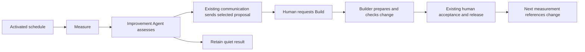

# Governed Measure–Learn–Build Improvement Loop

## 1. Decision and first milestone

Declare one Improvement Agent per Company Workspace. Start with one scheduled
Sprint review, one target in the existing process configuration, one general
assessment Skill and two Company Tools. The Sprint Agent keeps operating the
process. The Improvement Agent measures, assesses evidence and delivers a useful
proposal to the responsible human. Reuse the existing Builder and release path,
then measure the result of the actual change.

The first milestone is one complete, human-approved improvement: an evidenced
Sprint finding, a delivered proposal, an implemented change and a later outcome
measurement. Delivering a report or deploying code alone does not close the loop.
If the evidence supports no useful change, retain that conclusion; do not build
something merely to complete the milestone.

The Core addition is permission-checked historical evidence access over the
existing stores and qualified sources actually needed. It serves any explicitly
granted Agent/Tool; the Improvement Agent is its first consumer.

The Workspace Skill compares the latest relevant assessment, the last actually
delivered report and linked human feedback before recommending another message.
Reuse existing communication, recipient checks, effect receipts and same-run
retry controls. No new cross-run notification identity or admission mechanism
is required for this pilot.

Qualify existing operations monitoring so a broken review loop becomes visible
without a successful Agent run. The Skill waits for a running change's agreed
evaluation period and outcome before proposing another intervention for the
same measurement goal.

This is not a new Core Agent type or improvement platform. Reuse the Agent and
ToolSet resolvers, Workflow Engine, timers, Company Records, roster, governance,
Builder, Release Coordinator and System of Proof. No new database, process
registry, scheduler, approval system or notification service is required.

Implementation is being prepared on an isolated branch from Core 0.12.0.
This plan does not authorize activation or external effects. Public examples are synthetic;
company-specific roles, resources and inspection evidence remain private.

## 2. Baseline, placement and reuse

The initial 2026-09-11 inspection covered released Core 0.11.5 at
`1cd89542cc75055094572670f4742507817a0108` and the open workflow-conversation
migration, Core PR98 at `2ef146220423352d31124679f3f4e729c3c3ff2f`.
The authoring checkout is older and contains ongoing Knowledge/Brain retirement
in favor of reviewed Handbook Markdown. Reconcile maintained source, migration
and exact deployed Artifact before implementation. These are inspection-time
references, not fresh production verification.

The migration already contains briefing and retrospective behavior. Existing
Context Readers supply bound execution context, but do not establish general
historical access across runs. Current communication effects already have
claims and receipts; their Workflow key includes the run ID and therefore does
not suppress the same proposal in a later run. Accept that pilot limitation:
the Skill judges relevance across runs while Core retains technical retry safety.

Use the Workspace entrypoint, company definition, roster, governance, process
configurations, Skills, schedules and Instance declaration as authoritative
context. A workspace tour may link them; it must not become another source of
roles or permissions. Business metrics belong in Company Tools; provider access
stays behind qualified Core Capabilities and Connectors.

<!-- product-planning-gate:v1 -->

#### Responsibility placement

| Boundary | Responsibility |
| --- | --- |
| Core | Generic bounded evidence reads and qualified links over existing stores; reuse current communication, authorization and effect controls |
| Packages or Blueprints | None initially; extract reusable declarations only after demonstrated reuse |
| Company Workspace | Target, Improvement Agent, explicit review Workflow, fixed context, Tools/Skill, reporting and evaluation rules, and responsible humans |
| Company Instance | Exact bindings, activation, credentials outside Git, existing source/run/decision/effect/Builder/release state and operations monitoring of review health |

#### Existing mechanism review

| Mechanism | Decision | Reason |
| --- | --- | --- |
| `capability-contracts-and-connectors` | extend | Expose required retained history, selected context and exact run/effect/message/reply/Build links through existing mechanisms |
| `identity-and-authorization` | extend | Apply existing Agent/Tool grants and current data permissions to evidence reads, narrowed by trusted invocation/workflow scope |

All other mechanisms: reuse

#### New Core mechanisms

- One generic bounded evidence-read contract over existing stores and qualified
  adapters. Missing relationship capture extends existing receipts or outputs;
  no new finding store, notification system or optional check Tool.

#### Boundary assertions

- company-values-in-core: false
- secrets-in-git: false
- public-fixtures: synthetic-only
- record-source-delivery: not-applicable
- core-reusability: Any explicitly granted Agent/Tool can read authorized historical evidence within its invocation scope; goals, business semantics and report relevance remain in the Workspace.

This proposal reuses existing Record Source declarations. If the pilot needs a
new history source or materially changed mapping, give that bounded implementation
its applicable Record Source delivery gate, isolated qualification and separate
activation. A generic query cannot manufacture missing history.

## 3. Prove the evidence before building the loop

First trace a few real items from the selected cohort, including direct Sprint
entry where present. Establish what can actually be read:

`item/Sprint entry → workflow opening → request → owner decision → saved brief`.

Record the exact source/run/decision/effect references, times, deployed Artifact
and gaps. Verify actual activation, selector coverage and delivery before
attributing missing briefs to unanswered requests. Test-cohort acceptance,
merged source and live operation are different facts.

If essential history is unavailable, the first deliverable is a truthful
baseline or the smallest missing instrumentation change. Begin measurement from
an explicit boundary; do not reconstruct past events from current text or invent
a backfill. This evidence check determines the actual Core work needed.

### Single target and measurement

The first target is an individual implementation brief, not a Sprint-wide
planning overview. Add this to the existing migrated v2 Sprint configuration:

```yaml
desired_state:
  description: >
    Every new Sprint item has an owner-confirmed implementation
    brief saved before it enters IN SPRINT.
  target_ratio: 1
```

The existing v2 schema accepts nested literals and the compiler retains their
Artifact/digest. The measurement Tool validates the business shape. Legacy v1
rejects extra fields: complete the real migration, not a version-number edit.
Agent instructions and Skills reference this target rather than duplicate it.

The Workspace defines population, successful evidence and ordering in reviewed
Company Tool logic. Domain terms such as `briefing.saved` are interpreted there
from exact decisions and save receipts, not hardcoded in Core. Configuration
names logical sources/workflows, never SQL tables or physical store names. Core
adapters own physical retrieval. A storage-only change should preserve the read
contract; a change in evidence meaning requires review of the Workspace mapping.
No general `measurement:` YAML rule interpreter is needed for the pilot.

The reviewed measurement Tool, not the model, defines the calculation:

- Freeze `(start, end]` from the calendar and explicit monitoring start; delayed
  or retried runs retain the same window. Missing intervals remain visible.
- Include all eligible entries, including items that bypass planning intake.
  Count the first entry per item/Sprint; same-Sprint re-entry does not count
  twice. New-Sprint recommitment needs period evidence; continuous carryover is
  reported separately.
- Success requires the accountable owner's confirmation of the exact brief and
  a verified matching save, both before entry. Current text or a generic update
  does not establish this. Late repair does not rewrite an on-time failure.
- Compute successes / eligible entries only with sufficient population and
  classification evidence. Retain known failures and unknowns. Incomplete history,
  scans or ordering yield `not-measurable`; zero entries yield `not-applicable`,
  not 100%. Never drop unknown items from the denominator to improve the ratio.

Confirm the entry/window defaults in the concrete implementation plan. Retain
metric, target and operating versions. Target or metric changes require the
normal human review and a new comparable series; the Agent cannot lower the
standard to make an intervention appear successful.

## 4. Trigger, files and process context

The existing Runner cron wakes timer processing. An activated calendar occurrence
opens the named review Workflow; its compiled owner selects the Improvement
Agent. The operating Sprint Workflow does not need to call the reviewer.
Each run is bounded and forward-only; the next calendar occurrence continues
the feedback loop. No resident Agent or cyclic manifest is needed.

| Workspace surface | Pilot responsibility |
| --- | --- |
| Existing Sprint config | Single target, process settings and reporting recipient role |
| Existing schedule | One explicit review trigger at the selected cadence |
| New Sprint review Workflow | Select process/config, fixed context, evidence scope, measurement window and delivery route |
| Improvement Agent instructions | General review responsibility, explicit grants/read scopes and model profile |
| General improvement Skill and proposal template | Analysis method and concise human report |
| Measurement and assessment Company Tool directories | `TOOL.md` and `execute.ts` for deterministic measurement and validated model assessment |
| Existing operating Workflows and relevant Sprint Skills | Intended execution, briefing procedure and quality rules |
| Existing roster/governance and Instance declaration | Human responsibility, allowed bindings and explicit activation |

Name the exact configuration, operational Workflows and relevant Skills in the
review definition. The assessment Tool supplies `language.generate` with the
general Skill as `prompt_path` and three labeled inputs: desired outcome,
intended process behavior, and observed evidence with previous review/change
references. Specialist instructions are material being reviewed, not authority
to assume that Agent's identity or Tools. Provider content remains untrusted.

Resolve this small explicit list against the retained Artifact, check read scope
and retain paths/digests. Do not build automatic dependency traversal or general
context discovery. The inspected retrospective proves prompt/data generation,
not arbitrary cross-Agent file access; qualify the selected compiled read path
and extend it only if necessary. Missing context is an explicit limitation.
If versions differ, separate comparable observations or mark them inconclusive;
a general historical reconstruction engine is not a pilot dependency.

Company Tools belong to their declared owner. The new Tools live under the
Improvement Agent; reading a Sprint Skill grants no Sprint-owned Tool. Do not
add the improvement method to every specialist. An operating Workflow changes
only if a necessary evidence reference is missing, or an accepted intervention
changes its behavior.

For 100 processes with 20 selected for improvement, later declare 20 independently
scoped review Workflows, normally owned by the same Improvement Agent. Each gets
its own explicit context and cadence. No automatic process discovery or shared
company-wide prompt is needed. A specialist can own a review through an ordinary
Workflow declaration if access or domain requirements warrant it.

## 5. Core evidence addition: only the reads the pilot needs

Expose a general Evidence Read Capability through the existing SDK and
Agent/ToolSet grants. `evidence.query` is a proposed name, not an installed API
or a special Improvement-Agent privilege. Other Agents may receive this same
Capability with their own scopes; availability grants no automatic access. Start
with required run/step outcomes, exact decisions, effect receipts and qualified
business-entry history. Read Builder/release links through existing mechanisms
for outcome evaluation. Do not require every store or provider to implement a
universal federated query before this pilot can run.

Reuse existing Record Sources, Company Records, connections and bindings. Prefer
retained evidence. Any necessary provider history read uses a qualified Connector,
never Workspace SQL or provider SDKs. More sources can implement the same bounded
contract later; a binding alone cannot enable an unsupported source.

The implementation fixes the exact schema after the inventory. Its minimum
contract is:

| Input or result | Required behavior |
| --- | --- |
| Trusted scope | Runtime-supplied Instance, Agent/Tool and invocation context; intersect grants/current governance with allowed sources/resources/data classes and the narrower workflow process/window where applicable |
| Query | Explicit subject/workflow/source references, fixed time bounds and bounded retrieval with completion information |
| Facts | Stable event/receipt ID, occurrence and observation times, source object/version and relevant run/decision/effect references |
| Proof | Qualified subject/candidate links, source/binding provenance and actual verification method or receipt |
| Coverage | Covered interval/population, freshness, completeness and missing/conflicting facts; empty results alone do not prove absence |
| Failure | Distinguish denied access, unavailable/unsupported source, incomplete history and ambiguous correlation |

Join by retained qualified references, never similar titles, display names or a
model guess. An untrusted URL is not relationship proof. A chat “yes” is not an
exact-candidate approval; a document update is not a confirmed brief; provider
message acceptance is not human reading. Business interpretation stays in the
Company Tool. A single `verified: true` cannot replace these distinctions.

Enforce the narrower review scope server-side even if the Agent owns other
reviews. Joins and summaries do not widen access. Preserve existing retention
and current authorization; historic roles do not authorize new actions. Add a
missing subject/candidate reference to an existing operating receipt only when
needed, and qualify its future capture. Do not add another evidence database,
source registry, transcript archive or generalized correlation engine.

## 6. Proposal, previous context and reporting

Every run retains a validated assessment, no-action/insufficient-evidence result,
or explicit failure in existing Workflow outputs. That does not mean every run
sends a message. The human report has five short parts:

1. **Finding:** target versus observed result, or a clear measurement limitation.
2. **Evidence and explanation:** linked facts, supported cause or hypothesis,
   and what remains unknown.
3. **Proposed change:** smallest concrete before/after intervention and scope;
   explicitly say when no useful change is supported.
4. **Tradeoff and decision:** benefit, burden, alternative and the human decision
   needed, if any.
5. **Success check:** Builder acceptance criteria, later outcome/window and
   keep/revise/revert/inconclusive criteria, with rollback limits where relevant.

Define the small output schema in the assessment Tool and render it with the
proposal template. Retain technical metadata automatically: source run and exact
assessment output reference, window, Artifact/config/metric versions, evidence,
delivery state, human decision, Build/job/release and later measurement links.
Use existing run IDs, output locations/digests, effect IDs and provider message
references. Do not introduce a separate finding ID, notification version, Core
case type or large form for the human to fill out.
Validate model output and references before delivery; failures cannot become a
successful analysis. Resolve recipient and authority from actual governance.

### Find the previous context through existing references

The review definition already names its process and review Workflow. Through
the general evidence read, select that Workflow's latest applicable completed
review before the current run's cutoff, in the same authorized Instance/process.
Use qualified timestamps/order, exclude the current or still-running review,
and retain the selected run ID. This is a bounded lookup, not a search across
all conversations or a new improvement registry. A more recent failed attempt
is visible as a failure; it does not erase the last valid assessment.

Read three pieces of context, which may belong to different earlier runs:

1. The latest relevant assessment and its exact output.
2. The last actually delivered report, identified by its effect/provider receipt.
3. Human replies/decisions attached to that report, plus linked Build/release
   outcomes where present.

Follow the existing chain:

`review run/output → communication effect → provider message/thread receipt →`
`related human reply/decision → referenced Builder job/release`.

A quiet review retains the prior report/run references it used, so it does not
hide the last delivered report or the human's response. Where no pointer exists,
perform a bounded lookup of prior runs of that same Workflow. Report missing or
truncated history instead of claiming that no prior report or reply exists.
Read later feedback on the referenced message up to the current review cutoff;
the context is not frozen at the time the old report was sent.

These links must be retained when the original actions occur. Reuse existing
fields first. If a reply lacks its originating message/effect/run relation, add
that specific reference to the existing communication/decision capture path.
The human Build brief carries the source review/output reference. No title
matching, invented historical links, automatic graph discovery or new finding
store is required. A linked reply is feedback; it becomes authorization only
when the existing authenticated decision/approval contract establishes that.

### When to send

The Workspace Skill compares today's assessment with that previous context;
the review Workflow validates its recommendation and uses existing communication.
The intended pilot behavior is:

| Result | Pilot behavior |
| --- | --- |
| Target met or unchanged finding without new useful information | Retain quietly |
| First evidenced target miss | A short factual report, even if no fix is known |
| New useful proposal, material evidence or changed required decision | Agent recommends an update with supporting references; another intervention for the same goal waits for the running change's evaluation |
| Accepted change awaiting Build/release or still in its agreed evaluation period | Continue measurement and observation; do not propose another intervention for the same goal |
| Change evaluated | A useful outcome update, including ineffective or inconclusive results; compare prior delivered updates |
| Measurement failure or material evidence gap | Explain the limitation when useful or action is needed; compare prior reports rather than announce it every day |

A new day, changed wording or small percentage change is not itself a useful
update. Suppress materially unchanged recommendations already delivered and take
human rejection/revision feedback into account. A materially different supported
cause or decision can justify a new proposal. This is Agent judgment, not a
structured change-detection engine or a Core guarantee against cross-run duplicates.

A saved report is not proof of delivery. Confirmed non-delivery can justify
delivery through the existing recovery path, even when its content is unchanged.
An unknown provider outcome or missing receipt is not confirmed failure: reconcile
it before another send, including from a later run. Never mint a fresh run/effect
to bypass an unresolved earlier dispatch.

If analysis itself fails, retain the failure and use existing Workflow failure
handling and the operations monitoring described below. The next successful
review also sees it in its prior context; detection must not depend on that
successful run occurring.
Resolve the Process Steward from existing governance and use the qualified private
destination. Missing routing stays explicitly undelivered; it does not justify a
broader audience. No automatic reminder, snooze, digest or recurrence state machine
is promised in the pilot.

### Make a broken review loop visible through existing operations

Before unattended activation, identify and qualify the existing operations
monitor, responsible human and allowed alert destination. Configure concrete
conditions for blocked runs requiring intervention, repeated failed review
occurrences and an overdue successful review, using the actual business cadence.
An expected quiet result or a scheduled non-working day is not an outage.

The check reads existing schedule/run/worker status and last successful completion;
it must work when the Improvement Skill or model cannot run. Reuse existing
operational alert/recovery handling and its repeat suppression. A log entry or
"the next review will notice" alone is insufficient. Prove detection and delivery
with an intentionally failed or blocked review before the unattended pilot.
If that route is unavailable, keep unattended activation pending and qualify the
smallest integration into existing operations. Do not create another Agent,
notification platform or improvement-state store for this purpose.

### Reuse existing communication and retry controls

Use `oregano:communications/publish` and `communication.message.publish` through
existing runtime/Workflow guards, eligible recipient bindings and effect claims.
Current authorization, input validation, dispatch leases, receipt recording and
same-run retry/recovery rules remain mandatory; they are not model decisions.
Qualify them for the actual review path, including unresolved provider outcomes.
Do not add an optional check Tool or a new notification policy subsystem.

Cross-run semantic comparison belongs to the Skill. No stable cross-run finding
identity, notification version, structured change detector or new atomic
notification reservation is a pilot prerequisite. Existing run/effect/message
identities still provide traceability and technical retry protection. If current
recovery cannot prove whether a message was sent, retain the unknown outcome and
use its existing reconciliation path rather than promise exactly-once delivery.

Different review runs, particularly concurrent ones, can still recommend the
same message. Accept and evaluate that pilot limitation. Only observed repetition
or missed updates should motivate later stronger controls; do not claim hard
cross-run deduplication based on the Skill instruction alone. Existing applicable
limits remain in force; new snooze/reminder and aggregate-budget features stay later.

## 7. Human Build, release and outcome



The human receives the proposal and can request a Build, ask for revision or
reject it through existing authenticated paths. The Build brief includes the
accepted scope, acceptance criteria and immutable review-run/output reference.
Record the resulting job and release references. No new approval button or
system-origin Builder intake is assumed.

Accepting an improvement idea does not approve an unseen code result. Reuse the
current exact-candidate human acceptance and Release Coordinator. R0–R4 risk,
change classes and current authority still apply: the Process Steward handles
assigned process responsibility, the Workspace Steward handles roles/grants and
protected policy, and an Oregano Maintainer handles Core changes. Deployment
uses current deployment authority. Agent names, groups and provider access do
not grant human approval rights. Reuse a qualified combined human action where
available; a new split-actor release flow is later work.

### Evaluate the running change before the next intervention

For each measurement goal, the Improvement Skill treats an accepted change as
in progress while its Build/release is pending and during its agreed evaluation
period. Use the existing review, human decision, Build and release references;
no new lock, Core approval rule or change registry is needed.

The accepted proposal specifies the evaluation period. Anchor its start to actual
activation/exposure, not proposal creation. Continue scheduled measurement and
retain new evidence during this period, but do not recommend another intervention
for the same goal until the current attempt has an outcome assessment. Elapsed
time alone is not that assessment: record effective, ineffective or inconclusive
results before choosing the next step.

A failed or cancelled Build is assessed as an unimplemented attempt. Material
problems or guardrail breaches can still be reported while evaluating; any early
stop/revision uses the existing responsible human decision path. Do not silently
reset the period, switch interventions or suppress an operational failure.

The next measurement distinguishes no Build, change not yet live, insufficient
exposure, effective change and ineffective/inconclusive change. Join through
recorded references, not title similarity. Preserve the target and compare
comparable cohorts. Use current authority to stop or revise a failed intervention;
a successful deployment receipt is not evidence of business improvement.

## 8. Bounded implementation order and acceptance

| Step | Deliverable | Exit condition |
| --- | --- | --- |
| 0 | Reconcile migration/deployment and inspect a few real item histories | Exact cohort, Artifact, activation and required evidence availability established; missing history explicit |
| 1 | Add required evidence/context reads and missing original-action links only | Selected subject/window measurable; prior assessment, last delivered report and linked feedback/Build evidence retrievable with scope and coverage |
| 2 | Configure one review, two Company Tools, Skill/template and recipient; reuse communication and operations monitoring | Scheduled review and prior-context comparison work; useful report delivered; retry/recovery and Agent-independent failure visibility qualified |
| 3 | Complete one human-approved improvement and measure afterward | Actual Build/release linked to evidence from its agreed evaluation period and an honest outcome; no competing intervention for the same goal during that period |

These are bounded implementation changes, not one PR for a general platform.
Tool count is not an effort estimate. Reuse the capability catalog, existing
Workflow/Records stores, scoped Artifact materials and maintained adapters for
bounded historical reads. Add only missing query or original-action relationship
capture. Reuse communication guards and effects unchanged wherever they already
satisfy this pilot. Any proven missing operation or migration receives its own
bounded implementation plan; no new cross-run dispatch machinery is assumed.

Required checks cover the real boundaries:

- Compile the actual Workspace; selected Workflow/owner/context only, no inherited
  specialist Tools, denied cross-process reads and explicit missing/versioned context.
- Metric cases: direct entry, exact window, re-entry/carryover, missing history,
  zero population, late repair and unchanged target semantics.
- Previous context: skip the current/in-flight run; survive a quiet intervening
  review or failed attempt; follow exact delivery/reply/Build links, including
  later feedback, and expose missing or truncated history.
- Reports: first miss without a fix, unchanged/rejected proposals, useful new
  evidence, confirmed non-delivery, model failure and outcome result. Evaluate
  the Skill on representative cases; cross-run silence is not a Core guarantee.
- Review health: blocked, repeatedly failed and overdue reviews become visible
  through existing operations even with the model unavailable; verify the real
  recipient route and distinguish quiet success/non-working days from failure.
- Existing dispatch: current recipient/grants, same-step retries, payload conflict
  and unknown provider outcome. Exercise a prior unknown delivery: the review
  should request reconciliation rather than recommend a resend. This is not a
  new Core cross-run admission guarantee. Any actual atomic store change needs
  real database tests; none is assumed just to add this reporting behavior.
- Handoff: exact human Build/result authority, retained change links and later
  measurement. Missing links or insufficient exposure remain inconclusive.
- Evaluation pacing: pending Build/release and an open evaluation period prevent
  another intervention recommendation for the same goal in Skill scenarios;
  measurement continues, and failure/cancellation or the final assessment enables
  a reasoned next step. Early stops retain the responsible human's decision.

Before a live pilot, qualify the migrated configuration, Agent grants, exact
compiled Artifact, recipient/resource bindings, schedule principal and calendar
activation, including Instance `enabledWorkflowIds` and `autoOpenWorkflowIds`.
Qualify review-health thresholds, responsible operator and alert delivery through
existing operations independently of the Improvement Agent.
A blocked calendar does not run because a YAML entry exists. Keep synthetic/local
checks separate from real provider delivery and outcome acceptance.

Run relevant implementation checks, Core inspection and documentation/publication
checks for each change. This documentation revision claims no runtime tests or
production activation.

## 9. Later extensions and stopping rules

The design stays open through explicit context, domain Tools and existing
contracts. The following work is intentionally outside the first pilot:

| Later need | Extension when needed |
| --- | --- |
| More processes and reusable packaging | Add a second and third review, then extract useful shared Skills/Blueprints; no new routing platform |
| More evidence providers | Qualify only required source adapters and mappings; no universal source rollout first |
| Stronger reporting controls | Only after observed need: cross-run notification identities/reservations, structured change detection, snooze/reminders, digests or aggregate limits |
| Automatic improvements | Add bounded prior mandates/system-origin Builder admission with accountable human authority, scope, budget, expiry and revocation; Agents cannot grant or alter their own mandate |
| Product experiments | Add domain measurement and predeclared comparison/guardrails; elapsed time alone does not establish a winner |
| Customer feedback | Add roadmap-fit assessment and outcome evidence; customer communication needs its own authorization |
| Handbook learning | Propose sourced Markdown corrections and evaluate answer quality; no replacement knowledge database |
| Sprint capacity | First obtain comparable effort and human-declared capacity; card counts alone do not measure workload or performance |

Agent capability fixes, product experiments, feedback, Handbook maintenance and
Sprint improvements use the same review/build/evaluate structure. They do not
need all their domain-specific requirements implemented together. A second-domain
integration pilot and mandate controls are later acceptance work, while the first
Core contracts and public fixtures must already be company-neutral.

For the Sprint case, propose the smallest change supported by the diagnosis:
activation/selector correction, better questions, or a bounded operating
follow-up. A hard readiness gate, reassignment or changed commitment needs its
own business decision. The target alone authorizes none of these changes.

Stop new scheduled openings independently of existing Builder work; retain run,
decision and effect proof. Restore a prior exact Artifact through current release
authority when appropriate. Reconcile unknown effects; code rollback does not
undo sent messages, accepted decisions, provider writes or data migrations.

Adoption selects the exact cohort/resources and exposure window, confirms metric
conventions and uses existing model/coding budgets. Future mandates and richer
notification policy are not prerequisites for the first complete loop.

## 10. Implementation branch status

The first implementation is based on maintained Core 0.12.0, commit
`eda80f4d5a38406d1b83391d4fe54ab0409f2581`; the workflow-conversation migration
is already integrated there. Ongoing unrelated Handbook retirement is not part
of this branch. No release or production activation is implied.

The branch implements `evidence.query@1.0.0`, bounded reads in the existing
Workflow and Records stores, selected Artifact materials, attributable published
reply capture, exact existing Builder-constraint/release links and the operator
health read. The private Workspace compiles one Improvement Agent, two Tools,
one calendar review and private delivery through the existing recipient binding.
The Skill owns semantic novelty and evaluation pacing. No finding store or
cross-run notification subsystem has been introduced.

The first installed source still supplies observations, without a qualified
complete Sprint-entry population and period identity. Its executable baseline
therefore retains known observations and confirmed/saved briefing evidence while
reporting the target as `not-measurable`. It does not implement a fictional
percentage calculator over snapshots. A qualified entry-history mapping is
required before the numerical metric acceptance cases can pass against live
facts. Direct entry, re-entry and carryover cannot be guessed from current text.

Local tests exercise the actual compiler, sandbox, workflow, private report,
quiet subsequent review, linked feedback, unknown-effect refusal and failed
model path. Database tests qualify the new bounded storage reads separately.
Synthetic provider/model tests do not qualify business accuracy, real message
receipt, operations alerts or a measured improvement. Live source inventory,
activation, alert delivery and the first human-approved intervention remain
separate acceptance work. Preserve these limitations at handoff.
