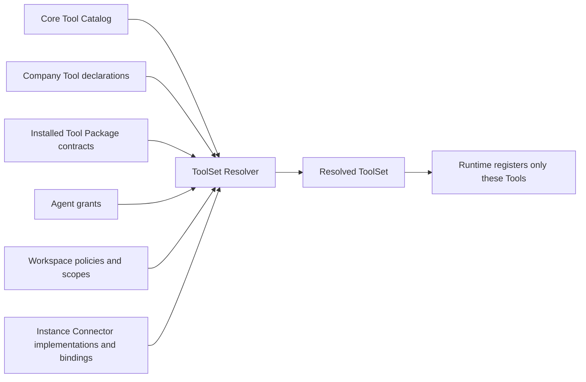

# Tool Architecture Specification

This document is the controlled English successor to the normative German v0.6
Tool supplement. Implemented and missing portions are separated explicitly.

## 1. Four layers

1. **Core mechanisms** enforce identity, approval, effect state, idempotency,
   evidence, and run pinning. They are not model Tools.
2. **Connector capabilities** provide controlled technical access to external
   systems, including authentication, rate limits, retry policy, provider
   evidence, and read-after-write.
3. **Oregano standard Tools** expose reusable, company-neutral agent
   operations implemented and versioned in Core.
4. **Company Tools** compose granted capabilities for one company's domain and
   live with the responsible agent in its Company Workspace.

A Capability Contract is a provider-neutral Core contract, not a Package or
grant. A Connector implementation supplies a Capability. A Tool is an
agent-callable operation that may require one or more Capabilities. Distribution
ownership and runtime availability are therefore separate.

Deterministic business machines—such as progression calculation, escalation
timers, and scheduling—are generic Core modules parameterized by Workspace
files. They are not Company Tools or company-specific Core forks.

## 2. Tool contract

A Tool has a stable ID, human-readable description, input and output schemas,
minimum risk, data class, idempotency rule, required capabilities, expected
evidence, failure semantics, version, and implementation. A Tool is not a
workflow, connector, approval, scheduler, StateStore, or runtime adapter.

Missing risk defaults to R3. Effective effect risk is the maximum of the
workflow step, Tool minimum, connection operation, policy override, spend, and
blast-radius constraints.

## 3. Namespaces and grants

```yaml
tools:
  - oregano:sprint/write-card-field
  - company:calculate-weekly-facts-log
```

`oregano:<module>/<tool>` resolves against the exact Core catalog and is never
copied into the Workspace. `company:<tool>` resolves relative to the owning
agent's `tools/<tool>/` directory and becomes a role-qualified runtime ID.

File existence does not grant use. Effective availability requires all of:

- a resolvable implementation in the exact Core/Workspace pair;
- an explicit agent grant;
- compatible agent scope;
- permitted connection capabilities;
- available Instance configuration;
- policy and risk requirements.

Unknown, duplicate, ambiguous, unavailable, or scope-incompatible grants MUST
fail closed.

## 4. Local Company Tool

```text
agents/<agent-id>/tools/<tool-id>/
├── TOOL.md
├── execute.ts
└── tests/
```

`TOOL.md` is the accountable contract. `execute.ts` may call only the approved
Oregano Tool SDK. It MUST NOT import a runtime, provider SDK, network client,
environment secrets, or direct database client. It cannot call Core approval or
effect primitives directly.

Company Tool changes and Tool grants are security-class Workspace changes. A
new Tool begins at R3 until evidence justifies a stricter declared lower bound
that is still no lower than any capability effect.

A published Tool Package uses the same Tool contract, Tool SDK restriction,
risk floor, resolution, and grant rules. Publication changes how the Tool is
distributed and maintained; it does not increase runtime privilege. Its exact
Package source, version, manifest digest, and managed provenance are recorded in
the Workspace Package lock defined by `specification.companyos-packages-v0.1`.

## 5. Deterministic resolution

The **ToolSet Resolver** (not “Revolver”) is the deterministic compiler between
what exists and what one agent may actually use. A Tool is an available
capability; a grant is an explicit request to make that capability available
to one agent. Neither is sufficient on its own.



The resolver performs the following steps without model judgment:

1. read the exact Core catalog, Company Tool declarations, installed Tool
   Package contracts, and Package lock;
2. resolve every explicit agent grant to exactly one implementation;
3. intersect the result with agent scope, Workspace policy, connection
   capabilities, and available Instance configuration;
4. compute effective risk and required approval metadata;
5. reject unknown, ambiguous, unavailable, or incompatible inputs; and
6. emit one ordered `ResolvedToolSet` manifest per agent.

The manifest includes exact Tool, module, and Package versions, manifest
digests, contracts, Connector implementations, capabilities, scopes, risks,
input hashes, and resolver version. Only this resolved set is registered with
the runtime. An agent cannot discover or call an installed but ungranted Tool,
and a grant cannot make an unavailable connection or forbidden scope usable.

The resolver is deterministic and LLM-free. Its output hash is recorded in
deployment and execution provenance. Identical material inputs MUST produce an
identical manifest and hash. Any material change to a contract, grant, scope,
policy, capability, connection binding, or version MUST change the hash.

Resolution decides availability and effective control metadata; it does not
approve an effect. Runtime approval and effect claiming remain separate Core
mechanisms.

The experimental implementation resolves local Company Tools against the Core
Capability catalog, Workspace connection allowlist, agent grants, and exact
Instance bindings. It rejects unknown, duplicate, ambiguous, unbound, and
disallowed inputs, raises effective risk to the Capability minimum, emits a
stable hash, and registers only resolved implementations. Standard Tool and
published Tool Package catalogs remain future inputs; the implementation does
not claim those distribution paths.

The reference production Artifact Connector implements `artifact.publish`
through Postgres and the Vercel Runner's public route. It accepts only bounded
artifact identifiers and approved text/HTML media types, rejects conflicting
content under an existing identifier, and returns a digest plus public URL as
real evidence. It does not implement paid marketing Capabilities.

## 6. Distribution

Production builds combine an exact Core checkout and an exact Company Workspace
checkout. Standard Tool code comes from the pinned Core revision; Workspace
files contain only their grants. Company Tool code comes from the exact
Workspace revision. Generated artifacts are disposable and record both commits.

The open Package ecosystem complements this deployed Core/Workspace pairing.
Blueprint and Tool Package origin is versioned in the Workspace Package lock;
Connector Package installation and binding is versioned in the Instance Package
ledger. Their hashes become deployment provenance inputs.

A future package distribution MAY replace the Core/Workspace co-checkout, but
must preserve exact version pairing, provenance, validation, signing, and
rollback. Silent upgrades and copying standard Tool source into a Workspace are
forbidden. Package installation alone does not grant, bind, activate, deploy, or
approve a Tool.

## 7. Duplication and graduation

Local Tools cannot import each other across agent scopes. If two agents need a
similar company-specific operation, the Process Steward chooses explicit
duplication, delegation to one responsible agent, or a proposal to graduate a
generic mechanism into Core.

Graduation requires evidence across companies, a company-neutral contract,
Core ownership, compatibility policy, generic tests, and migration. An agent
does not move code into Core merely because it looks reusable.

## 8. Required validation and tests

- unknown standard and Company grants fail;
- ungranted Tool is not callable;
- Company Tool forbidden imports fail;
- missing risk defaults to R3;
- scope/capability mismatch fails;
- same-named Company Tools remain role-qualified;
- installed published Tools without a resolved grant remain undiscoverable and
  uncallable;
- exact ToolSet hash is stable for identical inputs and changes for any
  material Package, contract, grant, scope, Connector, capability, binding, or
  version change;
- runtime registers only the resolved set;
- a Tool cannot bypass approval/effect control through direct provider access.

## 9. Standard Knowledge Tools

`oregano:knowledge/search`, `oregano:knowledge/get`, and
`oregano:knowledge/traverse`, all at version `3.0.0`, are implemented Core
standard Tools. They resolve through the same explicit grant, allowed
Capability, Instance binding, schema validation, isolation, evidence, and
runtime enforcement path as Company Tools. The Runtime resolves the requesting
principal against the active roster, derives groups inside Core, and passes
that subject only in the trusted Capability context. They call `knowledge.search`,
`knowledge.get`, or `knowledge.traverse` through a Connector and never import a
database client. All are R0 reads over the active authorized snapshot. Search
returns bounded citations and explicit degradation/gaps; get uses one exact
path without fuzzy widening; traversal follows only validated bundle links and
enforces hard depth/node limits. The Knowledge Connector fails closed when the
trusted subject is absent or inactive, and the Provider filters protected
candidates before rank, hydration, traversal, citation, or model output.

## 10. Workflow Tool authority

A compiled workflow uses the same CompanyOSRuntime, Tool isolation, Capability
registry and approval/effect store as any other Tool execution. Its additional
[workflow guard](workflow-execution-v1-draft.md#implemented-runtime-guard)
intersects the resolved ToolSet with a trusted current step and exact resolved
inputs. A model cannot omit an assignment to recover reserved effect authority.
Constructor-injected host context carries assignment and current authorization;
Tool input carries business data only. The durable host adapter remains pending.

The Runtime derives stable workflow effect identities independently of input
hashes. Changed input cannot create a new send for the same run/step/item.
Schema-invalid effect receipts retain an unknown outcome with partial provider
evidence. Successful receipts remain completed even if a workflow-required
output field or later audit append fails. Recovery reads the retained effect;
it does not ask a Connector to implement the Runtime's deduplication guarantee.


The durable interpreter supplies Tool context by rereading its actual current
lease, pinned run and current roster. Human decision notices compile to the
same granted communication Tool below R3; they cannot recurse into an approval
for their own delivery. A request's complete payload is shown before its
response may authorize the bound consumer. Notice and foreach deliveries use
separate stable item identities and retained receipts. The conversation reader
uses authenticated account/channel/thread/subject assignments; a model cannot
choose a run or step through Tool arguments. Hosted transport wiring and
provider binding qualification remain separate from this Core implementation.

## Partial effect review evidence

An outcome-unknown Capability exception retains its original provider evidence
inside a Registry envelope with the exact bound Connector, Connector version,
Capability and contract version. Provider fields cannot replace that identity.
The optional `effect_review` v1 contains at most 1,000 unique bounded item IDs,
each with `verified`, `unknown` or `not-attempted`, and an optional bounded
provider version. This is privileged Connector receipt evidence, never a Tool
or model authorization. Operator reports expose only these allowed fields and
evidence digests; raw provider errors and payloads stay in the existing store.

For `work-item.batch-update`, the Registry rejects duplicate request IDs before
dispatch. Each entry may contain distinct target values: the human decision
binds the complete ordered array, including item IDs, expected versions, fields
and values, on one independently bound resource. A provider adapter must not
require identical changes across entries. Every mapped field and expected
version is preflighted before the first mutation. This corrects the maintained
adapter's extra restriction within the existing `1.0.0` Capability input shape;
it adds no grant or approval authority. A successful result must say
`complete: true` and account for exactly
every requested item once. A partial result or an incomplete identity set becomes
outcome-unknown even when the output satisfies its JSON schema. An optional item
review must match the complete requested sequence; invalid or absent evidence
cannot prove an item was unattempted. The effect remains claimed and cannot be
retried automatically.

The maintained Monday batch adapter records its completed prefix, the current
uncertain item and the remaining unattempted suffix. `verified` means its write
returned and its subsequent read receipt and echo evidence were retained. It
does not establish provider-side atomicity or the absence of later changes.
Readback or receipt-persistence failure leaves the current item uncertain.
This report performs no reconciliation and grants no retry or new approval.

Hosted Monday Connector configuration requires an exact
`credential_identity` (account, authenticated member, external-Agent kind and
provider Agent subject); `actor_id` must equal that authenticated member ID.
The hosted factory always installs the trusted qualification hook. Before each
Capability invocation, the same client checks current identity, active board,
minimum access and active mapped columns. Duplicate or unexpected board results
and field aliases fail. Successful and uncertain receipts retain content-free
qualification metadata separately from write evidence. Low-level adapter
construction remains a trusted integration boundary; an alternative host must
supply equivalent qualification and cannot delegate it to a Company Tool.

The maintained Monday work-item client requires exactly one matching item in
preflight and readback responses, and its update mutation acknowledgement must
identify that same requested item. A wrong or ambiguous read before dispatch
is refused; a missing/wrong acknowledgement or readback after dispatch remains
outcome-unknown. Single updates and comments also preserve unknown evidence if
their post-write receipt or echo persistence fails. A comment acknowledgement
needs a stable comment identity. These checks do not establish provider-side
atomicity or replace current credential and resource qualification.

Allowed, non-empty mapped changes are validated for the entire batch before
the first mutation. Known local field/permission failures do not start provider
writes. Uncertain single-item effects use the same content-free item-review
shape and existing Runtime claim/evidence lifecycle as batches.
